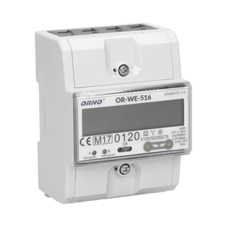
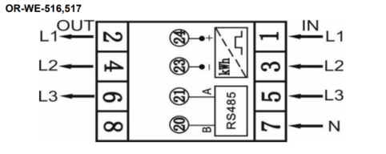
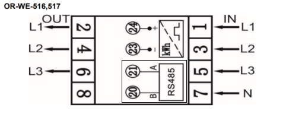

import Image from '@theme/IdealImage';

[Web-Site](https://www.orno.pl/en/energy-meters-with-mid/349-3-phase-energy-meter-with-rs-485-80a-mid-4-5-modules-din-th-35mm-5902560322415.html#download)



### Description

The OR-WE-516 is a compact **three-phase** energy meter designed for accurate measurement of active energy in electrical installations. It is equipped with an **RS-485 Modbus interface** for remote data reading and is MID-certified for fiscal metering applications.

:::info

This energy meter **does not require** any **external sensor** for current measurement. It features built-in measurement capability through direct connection.

:::

 ---

### Power Installation

#### Example of Installation: ORNO Energy Analyzer - OR-WE-516

| **ORNO Energy Analyzer - OR-WE-516** | |
|----------------------------------------|-----------------------------------------------|
| Pin 1                                  | **L1 (IN)**                                   |
| Pin 3                                  | **L2 (IN)**                                   |
| Pin 5                                  | **L3 (IN)**                                   |
| Pin 7                                  | **N (IN)**                                    |
| Pin 2                                  | **L1 (OUT)**                                  |
| Pin 4                                  | **L2 (OUT)**                                  |
| Pin 6                                  | **L3 (OUT)**                                  |

#### Connection Diagram (OR-WE-516)



:::info

In this case, it is also possible to connect the energy analyzer in single-phase mode, by wiring the phase (L) to terminal 1, the neutral (N) to terminal 7, and the output phase (L out) to terminal 2.

:::

---

### Modbus Communication

#### Example of Modbus Communication Installation: ORNO Energy Analyzer - OR-WE-516

| **ORNO Energy Analyzer - OR-WE-516** | **CHESTER Modbus** |
|---------------------------|--------------------|
| Pin 20                    | Pin 6 (B)          |
| Pin 21                    | Pin 7 (A)          |


#### Connection Diagram (OR-WE-516)



---

### Browsing and Configuration Buttons

* `➡️` **Right button**
    * Navigate right in the menu

* `⬅️` **Left button**
    * Navigate left in the menu

---

### Modbus Communication Configuration


You can edit the communication settings of the ORNO energy meter using one of the following methods:


#### 1. Using the Official ORNO Software

Communication parameters can be configured directly via the official software provided by ORNO.  
The configuration tool can be downloaded here:  
**[Download ORNO configuration software for OR-WE-516](OR-WE-516_program.7z)**

To connect the device to your PC, use a **standard USB–RS485 converter**.  

:::info
Connect the USB side of a standard USB–RS485 converter to your computer, where the ORNO configuration software is installed.
Then, connect the RS485 side of the converter to the energy meter’s communication terminals by wiring **terminal A to pin 21** and **terminal B to pin 20**.
:::


#### 2. Using the Chester Terminal

There are multiple options to access the terminal:

- Use the **HARDWARIO Manager app** (desktop or mobile)
- Use the **Cloud Terminal** in **[HARDWARIO Cloud](https://hardwario.cloud/)**
- Use the **Google Chrome terminal** at **[terminal.hardwario.com](https://terminal.hardwario.com/)**


#### Modbus Communication Configuration for Chester

Use the following commands to configure communication parameters via Chester terminal:


#### Configuration of chester

To configure the energy meter in the CHESTER application, enter the following set of commands into the terminal. These commands set the correct serial communication mode, define the connected device, and determine the intervals for measurement and data transmission.

```bash
# Configure communication with the energy meter
app config serial-mode "modbus"
app config serial-baudrate 9600
app config serial-data-bits 8
app config serial-parity "even"
app config serial-stop-bits 1

# Activate the device on the Modbus bus (format: "type,address")
app config device-0 "or_we_516,1"

# Configure application behavior and data transmission
app config mode "lte"
app config interval-sample 60
app config interval-aggreg 60
app config interval-report 30

# Save changes and verify settings
config save
app config show
```

##### Detailed Description of Configuration Commands

<details>
<summary><b>Show Detailed Description of Commands</b></summary>
<p>

| Command | Default Value | Description |
| :--- | :--- | :--- |
| **`app config serial-mode "modbus"`** | `"transparent"` | Switches the built-in serial line from transparent mode to Modbus RTU master mode. |
| **`app config serial-baudrate 9600`** | `9600` | Sets the communication speed (Baud rate). It must match the settings on the energy meter's display. |
| **`app config serial-data-bits 8`** | `8` | Number of data bits in the Modbus frame. |
| **`app config serial-parity "even"`** | `"none"` | Sets the parity (even parity), which is standard for this type of energy meter. |
| **`app config serial-stop-bits 1`** | `1` | Number of stop bits. |
| **`app config device-0 "or_we_516,1"`** | `""` | Adds the energy meter to the first available slot (`device-0`). The format is `[device_type],[modbus_address]`. |
| **`app config mode "lte"`** | `"none"` | Determines the primary communication interface of CHESTER. In this case, the LTE (NB-IoT/LTE-M) module is activated. |
| **`app config interval-sample 60`** | `60` | Interval (in seconds) determining how often CHESTER polls the energy meter for current values. |
| **`app config interval-aggreg 60`** | `300` | Interval (in seconds) during which collected data is aggregated (averaged or summed) into a single packet. |
| **`app config interval-report 30`** | `1800` | Interval (in seconds) determining how often CHESTER sends the aggregated data to the server/cloud. |
| **`config save`** | — | Permanently saves the current configuration to the device's flash memory. |
| **`app config show`** | — | Prints the currently set values for verification. |

</p>
</details>
---

### Default Modbus Communication Configuration

| Address | Baud Rate | Parity | Stop Bit |
|---------|-----------|--------|-----------|
| 1       | 9.6k      | Even   | 1         |

:::info
The table above shows the default communication settings used in our setup.  
However, the energy meter may have different values already configured.  
Before applying these settings in Chester, you should check the actual communication parameters in the energy analyzer's menu. [➡️Navigation in the energy meter menu⬅️](#browsing-and-configuration-buttons)  
Make sure to match the settings in Chester according to the values configured in the energy meter.
:::

### Measured values

| Measured Value | Key / Path                                   |
|----------------|----------------------------------------------|
| Power          | E_ENERGY_METER.METER_3.POWER.MEASUREMENTS    |
| Frequency      | E_ENERGY_METER.METER_3.FREQUENCY.MEASUREMENTS|
| Energy In      | E_ENERGY_METER.METER_3.ENERGY_IN.MEASUREMENTS|
| Energy Out     | E_ENERGY_METER.METER_3.ENERGY_OUT.MEASUREMENTS|
| Voltage L1     | E_ENERGY_METER.METER_3.VOLTAGE_L1.MEASUREMENTS|
| Voltage L2     | E_ENERGY_METER.METER_3.VOLTAGE_L2.MEASUREMENTS|
| Voltage L3     | E_ENERGY_METER.METER_3.VOLTAGE_L3.MEASUREMENTS|
| Current L1     | E_ENERGY_METER.METER_3.CURRENT_L1.MEASUREMENTS|
| Current L2     | E_ENERGY_METER.METER_3.CURRENT_L2.MEASUREMENTS|
| Current L3     | E_ENERGY_METER.METER_3.CURRENT_L3.MEASUREMENTS|
| Power L1       | E_ENERGY_METER.METER_3.POWER_L1.MEASUREMENTS |
| Power L2       | E_ENERGY_METER.METER_3.POWER_L2.MEASUREMENTS |
| Power L3       | E_ENERGY_METER.METER_3.POWER_L3.MEASUREMENTS |
| Energy L1      | E_ENERGY_METER.METER_3.ENERGY_L1.MEASUREMENTS|
| Energy L2      | E_ENERGY_METER.METER_3.ENERGY_L2.MEASUREMENTS|
| Energy L3      | E_ENERGY_METER.METER_3.ENERGY_L3.MEASUREMENTS|


---
