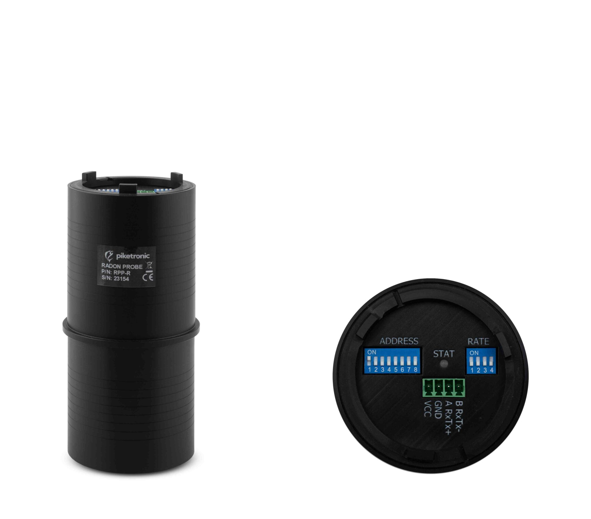

[Web-Site](https://www.piketronic.cz/)



### Description

The Piketronic **RPP-R** is a radon probe that continuously measures radon
concentration along with the air temperature and humidity inside its measurement
chamber. It is equipped with an **RS-485 Modbus RTU interface** for reading the
measured values. This device is supported by the **CHESTER Serial** application.

:::info

The radon probe is a self-contained sensor — it does **not** require any external
sensor. A new radon concentration value becomes available **every 4 minutes**;
reading more frequently returns the same value.

:::

---

### Modbus Communication

#### Example of Modbus Communication Installation: Piketronic RPP-R

The RPP-R has a 4-pin connector labelled **B RxTx-**, **A RxTx+**, **GND**, **VCC**.

| **Piketronic RPP-R** | **CHESTER Modbus**     |
|----------------------|------------------------|
| A RxTx+              | Pin 7 (A)              |
| B RxTx-             | Pin 6 (B)              |
| GND                  | Pin 1 (GND)            |
| VCC                  | Power (see note below) |

:::info

The probe needs a supply on **VCC**. It can be powered from CHESTER's dedicated power
output (VIN) **if** the voltage and current match the RPP-R's requirement — confirm
the probe's supply voltage first; otherwise use a separate external supply. RS-485
A/B labelling varies between manufacturers; if no data is received, swap the **A**
and **B** lines.

:::

---

### Browsing and Configuration

The RPP-R has **no display or buttons**. Its Modbus address and serial parameters
are set with two DIP-switch blocks on the probe. **The probe must be restarted
(power-cycled) after changing any switch.**

#### Address (switch block `ADDRESS`)

A value from **1 to 247**. Switch labelled `1` is the least significant bit; a
switch in the **down** position means logical `0`.

#### Speed and parity (switch block `RATE`, switches 4-3-2-1)

| RATE (4 3 2 1) | Baud Rate | Parity | Stop Bit |
|----------------|-----------|--------|----------|
| 0 0 0 0        | 19.2k     | Even   | 1        |
| 0 0 0 1        | 9.6k      | Even   | 1        |
| 0 0 1 0        | 2.4k      | Even   | 1        |
| 0 0 1 1        | 1.2k      | Even   | 1        |
| 0 1 0 0        | 19.2k     | Odd    | 1        |
| 0 1 0 1        | 9.6k      | Odd    | 1        |
| 0 1 1 0        | 2.4k      | Odd    | 1        |
| 0 1 1 1        | 1.2k      | Odd    | 1        |
| 1 0 0 0        | 19.2k     | None   | 2        |
| 1 0 0 1        | 9.6k      | None   | 2        |
| 1 0 1 0        | 2.4k      | None   | 2        |
| 1 0 1 1        | 1.2k      | None   | 2        |
| 1 1 x x        | *do not use* |     |          |

---

### Default Modbus Communication Configuration

| Address | Baud Rate | Parity | Stop Bit |
|---------|-----------|--------|----------|
| 1       | 19.2k     | Even   | 1        |

:::info

The table above is the recommended setup (`RATE` switches all down). Always set
CHESTER to match the switches actually configured on the probe.

:::

---

### Modbus Communication Configuration for Chester

Use the following commands to configure the CHESTER Serial application via the
Chester terminal. The probe is added as a Modbus device of type `piketronic`.

```
app config serial-mode "modbus"
app config serial-baudrate "19200"
app config serial-parity "even"
app config serial-stop-bits "1"
app config device-0 "piketronic,1"
config save
```

The `device-0` value is `type,address` — here type `piketronic` at Modbus address `1`.

You can also read the probe directly from the terminal at any time:

```
device piketronic sample 1
```

This prints the radon concentration (1-hour and 1-day average), temperature,
humidity, current settings, and the probe's device/firmware/serial identification.

---

### Measured values

Decoder: `com.hardwario.chester.app.serial` — values appear under the `devices`
array (`devices → data`).

| Measured Value             | Key / Path                              | Unit   |
|----------------------------|-----------------------------------------|--------|
| Radon concentration (1 h)  | devices → data → radon_concentration     | Bq/m³  |
| Radon concentration (1 day)| devices → data → radon_concentration_day | Bq/m³  |
| Temperature                | devices → data → temperature             | °C     |
| Humidity                   | devices → data → humidity                | %      |

:::info

The radon concentration is a **1-hour moving average** (updated every 4 minutes).
A separate **1-day moving average** is also reported.

:::

---
