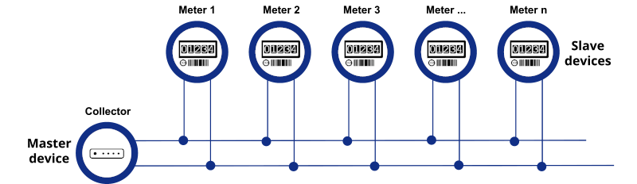

import Image from '@theme/IdealImage';

# M-Bus Sensors
Here is list of tested sensors by HARDWARIO with basic configuration to use:


# M-Bus (Meter-Bus) Communication Overview



*Figure: Example of M-Bus topology with master and multiple slave meters connected via 2-wire bus.*

## What is M-Bus?

M-Bus (Meter-Bus) is a European standard (EN 13757) for the remote reading of consumption meters and sensors, such as heat meters, water meters, gas meters, and electricity meters. It was designed to allow communication over a two-wire bus with multiple slave devices (meters) connected to a single master (typically a gateway or data concentrator).

M-Bus is commonly used in building automation and smart metering systems, where it provides a reliable and cost-effective means of collecting data from a distributed network of metering devices.

---

## Hardware Requirements

### Bus Topology
- **Two-wire bus** (non-polarized)
- Supports long cable lengths (up to 350 meters depending on baud rate and cable type)

### Voltage and Power
- **Nominal bus voltage**: 24 V DC
- **Typical current draw per slave**: ~1.5 mA
- The master must provide sufficient power for all connected devices
- Some M-Bus masters can support up to 250 slaves depending on the power budget and driver capacity

### Components
- **M-Bus Master**: Initiates communication and provides power to the bus
- **M-Bus Slaves**: End devices such as meters and sensors
- **Level Converter/Transceiver**: Optional interface between UART and M-Bus physical layer (used in some embedded systems)

---

## Data Format

M-Bus communication is defined in layers:

- **Physical Layer**: Defines signal modulation, voltage levels, and wiring
- **Link Layer**: Defines addressing, frame formats, and error detection
- **Application Layer (EN 13757-3)**: Defines the structure and encoding of data

### Message Structure
M-Bus messages are composed of:
- Start byte
- Control field
- Address field
- Control information field
- User data (telegrams)
- Checksum
- Stop byte

### Data Encoding
Data values are transmitted in a binary format using VIF (Value Information Field) and DIF (Data Information Field) descriptors. These specify the type, unit, and scale of the measurement.

Example:
- DIF = Energy  
- VIF = kilowatt-hours (kWh)  
- Value = `00071F` (hex) → 182.3 kWh

### Example Output (Parsed JSON)
```json
{
  "device_id": "MBUS-12345678",
  "timestamp": "2025-04-29T08:00:00Z",
  "energy_kwh": 182.3,
  "volume_m3": 12.01,
  "temperature_c": 55.2,
  "signal_strength_dbm": -72
}
```

---

## Applications

M-Bus is used primarily in:

- **Smart metering** for utilities (gas, water, heat, electricity)
- **Building automation** for HVAC, lighting, and energy efficiency monitoring
- **Industrial monitoring** of sensors and actuators with low power consumption
- **Data acquisition systems** in facilities management and infrastructure

---

## Advantages of M-Bus

- Low power and low cost
- Long cable distances with high noise immunity
- Support for a large number of devices on a single bus
- Standardized and widely adopted

---

## Limitations

- Slow data rates (typically 300 to 9600 bps)
- No native encryption or authentication
- Requires physical wiring
