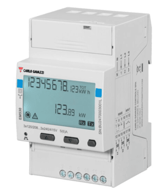
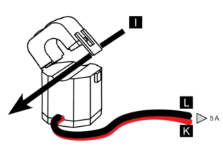

import Image from '@theme/IdealImage';

# Modbus Sensors

Here is list of tested sensors by HARDWARIO with basic configuration to use:

| Name                              | Type                 | Notes                          |
|-----------------------------------|----------------------|--------------------------------|
| [Carlo Gavazzi EM1XX Series](#carlo-gavazzi-em1xx-series)       | Electrometer         | Integrated into CHESTER Energy |
| [Carlo Gavazzi EM5XX Series](#carlo-gavazzi-em5xx-series)     | 3-Phase Electrometer | Integrated into CHESTER Energy |
| [ORNO OR-WE-516](#orno-or-we-516)                    | 3-Phase Electrometer | Integrated into CHESTER Energy |
| [Schneider Electric iEM3000 series](#schneider-electric-iem3000-series)  | 3-Phase Eletrometer  | Integrated into CHESTER Energy |
| [LAMBRECHT meteo sensors](#lambrecht-meteo-sensors)          |                      | Integrated into CHESTER Meteo  |

## Carlo Gavazzi EM5XX Series

[Web-Site](https://www.gavazziautomation.com/en-global/product/EM530DINAV53XM1X)

### Installation

| **Carlo Gavazzi – EM5XX** | **CHESTER Modbus** |
|---------------------------|--------------------|
| Pin 9                     | Pin 6 (A−)      |
| Pin 8                     | Pin 7 (B+)        |
| Pin 10                    | Pin 1 (GND)        |

#### Carlo Gavazzi - EM530 - Modbus communication

---

### Browsing and Configuration Buttons

* ▲ **Up button**
    1. Navigation through the menu
    2. Increasing the value

* ▼ **Down button**
    1. Navigation through the menu
    2. Decreasing the value

* ⯀ **Select / Enter / Menu button**

---

### Configuration

1. Press the **Select** button to open the menu.  
2. Use the **Select** button to choose the **Setting** option.  
3. Use the **Up/Down** buttons to select the menu item: `r5485`.  
4. Enter the configuration values according to the table below.

### Default Modbus Configuration

| Address | Baud Rate | Parity | Stop Bit |
|---------|-----------|--------|-----------|
| 1       | 9.6k      | None   | 1         |

---

### CT Ratio Configuration

1. Press the **Select** button to open the menu.  
2. Use the **Select** button to choose the **Reset** option.  
3. Use the **Up/Down** buttons to navigate to the menu item **MID res**.  
4. Press **Start**.  
5. Enter the CT ratio values.  
6. Confirm the settings by selecting **YES** using the **Up** button, then press the **Select** button.

### Example of CT Ratio Selection

**Split Core Current Transformer – Carlo Gavazzi**

| Model       | CT Ratio          |
|-------------|-------------------|
| CTA6X200A5A | 40 *(200:5 → 40)* |

:::info

 The CT ratio is selected based on the maximum expected primary current. For example, if the system's maximum current is around 200 A, a 200:5 CT is chosen to step this down to 5 A for measurement devices.

:::
>

---

### Example Installation: Split Core Current Transformer CTA6X200A5A

| **Carlo Gavazzi Energy Analyzer EM530** | **Split Core Current Transformer CTA6X200A5A** |
|----------------------------------------|-----------------------------------------------|
| Pin 13                                 | **K**                                         |
| Pin 14                                 | **L**                                         |

#### Carlo Gavazzi - EM530 - Connection Diagram

#### Carlo Gavazzi - CTA6X200A5A - Connection Diagram

