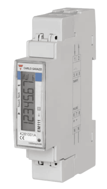
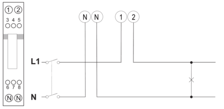
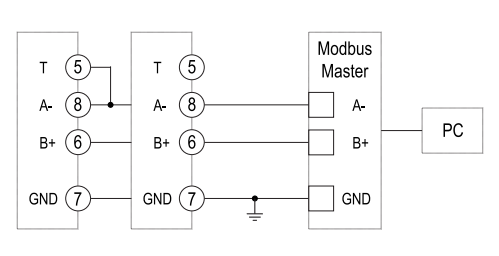

import Image from '@theme/IdealImage';

[Web-Site](https://www.gavazziautomation.com/en-global/product/EM111DINAV51XS1X)



### Introduction

The EM1xx series includes compact and user-friendly energy analyzers designed for **single-phase systems**. These devices are ideal for active energy metering and cost allocation in residential, commercial, and light industrial applications. With direct or indirect current measurement options and support for dual tariff management, the EM1xx series offers flexibility, precision, and easy integration.

:::info

This energy meter **does not require** any **external sensor** for current measurement. It features built-in measurement capability through direct connection.

:::

 ---

### Power Installation

#### Example of Installation: Carlo Gavazzi Energy Analyzer EM111

| **Carlo Gavazzi Energy Analyzer - EM111** | |
|----------------------------------------|-----------------------------------------------|
| Pin 1                                 | **L (IN)**                                         |
| Pin 2                                 | **L (OUT)**                                         |
| Pin N (left)                                | **N (IN)**                                         |
| Pin N (right)                                | **N (OUT)**                                         |

#### Connection Diagram (EM111)



---

### Modbus Communication

#### Example of Modbus Communication Installation: Carlo Gavazzi Energy Analyzer EM111

| **Carlo Gavazzi Energy Analyzer – EM111** | **CHESTER Modbus** |
|---------------------------|--------------------|
| Pin 8                     | Pin 6 (A−)      |
| Pin 6                     | Pin 7 (B+)        |
| Pin 7                    | Pin 1 (GND)        |

#### Modbus communication (EM111)



---

### Browsing and Configuration Buttons

* `◄` **Left button**
    1. Navigation through the menu
    2. Decreasing the value
    3. Hold for select / enter

* `►` **Right button**
    1. Navigation through the menu
    2. Increasing the value
---

### Modbus Communication Configuration for Energy Analyzer

1. Press and hold the `◄` **(Left)** button for 1.5 seconds.  
2. The screen will display `PASS`.  
3. Press the `◄` **(Left)** button again to start entering the password.  
4. Use the `►` **(Right)** and `◄` **(Left)** buttons to select digits.  
5. Confirm each digit by holding the `◄` **(Left)** button for 1.5 seconds to move to the next one.  
6. The default password is `0000`.  
7. After entering the password, the screen will display `N PASS` to prompt for a new password (if needed).  
8. Once in the menu, navigate using the `►` **(Right)** and `◄` **(Left)** buttons.  
9. To edit any value, press and hold the `◄` **(Left)** button for at least 1.5 seconds on the desired item.  
10. After adjusting the value, confirm it with another long press of the `◄` **(Left)** button.  
11. When finished with all settings, scroll through the menu until you find `END`, then hold the `◄` **(Left)** button to exit.  

:::info
If long presses don’t respond, try pressing the `◄` **(Left)** button closer to the center area of the screen.
:::


#### Default Modbus Communication Configuration

| Address | Baud Rate | Parity | Stop Bit |
|---------|-----------|--------|-----------|
| 1       | 9.6k      | None   | 1         |

---

### Modbus Communication Configuration for Chester

Use the following commands to configure communication parameters via Chester terminal:


```
app config modbus-baud "9600"
app config modbus-addr "1"
app config modbus-parity "none"
app config modbus-stop-bits "1"
app config em-type "g1"
config save
```

---
