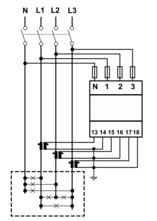
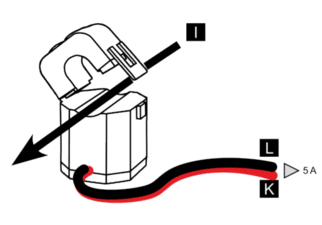
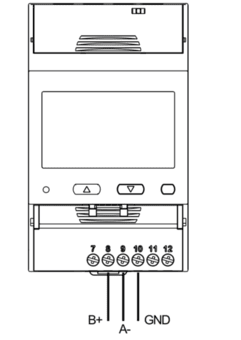

import Image from '@theme/IdealImage';


[Web-Site](https://www.gavazziautomation.com/en-global/product/EM530DINAV53XS1PFB)

<div class="container">
  <div class="row">
    <div class="col col--8">
      <div style={{ width: '376px', height: '376px' }}>
        <Image img={require('./carlo_gavazzi_em5xx.png')} />
      </div>
    </div>
    <div class="col col--24"></div>
  </div>
</div>
<br />


### Description

The EM5xx series offers a range of compact and versatile energy analyzers designed for monitoring electrical consumption and quality in **single-phase**, **two-phase**, and **three-phase systems**. These devices are ideal for use in residential, commercial, and industrial environments where accurate measurement, reliability, and ease of use are essential.

:::info

This energy meter **requires** the use of an **external sensor**, such as a current transformer (CT), to measure current. The sensor must be selected based on the expected load and system configuration.

:::

 ---

### Power Installation

#### Example of Installation: Carlo Gavazzi Energy Analyzer EM530

| **Carlo Gavazzi Energy Analyzer - EM530** | |
|----------------------------------------|-----------------------------------------------|
| Pin N                                 | **N**                                         |
| Pin 1                                 | **L1**                                         |
| Pin 2                                 | **L2**                                         |
| Pin 3                                 | **L3**                                         |

:::info

 In this case, it is also possible to connect the energy analyzer in single-phase mode, by wiring the neutral (N) to the N terminal and the phase (L) to terminal 1.

:::

#### Connection Diagram (EM530)



 ---
### Sensor Installation

#### Example of Installation: Split Core Current Transformer CTA6X200A5A


| **Carlo Gavazzi Energy Analyzer - EM530** | **Split Core Current Transformer - CTA6X200A5A** |
|----------------------------------------|-----------------------------------------------|
| Pin 13                                 | **K**                                         |
| Pin 14                                 | **L**                                         |


#### Connection Diagram (CTA6X200A5A)



---

### Modbus Communication

#### Example of Modbus Communication Installation: Carlo Gavazzi Energy Analyzer EM530

| **Carlo Gavazzi Energy Analyzer – EM530** | **CHESTER Modbus** |
|---------------------------|--------------------|
| Pin 9                     | Pin 6 (A−)      |
| Pin 8                     | Pin 7 (B+)        |
| Pin 10                    | Pin 1 (GND)        |

#### Modbus communication (EM530)



---

### Browsing and Configuration Buttons

* `▲` **Up button**
    1. Navigation through the menu
    2. Increasing the value

* `▼` **Down button**
    1. Navigation through the menu
    2. Decreasing the value

* `⯀` **Select / Enter / Menu button**


---

### Modbus Communication Configuration for Energy Analyzer

1. Press the **Select** button to open the menu.  
2. Use the **Select** button to choose the **Setting** option.  
3. Use the **Up/Down** buttons to select the menu item: `r5485`.  
4. Enter the configuration values according to the table below.

#### Default Modbus Communication Configuration

| Address | Baud Rate | Parity | Stop Bit |
|---------|-----------|--------|-----------|
| 1       | 9.6k      | None   | 1         |

---

### Modbus Communication Configuration for Chester

Use the following commands to configure communication parameters via Chester terminal:


```
app config modbus-baud "9600"
app config modbus-addr "1"
app config modbus-parity "none"
app config modbus-stop-bits "1"
app config em-type "g2"
config save
```

---

### CT Ratio Configuration

1. Press the **Select** button to open the menu.  
2. Use the **Select** button to choose the **Reset** option.  
3. Use the **Up/Down** buttons to navigate to the menu item **MID res**.  
4. Press **Start**.  
5. Enter the CT ratio values.  
6. Confirm the settings by selecting **YES** using the **Up** button, then press the **Select** button.

:::warning
These models are **MID-certified meters** (Measuring Instruments Directive — EU legal metrology standard).  
The CT ratio can be changed **only before** the device registers **1 kWh** of active energy.  
After exceeding 1 kWh, the CT ratio becomes **permanently locked** and **cannot be modified**, even with a factory reset or MID reset.  
:::

### Example of CT Ratio Selection

**Carlo Gavazzi Split Core Current Transformer - CTA6X200A5A**

| Model       | CT Ratio          |
|-------------|-------------------|
| CTA6X200A5A | 40 *(200:5 → 40)* |

:::info

 The CT ratio is selected based on the maximum expected primary current. For example, if the system's maximum current is around 200 A, a 200:5 CT (40 CT) is chosen to step this down to 5 A for measurement devices.

:::

>
### Measured values

| Measured Value | Key / Path                                   |
|----------------|----------------------------------------------|
| Current        | E_ENERGY_METER.METER_2.CURRENT.MEASUREMENTS  |
| Voltage        | E_ENERGY_METER.METER_2.VOLTAGE.MEASUREMENTS  |
| Power          | E_ENERGY_METER.METER_2.POWER.MEASUREMENTS    |
| Frequency      | E_ENERGY_METER.METER_2.FREQUENCY.MEASUREMENTS|
| Energy In      | E_ENERGY_METER.METER_2.ENERGY_IN.MEASUREMENTS|
| Energy Out     | E_ENERGY_METER.METER_2.ENERGY_OUT.MEASUREMENTS|
| Voltage L1     | E_ENERGY_METER.METER_2.VOLTAGE_L1.MEASUREMENTS|
| Voltage L2     | E_ENERGY_METER.METER_2.VOLTAGE_L2.MEASUREMENTS|
| Voltage L3     | E_ENERGY_METER.METER_2.VOLTAGE_L3.MEASUREMENTS|
| Current L1     | E_ENERGY_METER.METER_2.CURRENT_L1.MEASUREMENTS|
| Current L2     | E_ENERGY_METER.METER_2.CURRENT_L2.MEASUREMENTS|
| Current L3     | E_ENERGY_METER.METER_2.CURRENT_L3.MEASUREMENTS|
| Power L1       | E_ENERGY_METER.METER_2.POWER_L1.MEASUREMENTS |
| Power L2       | E_ENERGY_METER.METER_2.POWER_L2.MEASUREMENTS |
| Power L3       | E_ENERGY_METER.METER_2.POWER_L3.MEASUREMENTS |
---

