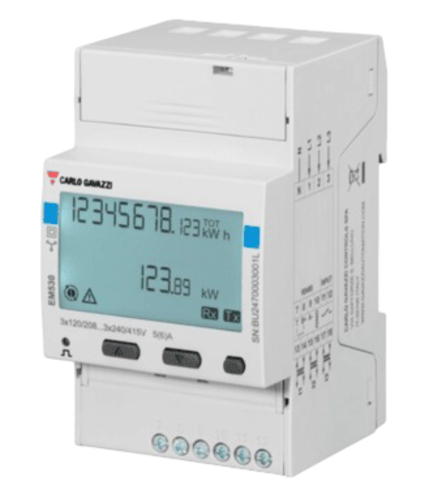

import Image from '@theme/IdealImage';

[Web-Site](https://www.gavazziautomation.com/en-global/product/EM530DINAV53XS1PFB)

### Introduction

The EM5xx series offers a range of compact and versatile energy analyzers designed for monitoring electrical consumption and quality in **single-phase**, **two-phase**, and **three-phase systems**. These devices are ideal for use in residential, commercial, and industrial environments where accurate measurement, reliability, and ease of use are essential.

:::info

This energy meter **requires** the use of an **external sensor**, such as a current transformer (CT), to measure current. The sensor must be selected based on the expected load and system configuration.

:::

 ---

### Power Installation

#### Example of Installation: Carlo Gavazzi Energy Analyzer EM530

| **Carlo Gavazzi Energy Analyzer - EM530** | |
|----------------------------------------|-----------------------------------------------|
| Pin N                                 | **N**                                         |
| Pin 1                                 | **L1**                                         |
| Pin 2                                 | **L2**                                         |
| Pin 3                                 | **L3**                                         |

:::info

 In this case, it is also possible to connect the energy analyzer in single-phase mode, by wiring the neutral (N) to the N terminal and the phase (L) to terminal 1.

:::

#### Connection Diagram (EM530)

 ---
### Sensor Installation

#### Example of Installation: Split Core Current Transformer CTA6X200A5A

| **Carlo Gavazzi Energy Analyzer - EM530** | **Split Core Current Transformer - CTA6X200A5A** |
|----------------------------------------|-----------------------------------------------|
| Pin 13                                 | **K**                                         |
| Pin 14                                 | **L**                                         |

#### Connection Diagram (CTA6X200A5A)

---

### Modbus Communication

#### Example of Modbus Communication Installation: Carlo Gavazzi Energy Analyzer EM530

| **Carlo Gavazzi Energy Analyzer – EM530** | **CHESTER Modbus** |
|---------------------------|--------------------|
| Pin 9                     | Pin 6 (A−)      |
| Pin 8                     | Pin 7 (B+)        |
| Pin 10                    | Pin 1 (GND)        |

#### Modbus communication (EM530)

---

### Browsing and Configuration Buttons

* `▲` **Up button**
    1. Navigation through the menu
    2. Increasing the value

* `▼` **Down button**
    1. Navigation through the menu
    2. Decreasing the value

* `⯀` **Select / Enter / Menu button**

---

### Modbus Communication Configuration

1. Press the **Select** button to open the menu.  
2. Use the **Select** button to choose the **Setting** option.  
3. Use the **Up/Down** buttons to select the menu item: `r5485`.  
4. Enter the configuration values according to the table below.

#### Default Modbus Communication Configuration

| Address | Baud Rate | Parity | Stop Bit |
|---------|-----------|--------|-----------|
| 1       | 9.6k      | None   | 1         |

---

### CT Ratio Configuration

1. Press the **Select** button to open the menu.  
2. Use the **Select** button to choose the **Reset** option.  
3. Use the **Up/Down** buttons to navigate to the menu item **MID res**.  
4. Press **Start**.  
5. Enter the CT ratio values.  
6. Confirm the settings by selecting **YES** using the **Up** button, then press the **Select** button.

### Example of CT Ratio Selection

**Carlo Gavazzi Split Core Current Transformer - CTA6X200A5A**

| Model       | CT Ratio          |
|-------------|-------------------|
| CTA6X200A5A | 40 *(200:5 → 40)* |

:::info

 The CT ratio is selected based on the maximum expected primary current. For example, if the system's maximum current is around 200 A, a 200:5 CT (40 CT) is chosen to step this down to 5 A for measurement devices.

:::
>

---

