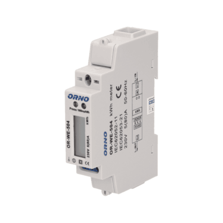
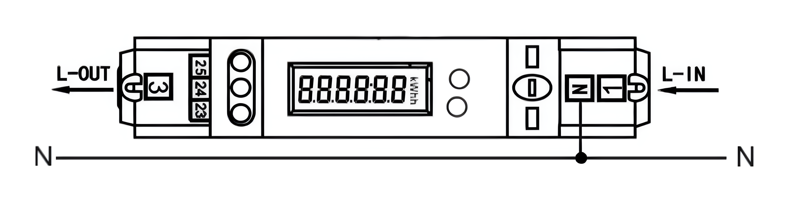

import Image from '@theme/IdealImage';

[Web-Site](https://www.orno.pl/en/energy-meters-without-mid/340-1-phase-energy-meter-wtih-rs-485-80a-5901752481282.html#download)



### Description

The **OR-WE-504** is a compact **single-phase** energy meter designed for monitoring electrical parameters and active energy consumption.
It is equipped with an **RS-485 Modbus RTU interface** for remote data reading.

This device **is not MID-certified** and is intended for **technical monitoring**, not fiscal metering.

:::info

This energy meter **does not require any external current sensors**.
Current and voltage are measured directly via internal circuitry.

:::

---

### Power Installation

#### Example of Installation: ORNO Energy Analyzer - OR-WE-504

| **ORNO Energy Analyzer - OR-WE-504** | |
|-------------------------------------|----------------|
| Pin 1                               | **L (IN)**     |
| Pin N                               | **N (IN)**     |
| Pin 3                               | **L (OUT)**    |

#### Connection Diagram (OR-WE-504)



:::info

The neutral conductor can be connected either directly to the meter’s **N terminal** or to a neutral busbar in the distribution panel.

:::

---

### Modbus Communication

#### Example of Modbus Communication Installation: ORNO Energy Analyzer - OR-WE-504

| **ORNO Energy Analyzer - OR-WE-504** | **CHESTER Modbus** |
|-------------------------------------|--------------------|
| Pin 23                              | Pin 7 (A)          |
| Pin 25                              | Pin 6 (B)          |
| Pin 24 (optional)                  | GND (optional)    |

#### Connection Diagram (OR-WE-504)


:::info

If the RS-485 converter does not support a GND terminal, **Pin 24 does not need to be connected**.

:::

---

### Modbus Communication Configuration

The communication parameters of the OR-WE-504 can be configured using one of the following methods.

---

#### 1. Using the Official ORNO Software

Communication parameters can be configured via the official ORNO configuration software.

[**Download ORNO configuration software for OR-WE-504**](https://files.orno.pl/support/Others/ORNO/ORWE504_5901752481282/OR-WE-504_program.zip)

To connect the device to your PC, use a **standard USB–RS485 converter**.

:::info

Connect the USB side of the USB–RS485 converter to your computer.
Connect the RS-485 lines to the energy meter:
- **A → Pin 23**
- **B → Pin 25**

:::

---

#### 2. Using the Chester Terminal

You can access the Chester terminal using one of the following options:

- Use the **HARDWARIO Manager app** (desktop or mobile)
- Use the **Cloud Terminal** in **[HARDWARIO Cloud](https://hardwario.cloud/)**
- Use the **Google Chrome terminal** at **[terminal.hardwario.com](https://terminal.hardwario.com/)**

---

#### Modbus Communication Configuration for Chester

Use the following commands to configure communication parameters via the Chester terminal:

#### Configuration of Chester

```
app config modbus-baud "9600"
app config modbus-addr "1"
app config modbus-parity "none"
app config modbus-stop-bits "1"
app config em-type "orno"
config save
```

---

### Default Modbus Communication Configuration

| Address | Baud Rate | Parity | Stop Bit |
|--------|-----------|--------|----------|
| 1      | 9.6k      | None   | 1        |

:::info

The table above shows the default communication settings.
However, the energy meter may already be configured differently.

Before applying these settings in Chester, verify the actual communication parameters
using the ORNO configuration software.

Make sure the Chester configuration **matches the meter configuration**.

:::

---

### Measured Values

| Measured Value | Key / Path |
|---------------|------------|
| Voltage       | E_ENERGY_METER.METER_1.VOLTAGE.MEASUREMENTS |
| Current       | E_ENERGY_METER.METER_1.CURRENT.MEASUREMENTS |
| Frequency     | E_ENERGY_METER.METER_1.FREQUENCY.MEASUREMENTS |
| Power         | E_ENERGY_METER.METER_1.POWER.MEASUREMENTS |
| Power Factor  | E_ENERGY_METER.METER_1.POWER_FACTOR.MEASUREMENTS |
| Energy In     | E_ENERGY_METER.METER_1.ENERGY_IN.MEASUREMENTS |

---