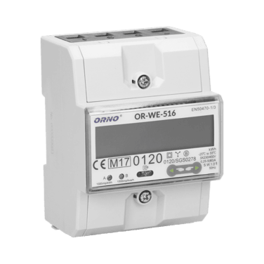
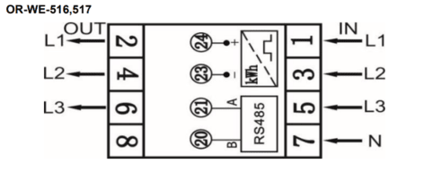
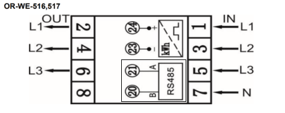

import Image from '@theme/IdealImage';

[Web-Site](https://www.orno.pl/en/energy-meters-with-mid/349-3-phase-energy-meter-with-rs-485-80a-mid-4-5-modules-din-th-35mm-5902560322415.html#download)



### Introduction

The OR-WE-516 is a compact **three-phase** energy meter designed for accurate measurement of active energy in electrical installations. It is equipped with an **RS-485 Modbus interface** for remote data reading and is MID-certified for fiscal metering applications.

:::info

This energy meter **does not require** any **external sensor** for current measurement. It features built-in measurement capability through direct connection.

:::

 ---

### Power Installation

#### Example of Installation: ORNO Energy Analyzer - OR-WE-516

| **ORNO Energy Analyzer - OR-WE-516** | |
|----------------------------------------|-----------------------------------------------|
| Pin 1                                  | **L1 (IN)**                                    |
| Pin 3                                  | **L2 (IN)**                                   |
| Pin 5                                  | **L3 (IN)**                                    |
| Pin 7                                  | **N (IN)**                                   |
| Pin 2                                  | **L1 (OUT)**                                    |
| Pin 4                                  | **L2 (OUT)**                                   |
| Pin 6                                  | **L3 (OUT)**                                    |

#### Connection Diagram (OR-WE-516)



:::info

In this case, it is also possible to connect the energy analyzer in single-phase mode, by wiring the phase (L) to terminal 1, the neutral (N) to terminal 7, and the output phase (L out) to terminal 2.

:::

---

### Modbus Communication

#### Example of Modbus Communication Installation: ORNO Energy Analyzer - OR-WE-516

| **ORNO Energy Analyzer - OR-WE-516** | **CHESTER Modbus** |
|---------------------------|--------------------|
| Pin 21                     | Pin 6 (A−)      |
| Pin 20                     | Pin 7 (B+)        |


#### Connection Diagram (OR-WE-516)



---

### Browsing and Configuration Buttons

* `➡️` **Right button**
    * Navigate right in the menu

* `⬅️` **Left button**
    * Navigate left in the menu

---

### Modbus Communication Configuration


You can edit the communication settings of the ORNO energy meter using one of the following methods:


#### 1. Using the Official ORNO Software

Communication parameters can be configured directly via the official software provided by ORNO.  
The configuration tool can be downloaded here:  
**[Download ORNO configuration software for OR-WE-516](OR-WE-516_program.7z)**

To connect the device to your PC, use a **standard USB–RS485 converter**.  

:::info
Connect the USB side of a standard USB–RS485 converter to your computer, where the ORNO configuration software is installed.
Then, connect the RS485 side of the converter to the energy meter’s communication terminals by wiring **terminal A to pin 21** and **terminal B to pin 20**.
:::


#### 2. Using the Chester Terminal

There are multiple options to access the terminal:

- Use the **HARDWARIO Manager app** (desktop or mobile)
- Use the **Cloud Terminal** in **[HARDWARIO Cloud](https://hardwario.cloud/)**
- Use the **Google Chrome terminal** at **[terminal.hardwario.com](https://terminal.hardwario.com/)**


#### Commands for Setting Communication Parameters

Use the following commands to configure communication parameters on the energy meter via Chester terminal:

#### Reporting Interval
```
app config interval-sample 300
```
#### Polling Interval
```
app config interval-poll 0
```
#### Reporting Interval
```
app config interval-report 900
```
#### Baud Rate
```
app config modbus-baud 9600
```
#### Modbus Address
```
app config modbus-addr 1
```
#### Parity
```
app config modbus-parity "none"
```
#### Stop bits
```
app config modbus-stop-bits "1"
```
#### Energy Meter Type
```
app config em-type "g1"
```
#### After entering all the commands above, make sure to run:
```
Config save
```
---

### Default Modbus Communication Configuration

| Address | Baud Rate | Parity | Stop Bit |
|---------|-----------|--------|-----------|
| 1       | 9.6k      | None   | 1         |

:::info
The table above shows the default communication settings used in our setup.  
However, the energy meter may have different values already configured.  
Before applying these settings in Chester, you should check the actual communication parameters in the energy analyzer's menu. [➡️Navigation in the energy meter menu⬅️](#browsing-and-configuration-buttons)  
Make sure to match the settings in Chester according to the values configured in the energy meter.
:::

---