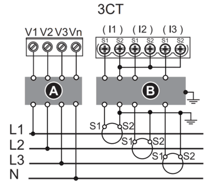
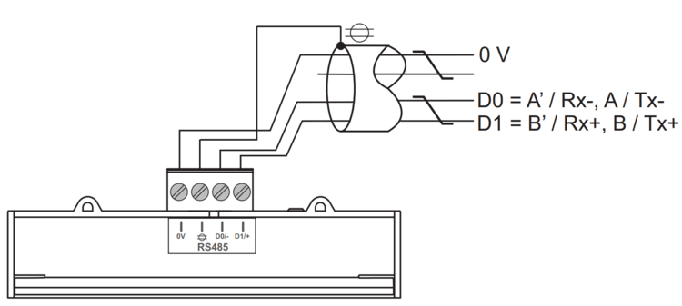

import Image from '@theme/IdealImage';

[Web-Site](https://www.se.com/cz/cs/product/A9MEM3255/iem3250-elektrom%C4%9Br-ct-modbus-2-digit%C3%A1ln%C3%AD-vstupy/)

<div class="container">
  <div class="row">
    <div class="col col--8">
      <div style={{ width: '376px', height: '376px' }}>
        <Image img={require('./schneider-electric-iem3000-series.png')} />
      </div>
    </div>
    <div class="col col--24"></div>
  </div>
</div>
<br />

### Description

The iEM3200 series consists of compact, DIN-rail mounted energy meters designed for accurate and certified measurement of electrical energy in **single-phase** and **three-phase systems**. These meters are MID-compliant, making them suitable for both fiscal metering and cost allocation applications in residential, commercial, and light industrial installations.

:::info

This energy meter **requires** the use of an **external sensor**, such as a current transformer (CT), to measure current. The sensor must be selected based on the expected load and system configuration.

:::

 ---

### Power Installation

#### Example of Installation: Schneider Electric Energy Analyzer IEM3250

| **Schneider Electric Energy Analyzer IEM3250** | |
|----------------------------------------|-----------------------------------------------|
| Pin V1                                 | **L1**                                         |
| Pin V2                                 | **L2**                                         |
| Pin V3                                 | **L3**                                         |
| Pin Vn                                 | **N**                                         |

:::info

 In this case, it is also possible to connect the energy analyzer in single-phase mode, by wiring the neutral (N) to the Vn terminal and the phase (L) to terminal V1.

:::

---

### Sensor Installation

#### Example of Installation: Carlo Gavazzi AC Current Transformer CTD-1X 100 5A XXX


| **Electric Energy Analyzer IEM3250** | **Carlo Gavazzi AC Current Transformer CTD-1X 100 5A XXX** |
|----------------------------------------|-----------------------------------------------|
| Pin S1                                 | **S1 (K)**                                         |
| Pin S2                                | **S2 (L)**                                         |

#### Connection Diagram (IEM3250)



---

### Modbus Communication

#### Example of Modbus Communication Installation: Schneider Electric Energy Analyzer IEM3250

| **Schneider Electric Energy Analyzer IEM3250** | **CHESTER Modbus** |
|---------------------------|--------------------|
| Pin D0/-                     | Pin 6 (A−)      |
| Pin D1/+                    | Pin 7 (B+)        |
| Pin 0V                    | Pin 1 (GND)        |

#### Modbus communication (IEM3250)



---

### Browsing and Configuration

* `▼` **Arrow button**
    1. Navigation through the menu
    2. Increasing/Decreasing the value

* `OK` **Select / Enter / Menu button**
  
* `ESC` **Escape button**

---

### Modbus Communication and CT Ratio Configuration for Energy Analyzer

1. Press and hold the `OK` and `ESC` buttons until the password prompt appears.  
2. Enter the password using the `▼` (**Arrow button**) button. (Default password for new meters is `0010`.)  
3. After entering the correct password, the configuration menu will appear.  
4. Use the `▼` (**Arrow button**) button to navigate to the menu item: `Communication – Change?`.  
5. Press the `OK` button to enter communication settings.  
6. Configure the following parameters as needed:  
   • Address  
   • Baud Rate  
   • Parity  
   • Stop Bit 
   • Stop Bit   
7. Continue using the `▼` (**Arrow button**) button to scroll to the end of the menu.  
8. At the `Exit Config` option, press the `OK` button to confirm and save the settings.

#### Default Modbus Communication Configuration

| Address | Baud Rate | Parity | Stop Bit |
|---------|-----------|--------|-----------|
| 1       | 9.6k      | None   | 1         |

---

### Modbus Communication Configuration for Chester

Use the following commands to configure communication parameters via Chester terminal:


```
app config modbus-baud "9600"
app config modbus-addr "1"
app config modbus-parity "none"
app config modbus-stop-bits "1"
app config em-type "g4"
config save
```

---

### Example of CT Ratio Selection

**Carlo Gavazzi AC Current Transformer CTD-1X 100 5A XXX**

| Model       | CT Ratio          |
|-------------|-------------------|
| CTD-1X 100 5A XXX | 20 *(100:5 → 20)* |

:::info

 The CT ratio is selected based on the maximum expected primary current. For example, if the system's maximum current is around 100 A, a 100:5 CT (20 CT) is chosen to step this down to 5 A for measurement devices.

:::
>
### Measured values

| Measured Value | Key / Path                                   |
|----------------|----------------------------------------------|
| Current        | E_ENERGY_METER.METER_4.CURRENT.MEASUREMENTS  |
| Power          | E_ENERGY_METER.METER_4.POWER.MEASUREMENTS    |
| Frequency      | E_ENERGY_METER.METER_4.FREQUENCY.MEASUREMENTS|
| Energy In      | E_ENERGY_METER.METER_4.ENERGY_IN.MEASUREMENTS|
| Energy Out     | E_ENERGY_METER.METER_4.ENERGY_OUT.MEASUREMENTS|
| Voltage L1     | E_ENERGY_METER.METER_4.VOLTAGE_L1.MEASUREMENTS|
| Voltage L2     | E_ENERGY_METER.METER_4.VOLTAGE_L2.MEASUREMENTS|
| Voltage L3     | E_ENERGY_METER.METER_4.VOLTAGE_L3.MEASUREMENTS|
| Current L1     | E_ENERGY_METER.METER_4.CURRENT_L1.MEASUREMENTS|
| Current L2     | E_ENERGY_METER.METER_4.CURRENT_L2.MEASUREMENTS|
| Current L3     | E_ENERGY_METER.METER_4.CURRENT_L3.MEASUREMENTS|
| Power L1       | E_ENERGY_METER.METER_4.POWER_L1.MEASUREMENTS |
| Power L2       | E_ENERGY_METER.METER_4.POWER_L2.MEASUREMENTS |
| Power L3       | E_ENERGY_METER.METER_4.POWER_L3.MEASUREMENTS |

---
