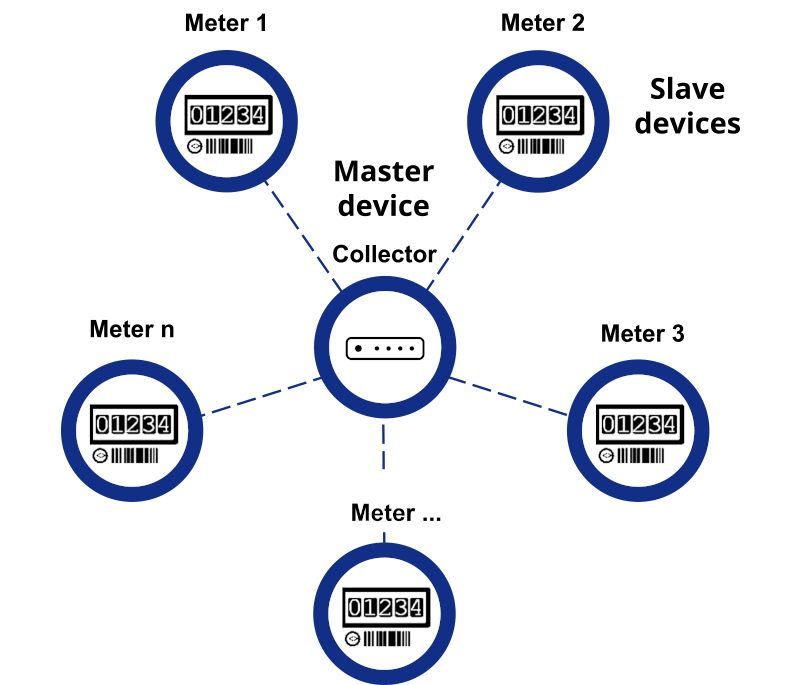

import Image from '@theme/IdealImage';

# wM-Bus Sensors

Here is list of tested sensors by HARDWARIO with basic configuration to use:

| Name of sensor                                                             | Type of sensor |
|----------------------------------------------------------------------------|----------------|
| [**BMeters IWM-TX3**](chester/supported-sensors/wm-bus/bmeters_iwm-tx3.md) | Watermeter     |

# Wireless M-Bus (wM-Bus) Communication Overview



*Figure: Example architecture using Wireless M-Bus devices communicating with a gateway.*

## What is Wireless M-Bus?

Wireless M-Bus (wM-Bus) is an extension of the wired M-Bus protocol defined by the EN 13757 standard, enabling wireless communication between utility meters and data collectors. It is primarily used in applications requiring remote meter reading over longer distances without the need for physical cabling.

wM-Bus is optimized for low-power, low-bandwidth communication, making it ideal for battery-powered metering devices in residential, commercial, and industrial environments.

---

## Wireless Modes and Frequencies

wM-Bus supports several modes depending on use case:
- **S-Mode**: Stationary, one-way communication (e.g., daily metering)
- **T-Mode**: Frequent transmissions with support for two-way communication
- **C-Mode**: Continuous communication with acknowledgment (bidirectional)
- **R-Mode**: Repeater mode for extending range

### Frequency Bands
- **868 MHz** (Europe)
- **433 MHz** (some regions)
- Data rate typically ranges from 2.4 kbps to 100 kbps depending on mode

---

## Hardware Requirements

### Components
- **wM-Bus Meters**: Battery-powered smart meters (gas, water, heat, electricity)
- **wM-Bus Receiver or Gateway**: Device with a radio module capable of demodulating and decoding wM-Bus frames
- **Antenna**: Proper RF antenna required for 868 MHz operation

### Power Consumption
- Designed for ultra-low power: meters may operate for >10 years on a single battery

---

## Data Format

wM-Bus shares its application layer with wired M-Bus (EN 13757-3):
- Uses the same telegram structure with encrypted or plaintext payloads
- Data is structured in DIF/VIF format
- Support for AES-128 encryption (optional, standard in many implementations)

### Message Structure
- Preamble
- Synchronization
- Header (CI field, Access number, status)
- Payload (Application Data)
- CRC checksum

### Example Output (Parsed JSON)
```json
{
  "device_id": "WMBS-98765432",
  "timestamp": "2025-04-29T08:15:00Z",
  "water_m3": 35.42,
  "battery_voltage_v": 3.01,
  "rssi_dbm": -80
}
```

---

## Applications

- **Automated meter reading (AMR)**
- **Smart city infrastructure**
- **Remote monitoring** in buildings and utilities
- **Energy efficiency audits**

---

## Advantages of wM-Bus
- No physical wiring required
- Long battery life (5–15 years typical)
- Reliable and standardized communication
- Well-supported in European utility infrastructure
- Support for encryption and secure authentication

---

## Limitations

- Limited bandwidth (not suitable for large or frequent data uploads)
- Susceptible to RF interference
- Regional regulatory constraints on ISM bands
