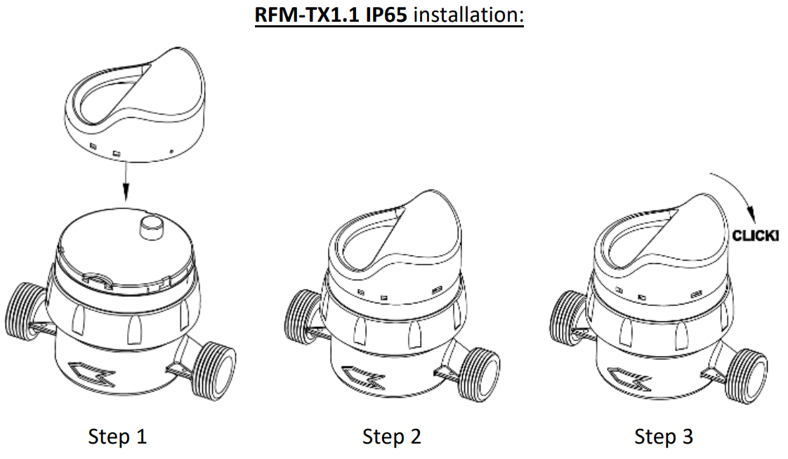

import Image from '@theme/IdealImage';

# BMeters RFM-TX1.1

[Web-Site](https://www.bmeters.com/en/products/rfm-tx1/)

  

    

      

        <Image img={require('./images/bmeters-rfm-tx1.1.png')} width={376} height={376} />
      

    

    

  

 

## Description

The RFM-TX1.1 is a radio module suitable for the consumption data transmission and applicable to the single jet GSD8-RFM water meters.

## Configuration

:::info

The device is delivered **pre-configured**, but it can be reprogrammed and customized through [**BMetering Software**](http://keygenerator.bmetering.com/API/DownloadBMetering).

:::

### Configuration Procedure

1. Configure the radio module using the [**RFM-RX2 receiver**](https://www.bmeters.com/en/products/rfm-rx2/) and [**BMetering Software**](http://keygenerator.bmetering.com/API/DownloadBMetering).  
2. Press the **red button** located on the lower plate of the module to start the configuration.  
3. Observe the **red LED**:  
   - If it blinks continuously for about **20 seconds**, the configuration is successful.  
   - If it blinks only for a couple of seconds, the configuration failed and the procedure must be repeated.  
4. After successful configuration, **connect the module to the meter** as shown in the picture.  
5. Carefully **align the optical index of the meter** with the hole on the module’s plate.  
6. With one hand, hold the meter’s rotating dial steady. With the other hand, press the module onto the meter and **rotate clockwise** to lock it in place.  
7. Verify in the **reading software** that data collection is correct and that no alarms are active.  
8. (Optional) To prevent tampering, insert the **orange seal** into the two small holes on the left side of the module and apply an **adhesive seal**.  

## Wireless M-Bus Address Configuration

### Where to Find the Address on the Device

The address is located on the **left side below the barcode**, as shown in the image below (8 digits).  

  

    

      

        <Image img={require('./adress-location/bmeters-rfm-tx1.1.png')} width={376} height={376} />
      

    

    

  

 

---

### Mapping the wM-Bus Address to Chester

The mapping must be carried out using the **Chester terminal**, for example with:  

- [**Hardwario Monitor (Windows)**](https://github.com/hardwario/hio-monitor/releases)
- [**Hardwario Manager (Android)**](https://play.google.com/store/apps/details?id=com.hardwario.manager)
- [**Google Chrome Terminal**](https://terminal.hardwario.com/)

---

### Managing and Adding wM-Bus Device Addresses in Chester

Here you can manage the list of **wM-Bus addresses** (**add/remove**), adjust scan settings, and review example configurations for typical setups.  

- [**Address List Configuration**](/chester/catalog-applications/chester-wm-bus#address-list-configuration) – **manage and edit** the list of linked wM-Bus **addresses**  
- [**Scan Configuration**](/chester/catalog-applications/chester-wm-bus#scan-configuration) – **adjust scan settings** for device communication 
- [**Example Configurations**](/chester/catalog-applications/chester-wm-bus#example-configurations) – reference **templates** for typical setups 

---

## Message Encryption and Key Management

The **transmitted messages are encrypted** to optimize energy consumption during data transmission, which extends the overall battery life.

The **received data must therefore be decrypted**, which is done using **decryption keys**.  
To achieve this, there are two options:

- [**Hardwario Cloud**](/chester/catalog-applications/chester-wm-bus#hardwario-cloud--decryption-keys) – tutorial on how to enter and manage decryption keys  
- [**Decryption page**](https://wmbusmeters.org/) – online tool for manual data decryption and analysis  
