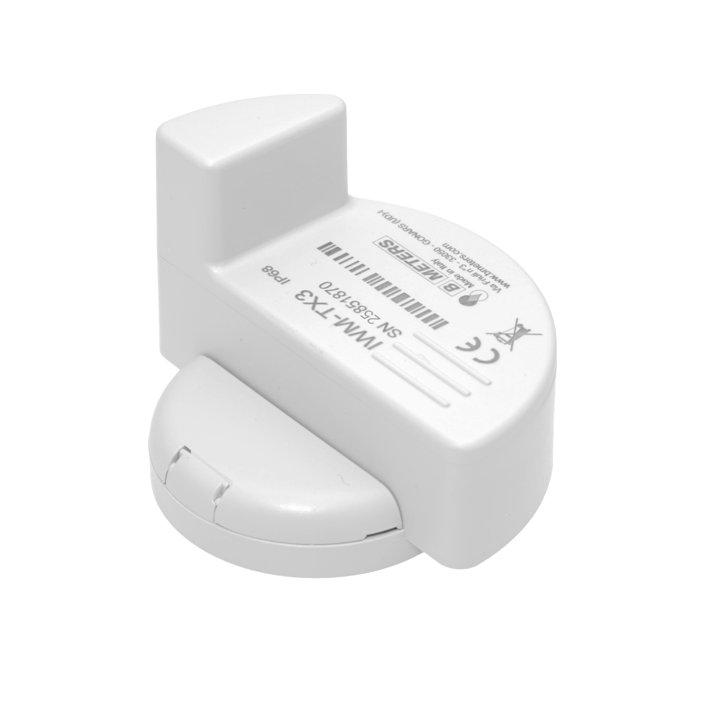

# BMeters IWM-TX3

## Descriptions

[Web-Site](https://www.bmeters.com/en/products/iwm-tx3/)

## Configuration

### Configuration Guide for IWM-TX3 Water Meter via NFC

This guide describes the steps to configure a water meter with an IWM-TX3 NFC module using an Android smartphone.

---

### Step 1: Install the Configuration App

Download the **B METERS NFC Config** application from the Google Play Store:

[https://play.google.com/store/apps/details?id=it.gread.bmeters_appnfc&hl=en](https://play.google.com/store/apps/details?id=it.gread.bmeters_appnfc&hl=en)

You can scan the QR code below to go directly to the app:

---

### Step 2: Connect to the Meter

1. Enable **NFC** on your Android device.
2. Open the **B METERS NFC Config** app.
3. Hold your smartphone close to the NFC tag on the water meter until the connection is established.

---

### Step 3: Select Device Type

From the list of available devices, select:

- **IWM-TX3**

---

### Step 4: Configure Sensor Parameters

Adjust the following settings:

- **AMR**: Check (enable automatic meter reading)
- **Water meter type**: `GMDM-I AF`
- **Transmit during weekend**: Check (enable weekend transmissions)

---

### Step 5: Write Configuration to Meter

1. Bring your phone close to the NFC tag again.
2. Tap the **Write** button.
3. Wait for the message: **Writing Done**.

---

### Step 6: Verify Settings

1. Tap the **Read** button.
2. Check that the configured values match what was written.

Your water meter is now successfully configured.

