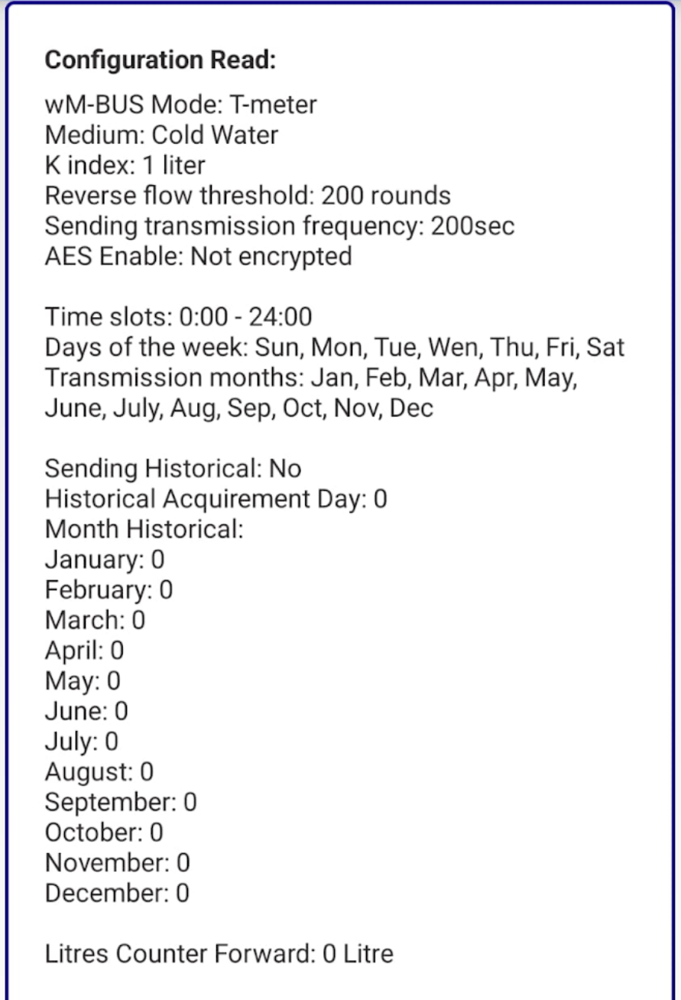

import Image from '@theme/IdealImage';

# BMeters IWM-TX5

[Web-Site](https://www.bmeters.com/en/products/iwm-tx5/)

  

    

      

        <Image img={require('./images/bmeters_iwm-tx5.png')} width={376} height={376} />
      

    

    

  

 

## Description

The IWM-TX5 is a radio module suitable for the consumption data transmission and applicable to the single jet GSD8-I water meters.

## Configuration

### Configuration Guide for IWM-TX5 Water Meter via NFC

This guide describes the steps to configure a water meter with an IWM-TX5 NFC module using an Android smartphone.

---

### Step 1: Install the Configuration App

Download the **B METERS NFC Config** application from the Google Play Store:

[https://play.google.com/store/apps/details?id=it.gread.bmeters_appnfc&hl=en](https://play.google.com/store/apps/details?id=it.gread.bmeters_appnfc&hl=en)

You can scan the QR code below to go directly to the app:

---

### Step 2: Connect to the Meter

1. Enable **NFC** on your Android device.
2. Open the **B METERS NFC Config** app.
3. Hold your smartphone close to the NFC tag on the water meter until the connection is established.

---

### Step 3: Select Device Type

From the list of available devices, select:
- **IWM-TX5**

---

### Step 4: Configure Sensor Parameters

Adjust the following settings:

- **AMR**: Check (enable automatic meter reading)
- **Water meter type**: `GSD8-I AF DN15`
- **Transmit during weekend**: Check "Saturday" and "Sunday" and "Send Date and Time"
- **Global encryption**: Check (Use of a global key instead of an individual one)

---

### Step 5: Write Configuration to Meter

1. Bring your phone close to the NFC tag again.
2. Tap the **Write** button.
3. Wait for the message: **Writing Done**.

---

### Step 6: Verify Settings

1. Tap the **Read** button.
2. Check that the configured values match what was written.

Your water meter is now successfully configured.

## Wireless M-Bus Address Configuration

### Where to Find the Address on the Device

The address is located **in the center below the barcode**, after the **CE mark**, as shown in the image below (8 digits).  

  

    

      

        <Image img={require('./adress-location/bmeters_iwm-tx5.png')} width={376} height={376} />
      

    

    

  

 

---

### Mapping the wM-Bus Address to Chester

The mapping must be carried out using the **Chester terminal**, for example with:  

- [**Hardwario Monitor (Windows)**](https://github.com/hardwario/hio-monitor/releases)
- [**Hardwario Manager (Android)**](https://play.google.com/store/apps/details?id=com.hardwario.manager)
- [**Google Chrome Terminal**](https://terminal.hardwario.com/)

---

### Managing and Adding wM-Bus Device Addresses in Chester

Here you can manage the list of **wM-Bus addresses** (**add/remove**), adjust scan settings, and review example configurations for typical setups.  

- [**Address List Configuration**](/chester/catalog-applications/chester-wm-bus#address-list-configuration) – **manage and edit** the list of linked wM-Bus **addresses**  
- [**Scan Configuration**](/chester/catalog-applications/chester-wm-bus#scan-configuration) – **adjust scan settings** for device communication 
- [**Example Configurations**](/chester/catalog-applications/chester-wm-bus#example-configurations) – reference **templates** for typical setups 

---

## Message Encryption and Key Management

The **transmitted messages are encrypted** to optimize energy consumption during data transmission, which extends the overall battery life.

The **received data must therefore be decrypted**, which is done using **decryption keys**.  
To achieve this, there are two options:

- [**Hardwario Cloud**](/chester/catalog-applications/chester-wm-bus#hardwario-cloud--decryption-keys) – tutorial on how to enter and manage decryption keys  
- [**Decryption page**](https://wmbusmeters.org/) – online tool for manual data decryption and analysis  

