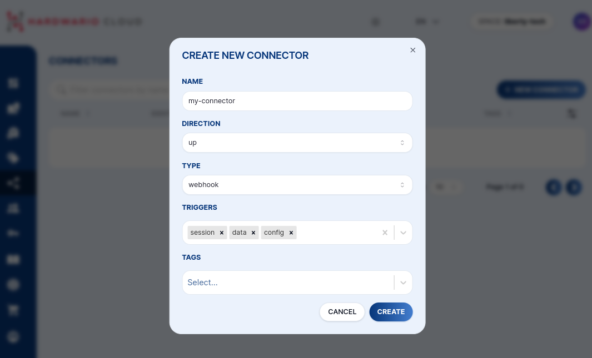
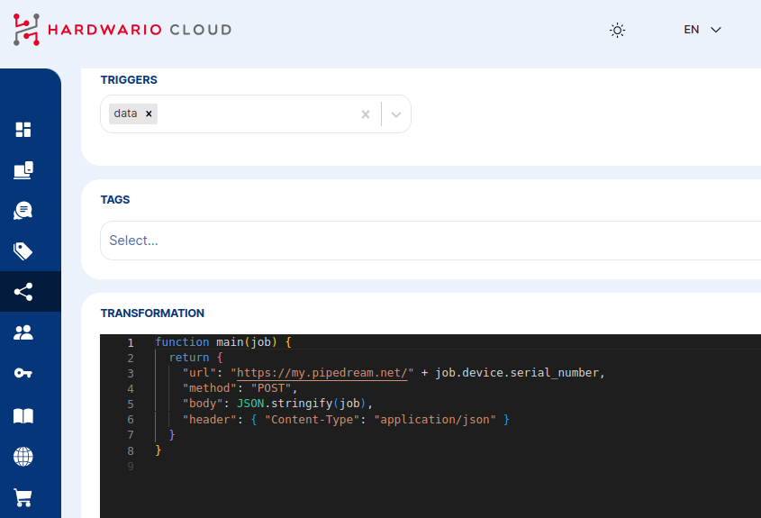
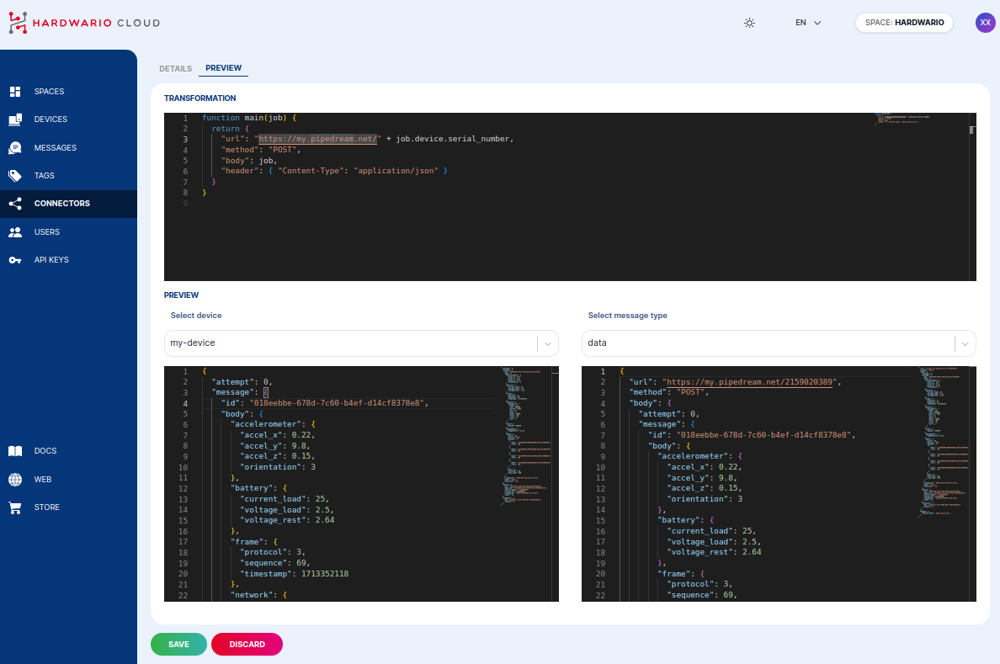

# Connectors

A **Connector** is a webhook that the Cloud calls every time a device sends an uplink message. Connectors are the primary way to push data from HARDWARIO Cloud to your own system, database, or third-party service.

## How Connectors Work

1. A device sends an uplink message to the Cloud
2. The Cloud finds all connectors that share a **tag** with the device
3. For each matching connector, the Cloud runs the **transformation function**
4. The transformed payload is sent as an HTTP request to your endpoint

```
Device ──uplink──▶ Cloud
                     │
              [tag matching]
                     │
              Connector 1  ──HTTP POST──▶  Your backend
              Connector 2  ──HTTP POST──▶  Grafana / Ubidots / ...
```

## Creating a Connector

1. Go to **Connectors** in the left sidebar
2. Click **+ NEW CONNECTOR**
3. Fill in:
   - **Name** — identifier for this connector
   - **Tags** — which device tags this connector listens to
   - **Triggers** — which message types trigger it (see below)
4. Write a **transformation function** (see below)
5. Click **Create**



## Triggers

Select which message types trigger the connector:

| Trigger | Description |
|---|---|
| `data` | Periodic uplink with sensor readings — most common |
| `session` | Boot message with firmware and network info |
| `config` | Configuration change acknowledgment |
| `stats` | Internal Cloud statistics |
| `codec` | Encoder/decoder key updates |

## Transformation Function

Every connector has a JavaScript function that receives a `job` object and returns the HTTP request to make. This lets you reshape the payload, add authentication headers, or filter messages.



```js
function main(job) {
  let body = job.message.body;
  return {
    "method": "POST",
    "url": "https://your-endpoint.example.com/data",
    "header": {
      "Content-Type": "application/json",
      "Authorization": "Bearer YOUR_TOKEN"
    },
    "data": body
  };
}
```

Returning `null` cancels the callback — useful for conditional forwarding:

```js
function main(job) {
  let temp = job.message.body?.thermometer?.temperature;
  if (temp === undefined) return null; // skip messages without temperature
  return {
    "method": "POST",
    "url": "https://your-endpoint.example.com/temperature",
    "data": { value: temp, device: job.device.name }
  };
}
```

### The `job` Object

The transformation function receives a `job` object with the following structure:

<details>
<summary><b>Show `job` object structure</b></summary>
<p>

```json
{
  "message": {
    "id": "018eebbe-678d-7c60-b4ef-d141f48378e8",
    "type": "data",
    "direction": "up",
    "created_at": "2024-04-17T11:08:27.917Z",
    "body": {
      "thermometer": { "temperature": 22.43 },
      "accelerometer": { "accel_x": 0.22, "accel_y": 9.8, "accel_z": 0.15, "orientation": 3 },
      "network": {
        "parameter": { "band": 20, "rsrp": -95, "rsrq": -6, "snr": 2 }
      }
    }
  },
  "device": {
    "id": "018a1535-fd39-7293-bd36-52df3e62e962",
    "space_id": "018a14f6-27e3-7293-b7d2-c39d7b0d7cd2",
    "serial_number": "2159020389",
    "name": "my-device",
    "label": { "location": "prague-floor-3" },
    "tags": ["temperature-sensors"]
  },
  "connector": {
    "id": "018aef7c-c122-7893-a07c-70dbc6ebbddc"
  }
}
```

</p>
</details>

## Live Preview

In the connector detail, the **Preview** tab lets you select one of the recent device messages and see in real time how your transformation function processes it — without sending any actual HTTP requests.



## Retry Policy

If the HTTP request fails (non-2xx response or timeout), the Cloud retries automatically. The default retry schedule (in seconds):

`10 → 30 → 60 → 600 → 1800 → 3600 → 10800 → 21600 → 43200`

You can customize the retry intervals in the connector's **Advanced** tab.

## Testing Endpoints

For local testing, use one of these free services to inspect incoming webhooks:

- [**requestinspector.com**](https://requestinspector.com/) — instant public HTTP endpoint
- [**ngrok.com**](https://ngrok.com/) — tunnel to your local machine
- [**tailscale.com**](https://tailscale.com/) — private network with public funnel
