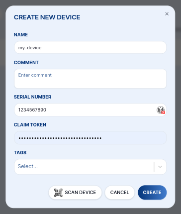

# Devices

The **Devices** page lists all IoT devices registered in your space. Each device corresponds to a physical CHESTER (or other HARDWARIO device) and has its own identity, status, and configuration.

## Adding a Device

:::tip Video Tutorial

Watch [**How to add CHESTER to Cloud**](videos-cloud/cloud-chester-add) for a step-by-step walkthrough.

:::

Click **+ NEW DEVICE** in the top-right corner. You can provision a device in two ways:

### Scan QR Code

Click **SCAN DEVICE** to open the camera scanner. Point it at the QR code on the device label. The scanner fills in the **Serial Number (HSN)** and **Claim Token** automatically.

### Manual Entry

Fill in the fields manually:

| Field | Description |
|---|---|
| **Name** | Human-readable name, e.g. `warehouse-sensor-01` |
| **Serial Number (HSN)** | HARDWARIO Serial Number printed on the device label |
| **Claim Token** | Unique per-device token — visible on the QR code or via `info show` over J-Link RTT |

:::tip

Create at least one [Tag](tags.md) and assign it to the device and a [Connector](connectors.md). Tags are what route the device's uplink messages to your integration.

:::

## Device List

The device list shows a summary for each device:

- **Name** and optional comment
- **Last Seen** — timestamp of the last uplink
- **Firmware** — application name and version
- **Tags** — assigned tags shown as color-coded chips

Click a device row to open its detail page.

## Device Detail

### Overview

Shows the full device profile, populated automatically from session messages:

| Field | Description |
|---|---|
| **Name** | Editable human-readable name |
| **Comment** | Optional free-text note |
| **Serial Number** | HARDWARIO Serial Number (HSN) |
| **Last Seen** | Timestamp of the last received message |
| **Product** | Hardware vendor and product name (e.g. CHESTER-M) |
| **HW Variant / Revision** | Hardware variant string and PCB revision (e.g. R3.4) |
| **Firmware** | Application bundle ID, name and version |
| **LTE Firmware** | Modem firmware version |
| **IMEI / ICCID / IMSI** | LTE modem identifiers |
| **BLE Passkey** | Bluetooth passkey for local BLE configuration |

### Tags

Assign or remove tags on the device. Tags determine which connectors receive this device's messages — a device and a connector must share at least one tag for messages to be forwarded.

### Labels

Labels are **key-value pairs** attached to a device. They are included in every connector callback payload so your backend can react differently per device.

Example use cases:
- `location: prague-warehouse-a`
- `customer: acme-corp`
- `floor: 3`

### Messages

Shows the message history for this specific device. See [Messages](messages.md) for details.

### Firmware

Shows firmware update history and allows scheduling a FOTA update. See [FOTA](fota.md).

### Downlink

Schedule downlink commands to be delivered on the device's next connection. See [Downlink](downlink.md).
