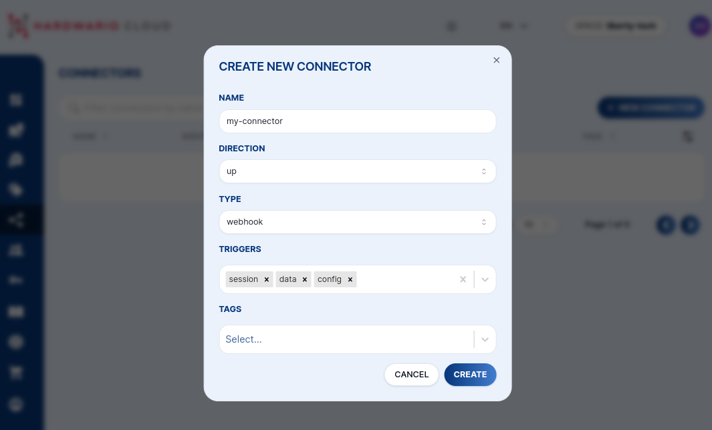

import Image from '@theme/IdealImage';

# Connectors

With a connector, you can create a webhook on the messages from the device.

You can set which type of uplink messages the webhook will be called:
- data
- session
- config
- stats
- codec



## JavaScript

Every message passing through the Cloud is handled by a JavaScript. Users can add further logic or completely reformat JSON which is sent. In script, you can also access all the information from the device like name, tags and labels. You can change HTTP request headers, change URL or completely stop the callback.

```js
function main(job) {
  return {
    "url": "https://best.app.ever/new-message",
    "method": "POST",
    "body": JSON.stringify(job),
    "headers": { "Content-Type": "application/json" }
  }
}
```

## Job object

Here is the structure of the `job` object.

```json
{
    "attempt": 0,
    "message": {
        "id": "018b85a4-673f-7fc7-9742-8c73f8a8e7c8",
        "body": "{\"accelerometer\":{\"accel_x\":0.61,\"accel_y\":9.72,\"accel_z\":0.07,\"orientation\":3},\"battery\":{\"current_load\":26,\"voltage_load\":2.65,\"voltage_rest\":2.8},\"frame\":{\"protocol\":3,\"sequence\":3,\"timestamp\":1698754222},\"network\":{\"parameter\":{\"band\":20,\"cid\":658209,\"earfcn\":6447,\"ecl\":0,\"eest\":7,\"plmn\":23003,\"rsrp\":-91,\"rsrq\":-5,\"snr\":10}},\"state\":{\"uptime\":86461},\"thermometer\":{\"temperature\":21.37}}",
        "created_time": "2023-10-31T12:10:25.983Z",
        "type": "data",
        "link_type": "up"
    },
    "device": {
        "id": "018a4535-fd39-7293-bd36-52df3e62e962",
        "space_id": "018a44f6-27e3-7293-b7d2-c39d7b0d7cd2",
        "serial_number": "2159020389",
        "session_id": "",
        "created_time": "2023-08-30T06:51:20.761Z"
    },
    "connector": {
        "id": "018aef7c-c122-7893-a07c-70dbc6ebbddc",
        "timeout": 0
    }
}
```
