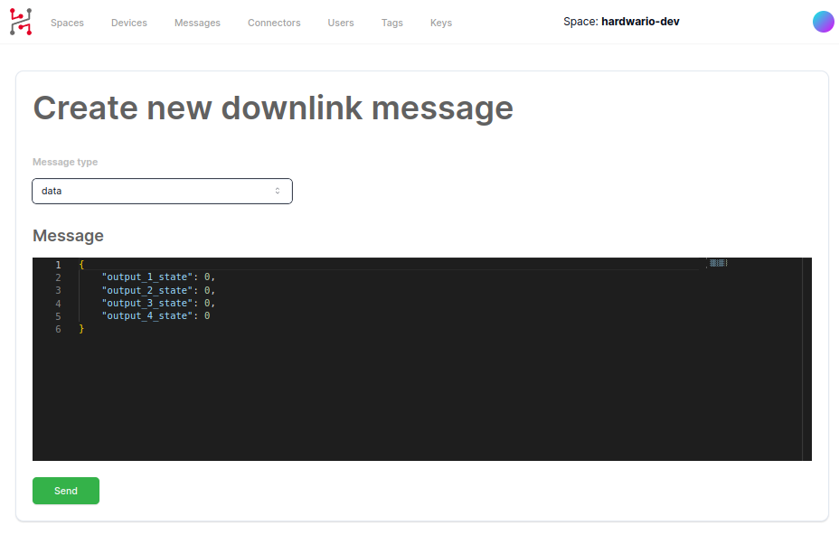

import Image from '@theme/IdealImage';

# Downlink

In the web interface or over API you can send downlink messages:

- Data
- Config
- Shell Commands

If you would like to send config or data from the web interface. Go to the device messages, in the top right corner click on **+&nbsp;SCHEDULE DOWNLINK**.

## Data

You can send JSON commands that the device will decode and your code will receive structure with a filled data.

## Config

You can configure the device the same way as you configure it over BLE or J-Link RTT. Just send for example `app config interval-report 600` command and CHESTER will apply the new configuration when it sends an uplink packet or polls for the new data.

## Shell Commands

In the messages or device detail, you can click on the **shell** icon and the shell console will open.

In the console, you can enter **single or multiple commands** that will be executed next time **CHESTER** will boot, send data or poll to the cloud. After that you will receive the **response of every message** and the response appears in the console. You don't need to keep the console window open. You can schedule commands and return later or the next day to see the results.

