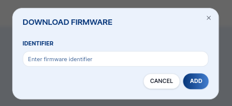

import Image from '@theme/IdealImage';

# Firmware Over The Air updates (FOTA)

You can also update firmware in your CHESTER.

First you need to build and deploy a firmware to our cloud using `hardwario chester app fw upload` command. Please see the [**CHESTER Deploy**](../../chester/firmware-sdk/build-and-deploy#deploy) and [**Firmware Upload**](../../chester/firmware-sdk/build-and-deploy#firmware-upload) chapters.

After you obtain the unique firmware ID like af637aa1c5b842c18f9b10b070cb0292 (newer ones have hyphens), you can click in the device's detail in the **Firmware** tab on the **+ DOWNLOAD FIRMWARE** button and paste the unique value there.

Once the CHESTER boots, send or polls for cloud data, it will start updating.

The update takes around 30 minutes. During this time, the download to the CHESTER will run in the background, so the device will still function normally, measure and send the data.

In the detail, you can see all the steps during the update.

After the new firmware is downloaded, it is swapped between external SPI FLASH and internal MCU FLASH. This takes up to two minutes and the status LED on the CHESTER will blink with green/yellow/red colors. After swapping the CHESTER connects to the HARDWARIO Cloud with the new firmware. This new firmware is validated as _healthy_ and it is confirmed to the cloud that the update finished sucessfully.

The MCUBoot bootloader has a protection, that in case the new firmware don't works correctly, it is swapped to the old version and device connects with the previous old firmware.
