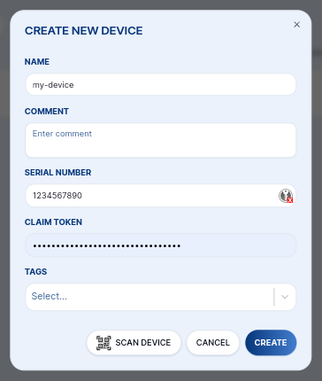

import Image from '@theme/IdealImage';

# Devices

In your space, you add your own devices.

## Create a Device

Click on the **+&nbsp;NEW DEVICE** button in the top right corner and create a new device.

:::tip

Tags are used to connect a group of devices to the connector. So also create at least a single tag and assign it to the **Device** and **Connector** later.

:::

### QR Code Scan

You can use **SCAN DEVICE** button at the bottom of the **CREATE NEW DEVICE** dialog and use the phone or computer camera to scan the device QR Code. The HSN and Claim token is filled from the code.

### Manually

You can add a device manually by filling:

- Name
- HARDWARIO Serial number (HSN)
- Claim token (unique for each device, scan QR code on the device with any QR code reader, or use `info show` in the device connected over J-Link)

