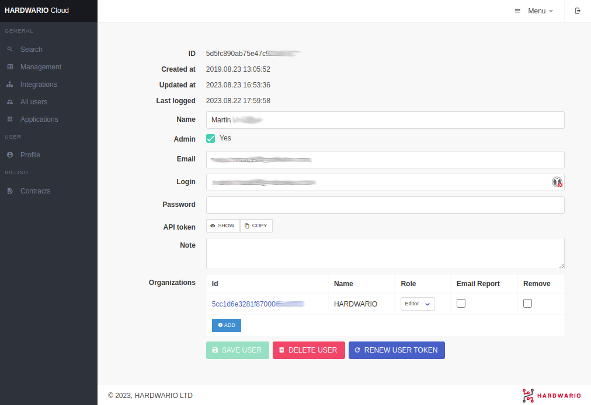
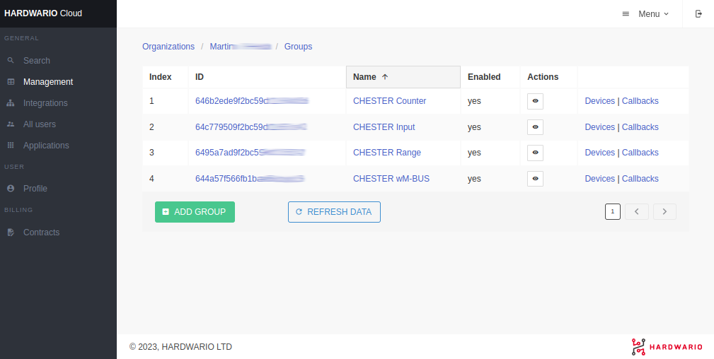
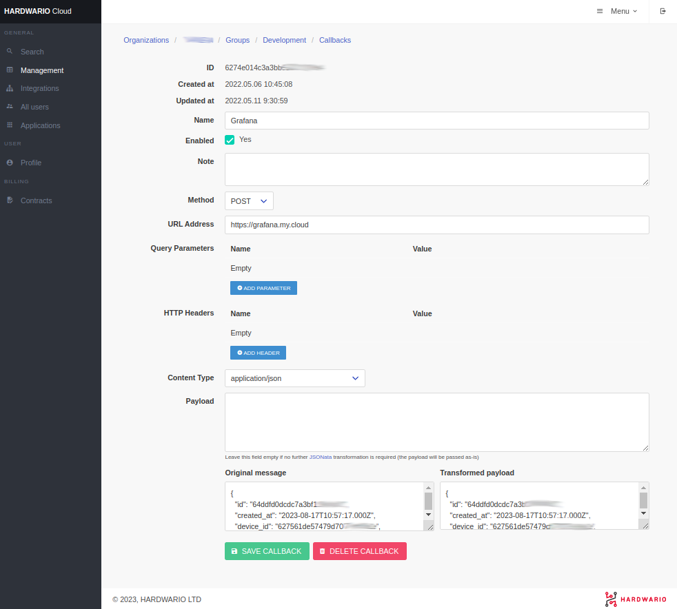
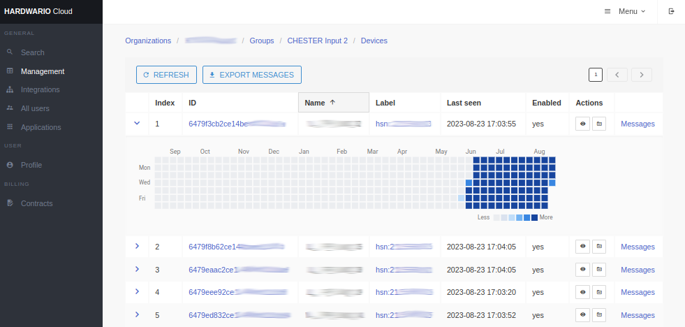
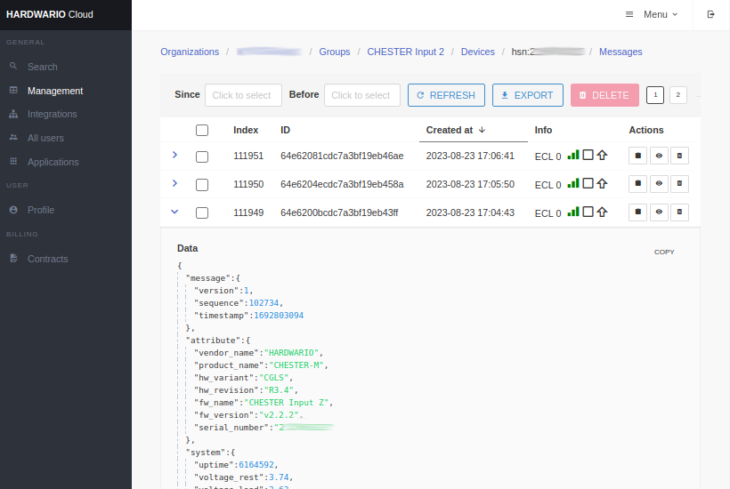

import Image from '@theme/IdealImage';

# CLOUD Overview

[**HARDWARIO Cloud**](https://hardwario.cloud) allows users to manage it's devices.

**HARDWARIO Cloud** has this structure:

- **Organizations** (assigned to users)
- **Groups** (callback configuration)
- **Devices** (display messages)

## User configuration

Here you can set users' login credentials and assign **organizations** and **roles** to them.



## Groups

Here you can see **groups** within the **organization**. Here you can also set the **callbacks** for each group.



## Callbacks

In **callbacks**, you can set URL and HTTP parameters. You can also apply [JSONata](http://docs.jsonata.org/simple) rules and completely change the structure of the JSON. You can also use values from the original JSON in the URL by typing:

```
http://my.callback.cloud/?temperature={{data.hygrometer.temperature.measurements.0.avg}}&humidity={{data.hygrometer.humidity.measurements.0.avg}}
```



## Devices

In the group, you can see all the devices. You can also use a handy visualization that shows how many messages devices sent every day.



## Messages

In the message section, you see all the received and decoded messages in **JSON** format. For each message, you can also check the callback endpoint response.



