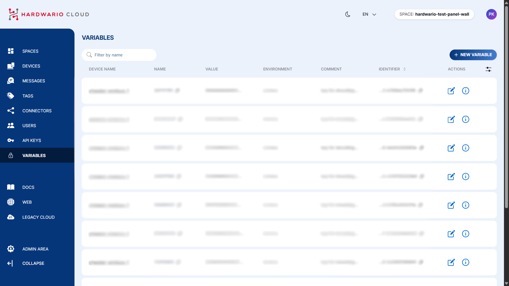
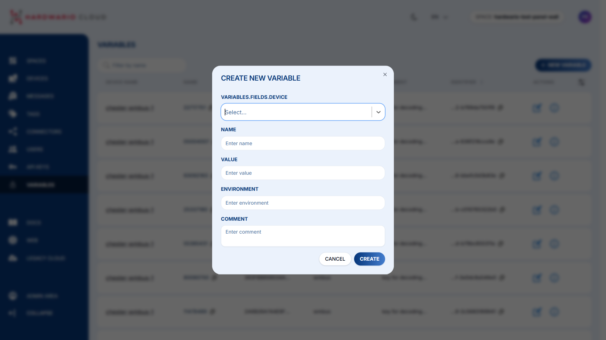

import Image from '@theme/IdealImage';

In the Variables section, you can upload **decryption keys** used to decode data when encryption is applied. Some transmitted data may be encrypted to ensure secure or efficient communication, in which case decryption keys are required to make the data readable. This section explains how to add individual decryption keys to the Cloud through the Variables section.

---

## Setting Up Decryption Keys

### Step-by-Step Instructions

1. In the left sidebar, select **Variables**.  
2. Click the **+ NEW VARIABLE** button in the top-right corner.  

3. Fill in the following information:  
   - **Device** → select your device  
   - **Name of Variable** → enter the wM-Bus address of the device  
   - **Value of Variable** → enter the decryption key assigned to your device  
   - **Environment** → select `wmbus`  
   - **Comment** → optional, you may add a comment if needed  

:::info
If a device is specified, the decryption key applies **only to that specific device**.  
If no device is selected, the key will apply **to the entire space**.
:::

4. Your data should now appear **decrypted** in the Cloud.  