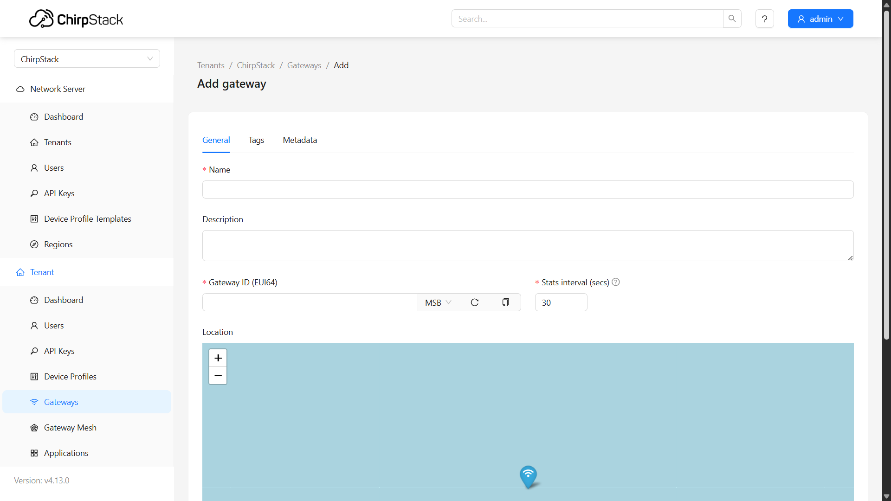

import Image from '@theme/IdealImage';

# ChirpStack v4 - Adding EMBER

This tutorial walks you through the process of adding HARDWARIO Ember (gateways) to ChirpStack v4.

---

## Step-by-Step Instructions

From the left navigation menu, under tenant, select **Gateways** and then click the **Add Gateway** button in the top right.  

A form will appear where you can enter gateway information such as:  
- **Name**  
- **Gateway ID**  
- **Stats Interval**  

Once completed, click **Submit**.  

:::info
The **Gateway ID** can be found through **[MikroTik software](/ember/mikrotik/gateway-configuration#c-link-lora-device-to-the-new-server)**.  
:::