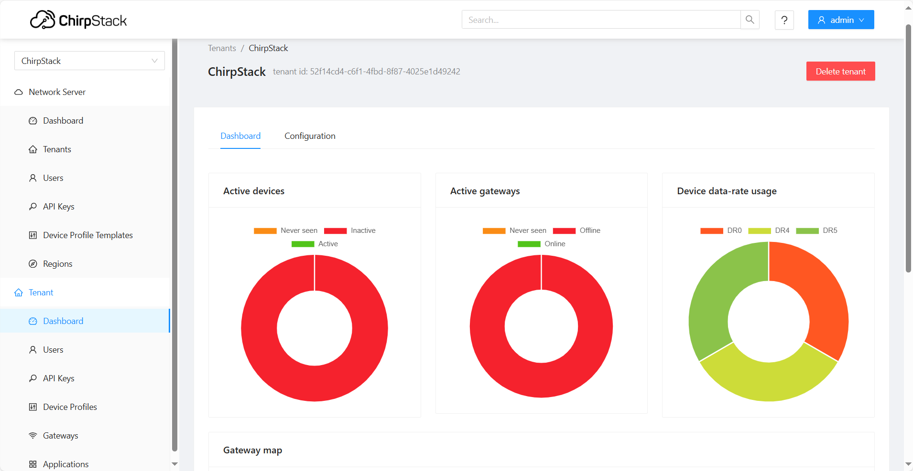
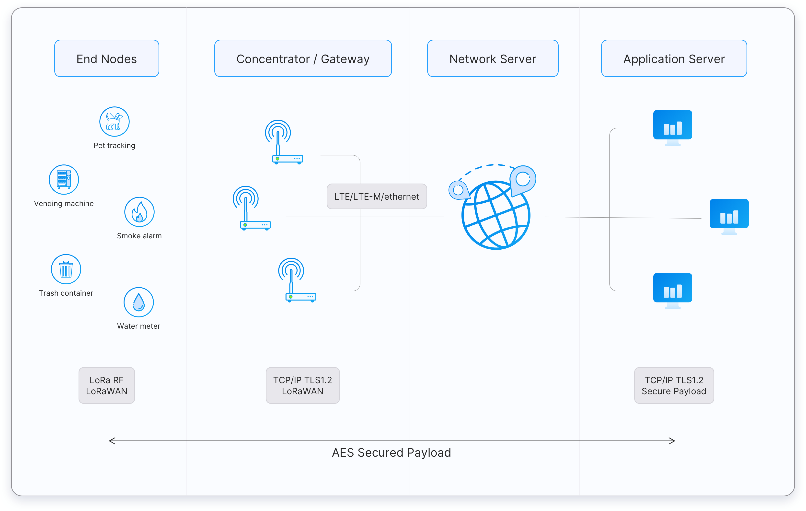

import Image from '@theme/IdealImage';

# ChirpStack 

ChirpStack is an open-source solution for building private or public [**LoRaWAN networks**](#lorawan-network). It enables organizations to connect **long-range**, **low-power devices**—such as sensors and meters—and manage them through an easy-to-use interface. ChirpStack simplifies the process of running secure IoT networks while offering flexibility to integrate with existing business systems.

---

## Example of an Dashboard Overview

---

## Getting Started with ChirpStack v4

This article walks you through the process of installing and configuring ChirpStack v4 for use with HARDWARIO devices.  

### 1. Install ChirpStack v4

In this guide, you will learn how to install the ChirpStack Network Server and its components. It explains the required environment setup, package installation, and initial configuration needed to get ChirpStack running on your system.  

👉 **Step-by-Step guide: [https://docs.hardwario.com/ember/chirpstack-v4-installation](ember/chirpstack-v4-installation.md)**  

### 2. Configure ChirpStack v4

In this guide, you will configure ChirpStack v4 by adding gateways, registering devices, and setting up payload decoders. It shows how to manage LoRaWAN device profiles, assign network parameters, and create custom codec functions to transform raw data into meaningful values.  

👉 **Step-by-Step guide: [https://docs.hardwario.com/apps/chirpstack/chirpstack-configuration](apps\chirpstack\chirpstack-configuration.md)**  

---

## LoRaWAN Network 
LoRaWAN is a **low-power, wide-area network (LPWAN) protocol** built on top of the LoRa modulation. It is specifically designed for Internet of Things (IoT) applications. LoRa modulation is based on chirp spread spectrum (CSS), which enables **long-range connectivity**, **resistance to interference**, and **operation with very low power consumption**.  

---

### Devices and Gateways  
End devices, such as **sensors or actuators**, are typically battery-powered and communicate using LoRa modulation. These devices transmit messages using an **ALOHA-based protocol**, meaning they send data whenever they need to, and any **gateway** within range can receive it. Gateways then act as **packet forwarders**, relaying received messages over IP (via Ethernet, Wi-Fi, or cellular) to the network server.  

### Network Server  
The **Network Server** is the central intelligence of a LoRaWAN network. It:  
- Authenticates and manages devices.  
- Deduplicates messages when several gateways receive the same transmission.  
- Determines the best gateway path for downlinks.  
- Enforces **end-to-end security** using AES-128 encryption.  

### Application Layer  
After processing, the Network Server forwards the messages to the **Application Server**. Here the data can be **visualized on dashboards**, **integrated into cloud applications**, or used to trigger **automation workflows**.  

### Topology and Use Cases  
LoRaWAN follows a **star-of-stars topology**, where end devices connect to multiple gateways, and those gateways are connected to a central server. This architecture is ideal for applications that require **long range**, **low power consumption**, and **small, infrequent messages**. Typical use cases include **smart agriculture, smart cities, asset tracking, utility metering, and industrial monitoring**.  

### LoRaWAN Network Topology

