import Image from '@theme/IdealImage';

# EMBER Quick Start Guide

Welcome! This page helps you **power up** your HARDWARIO **EMBER** and choose what to do next:
- Run a **managed LoRaWAN backend** via **EMBER Cloud Service** (ChirpStack + Node-RED)
- Connect EMBER to your own **ChirpStack**
- Connect EMBER to **The Things Stack (TTS)**

Official documentation:
- https://docs.hardwario.com/ember/

---

## Before you start

#### What EMBER is 
EMBER is an industrial **LoRaWAN gateway (IoT Hotspot)** based on **MikroTik RBM33G**, designed for outdoor deployments (IP67 enclosure).  
Hardware description: https://docs.hardwario.com/ember/hardware-description/

#### You will need
- EMBER gateway (Hotspot)
- **LoRaWAN antenna** (required)
- Power source:
  - 24 V DC adapter / 24 V DC power supply, or
  - 24 V DC passive PoE via the **WAN** port
- Internet connectivity (WAN and/or LTE, depending on your setup)
- A LoRaWAN backend (EMBER Cloud Service / ChirpStack / TTS / other)


#### Quick links
- EMBER product page (datasheet + overview): https://www.hardwario.com/ember
- Hotspot configuration (LAN IP, login, RouterOS script): https://docs.hardwario.com/ember/hotspot-configuration/
- EMBER Cloud Service (managed ChirpStack + Node-RED): https://docs.hardwario.com/ember/cloud-service/

---

## 1) Set up your EMBER

#### 1.1 Attach antennas (important)
- **Attach the LoRaWAN antenna before powering on.**
- If your unit includes LTE, it may use **two LTE antennas** (internal/external depending on configuration).

More details: https://docs.hardwario.com/ember/hardware-description/#antennas

#### 1.2 Power the gateway
EMBER can be powered by:
- **24 V DC power adapter**
- **24 V DC power supply**
- **24 V DC passive PoE** through the **WAN Ethernet port**

More details: https://docs.hardwario.com/ember/hardware-description/#power-supply-options

#### 1.3 Outdoor mounting safety note
:::danger

For outdoor installations, **EMBER Hotspot** has to be mounted with connectors facing down.

:::

---

## 2) Connect for local access

EMBER runs **MikroTik RouterOS**.  
For initial access and management, use the WAN interface (leftmost RJ-45 port) and standard RouterOS tools.

**If you don't already have Winbox 4 installed, follow the [Winbox 4 Installation guide](/ember/mikrotik/winbox4-installation).**
#### 2.1 Connect to Ember using Winbox 4

After opening the application, look at the list where you should see your **EMBER**.
- If there is more than one device, look at the EMBER board — on its left side there are two ethernet connectors with a sticker on them. On the sticker, find the **MAC address** — a combination of numbers and letters after the text **E01** (for example: **E01: 48:A5:8A:4F:17:A6**).
- Go back to **Winbox** and find the device with the **matching MAC address**. Click on the device in the list to select it.
- Make sure the **jumper** on the board is **removed**. The location of the jumper is shown in the picture below.
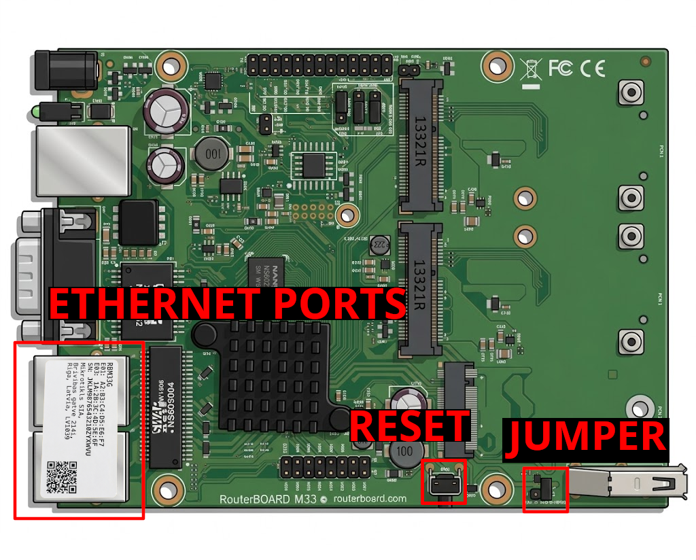

**Main documentation (recommended start):**
- EMBER Hotspot configuration & local access:  
  https://docs.hardwario.com/ember/hotspot-configuration/

---

## 3) Initial RouterOS Configuration Script

### 3.1 Set Password

**Open a New Terminal window** (or connect via SSH to your EMBER at `172.31.255.254`):

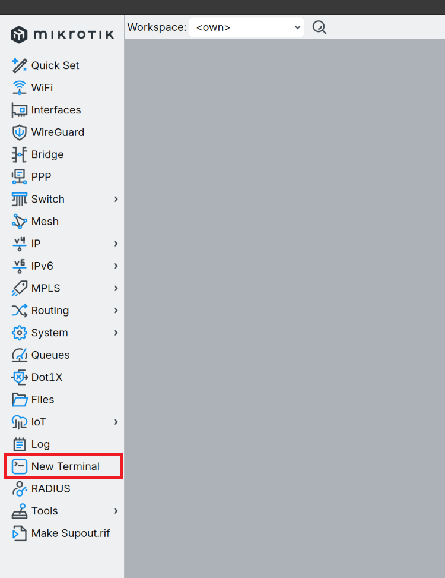    

**Set a secure admin password**

In the left panel, open **System**→ **Password**.

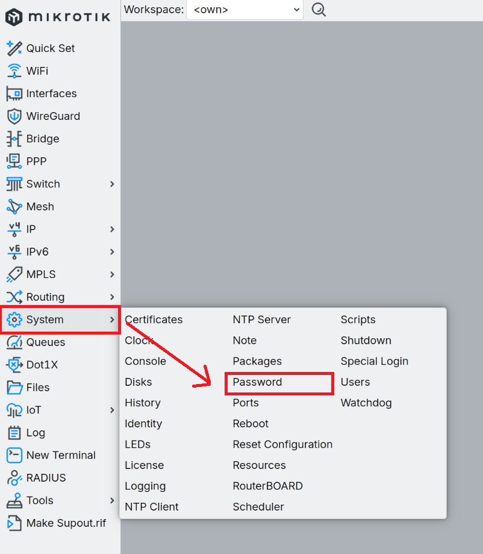

Fill the box: 
 - Old Password: **ember** (default password) 
 - New Password: `<YOUR_PASSWORD>` 
 - Confirm Password: `<YOUR_PASSWORD>`
 - Click **Change**

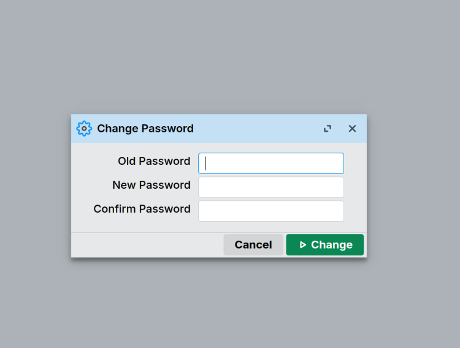

### 3.2 Run Base Configuration
Then paste the following script, or you can do it manually.

```routeros
/system identity set name=ember
/interface bridge add name=bridge0
/interface bridge port add bridge=bridge0 interface=ether2
/interface bridge port add bridge=bridge0 interface=ether3
/ip address add address=172.31.255.1/24 interface=bridge0 network=172.31.255.0
/ip dhcp-client add interface=ether1 disabled=no
/system note set show-at-login=no
```
Press **Enter** to execute the script.
Now you need to update RouterOS. Go to [Checks for RouterOS updates and installs if available.](#checks-for-routeros-updates-and-installs-if-available).

#### Manual Setup:
Sets the system identity to "ember".
- **System → Identity** change your identity to **ember** and click **OK**.
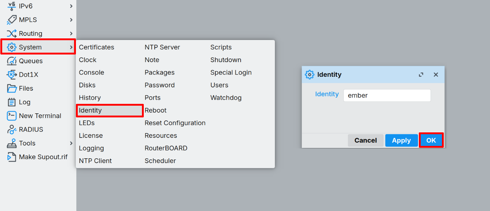

Creates a bridge interface (bridge0) and adds ether2 and ether3 to it.
- **Bridge → New**  change name to **bridge0** and click **OK**.
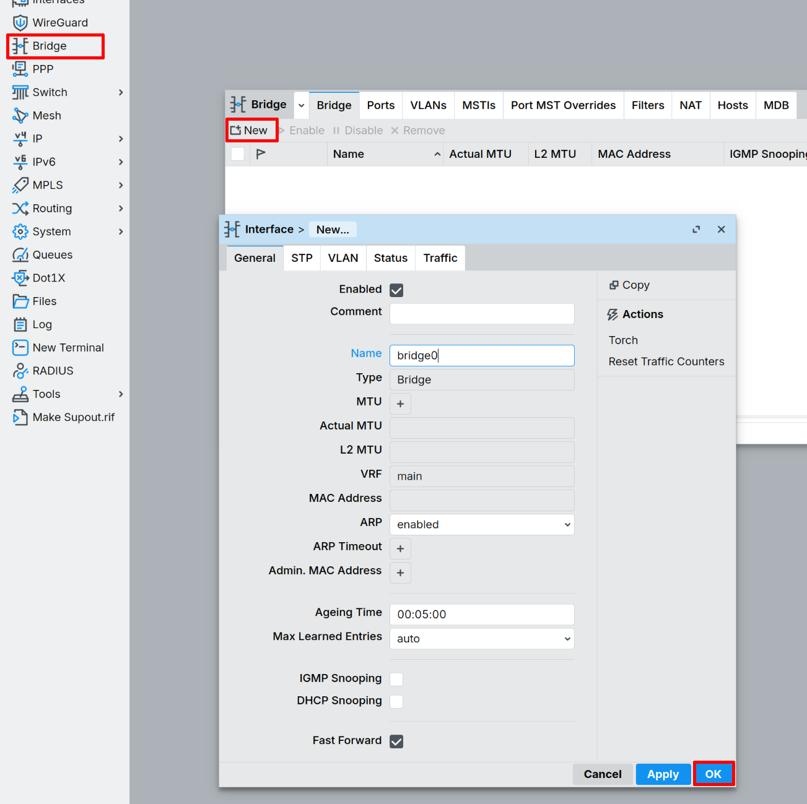

Assigns IP address 172.31.255.1/24 to the bridge for LAN access and add ports to the bridge.
- **IP → Addresses →  New** and fill **Address**, **Network** and select **Interface**:
  - Addresses: **172.31.255.1/24**
  - Network: **172.31.255.0**
  - Interface: **bridge0**
- Confirm it by clicking **OK**

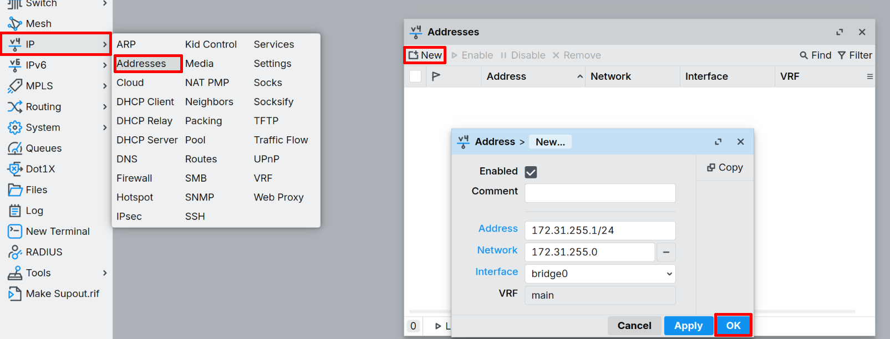

- In Bridge window go to **Ports → New**, select interface **ether2**. Make sure, that the **bridge0** is selected and click **OK**
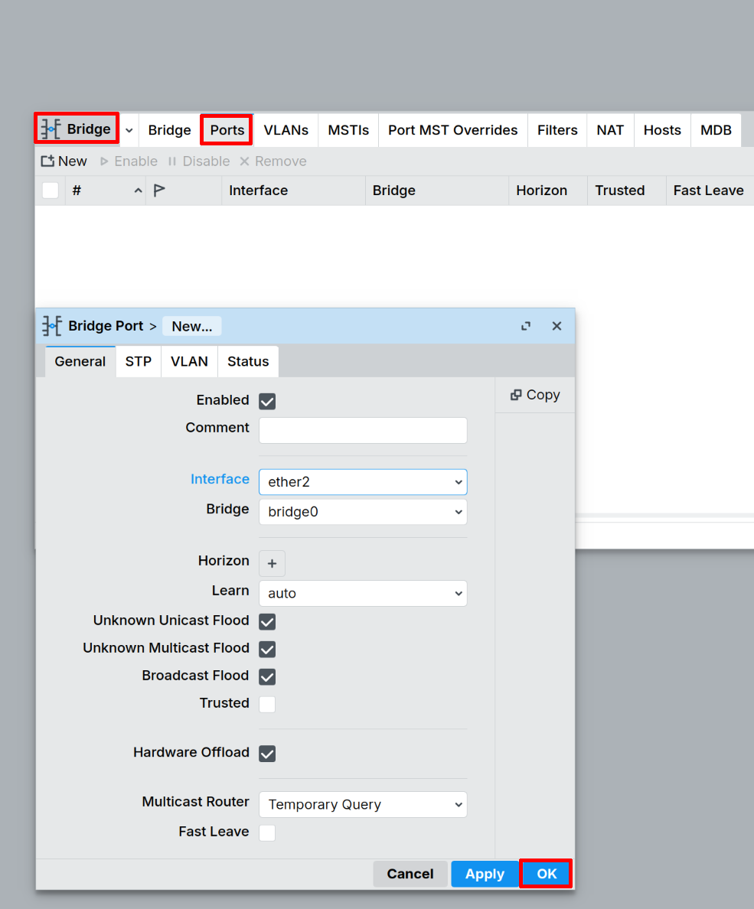

- In Bridge window go to **Ports → New**, select interface **ether3**. Make sure, that the **bridge0** is selected and click **OK**
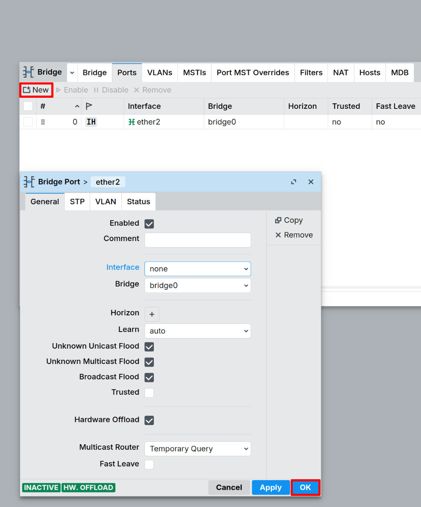


Enables DHCP client on ether1 (WAN) for internet connectivity.
- In the left panel **IP → DHCP Client → New**, select **ether1** as interface and click **OK**.
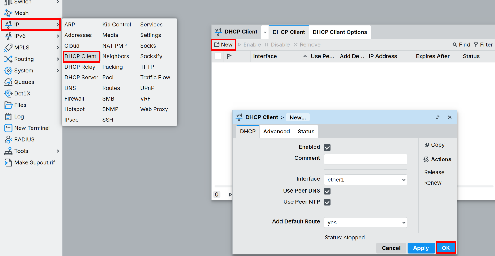 

Turn on welcome note.
- In the left panel **System → Note**, uncheck **Show At Login** and click **OK**.
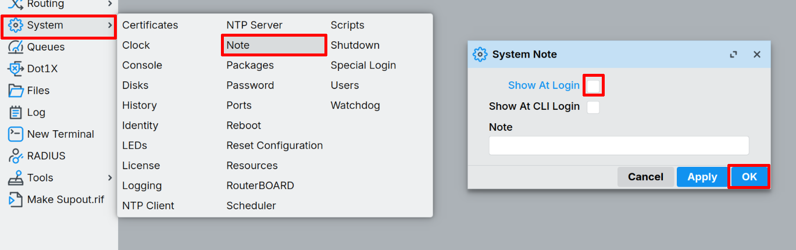

#### Checks for RouterOS updates and installs if available.
- In the left panel **System → Packages → Check for Updates**. A new window will open, check if the versions match. If not, click **Download&Install** and wait a few minutes.


---

### 3.3 Install IoT Package
After reconnecting, go to the left panel **System → Packages → Check for Updates**. At the list, find **iot**, click on it. In the right panel, click **Enable** and then **Apply Changes**. A new window will open, click **OK** and wait a few seconds.
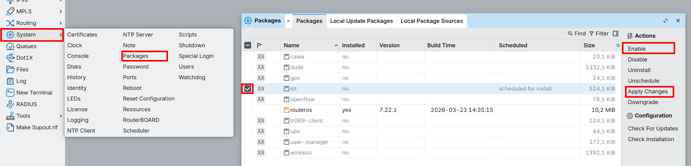

---

### 3.4 Configure LoRa Interface and Update Bootloader

After reconnecting following the reboot, paste this script in the terminal to configure the LoRa interface:

```routeros
/iot lora set 0 antenna=uFL
/iot lora servers remove [find]
```

**What this script does:**
- Sets the LoRa antenna to use the uFL connector
- Removes any preconfigured LoRaWAN Network Server (LNS) entries

Press **Enter** to execute.

### 3.5 Upgrade RouterBOARD
In the left panel, go to **System → RouterBOARD** and click **Upgrade**. A new window will open, click **OK**.


After upgrade you need to reboot the Ember. In the left panel, go to **System → Reboot**. A new window will open, click **OK**.


---

## 4) Choose your LoRaWAN backend 

### EMBER Cloud Service (managed backend)

**EMBER Cloud Service** is a fully managed LoRaWAN backend operated by HARDWARIO.  
It is designed for a fast start without the need to run your own infrastructure.

What the service typically provides:
- **ChirpStack** – LoRaWAN Network Server  
- **Node-RED** – data processing, payload decoding, and forwarding  
- Preconfigured connectivity between the gateway, LNS, and integrations

Recommended if you want to **get data from devices quickly** and forward it to applications or dashboards.

#### Key links
- Service overview and concept:  
  **https://docs.hardwario.com/ember/cloud-service/**

- EMBER Cloud web portal (service management):  
  https://docs.hardwario.com/ember/cloud-service/#web-management

- ChirpStack in EMBER Cloud Service:  
  https://docs.hardwario.com/ember/cloud-service/#chirpstack-lorawan-server

- Node-RED in EMBER Cloud Service:  
  https://docs.hardwario.com/ember/cloud-service/#node-red-application

---

### ChirpStack (self-hosted)

**Documentation:**
- ChirpStack (LoRaWAN Network Server overview):  
  **https://docs.hardwario.com/ember/lorawan-network-server/lorawan-chirpstack**

Additional resources:
- Add EMBER gateway to ChirpStack v4 (HARDWARIO tutorial):  
  https://docs.hardwario.com/ember/chirpstack/chirpstack-ember/

- (Optional) Install ChirpStack v4 (Debian/Ubuntu):  
  https://docs.hardwario.com/ember/chirpstack-v4-installation/

---

### The Things Stack

**Documentation**
- The Things Stack (LoRaWAN Network Server overview):  
  **https://docs.hardwario.com/ember/lorawan-network-server/lorawan-tts**


---

### Self-Hosted LoRaWAN Server
If you already run another LoRaWAN server, you can set EMBER to forward packets to your server.

Key note from the official Hotspot Configuration:
- If you **do not use EMBER Cloud service**, use **your LoRaWAN server IP address**
  and you **don't need to configure VPN tunnels**.

Reference: https://docs.hardwario.com/ember/hotspot-configuration/

---

## 5) Summary checklist

- LoRaWAN antenna attached (required)
- Power connected (24 V DC or 24 V passive PoE via WAN)
- Outdoor installation: connectors facing down
- PC connected to **WAN**, receives DHCP lease, can reach `172.31.255.1` (updated from default)
- RouterOS login works (`admin` / `[your-password]`)
- Initial configuration script completed (Section 3)
- RouterOS updated to latest version
- IoT package installed
- LoRa interface configured (antenna set to uFL)
- Bootloader updated
- Gateway is configured to your backend (EMBER Cloud / ChirpStack / TTS / other)
- In the LoRaWAN server UI, gateway status shows **Last seen / connected**
- You can see uplinks from at least one LoRaWAN device

---

## Troubleshooting (quick)

#### Can't reach `172.31.255.1`
- Make sure you are plugged into the **WAN** port (not LAN). LAN ports are ether2 and ether3 after running the configuration script.
- Ensure your PC is set to DHCP (or set a static IP in `172.31.255.0/24`).
- Check the Ethernet link LEDs.
- If you haven't run the configuration script yet, the default IP might still be `172.31.255.254`.

#### Gateway is powered, but not "seen" in the LoRaWAN server
- Check if the jumper is disabled. Picture is [here](#21-connect-to-ember-using-winbox-4).
- Confirm the gateway's forwarding destination (server address / ports / protocol).
- Verify WAN/LTE Internet connectivity.
- Ensure the IoT package is installed (check with `/system package print`).
- Verify LoRa interface is configured (check with `/iot lora print`).
- If using EMBER Cloud, confirm you are using the provided service URL and correct configuration guidance.

#### Reset device
Unplug the power cable, hold the reset button and plug the power cable back in. After 5 seconds the LED will start blinking, release the button. The reset button location can be found in the image [here](#21-connect-to-ember-using-winbox-4).

#### Want to understand the baseline RouterOS configuration
- The reference configuration is documented here:  
  https://docs.hardwario.com/ember/hotspot-configuration/
