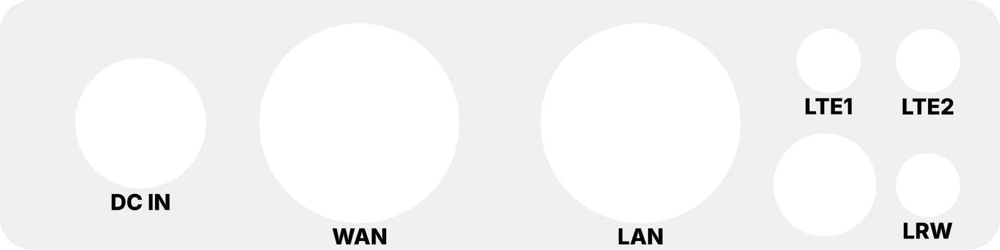

# Hardware Description

This article describes the **hardware configuration of the EMBER Hotspot**.

## EMBER Hotspot Overview

The **EMBER Hotspot** is based on the **RBM33G** platform from **MikroTik**.  
It is equipped with a **LoRaWAN** card and can optionally include an **LTE modem**.

The enclosure and connectors are **water-proof and dust-proof**, providing **IP67** protection.

### Connector Layout

## External Connectors & Antennas

The device is equipped with high-quality connectors for power, networking, and wireless communication.

### Antennas
- **LRW (LoRaWAN):** One N-type connector for the LoRa antenna. Required for gateway operation.
- **LTE1 & LTE2:** Two connectors for LTE antennas (Main and Diversity). Used if the LTE modem is installed to provide cellular backhaul (supports 2G / 3G / 4G).

### Power and Data
- **DC IN:** Circular industrial connector for external 24 V DC power supply.
- **LAN (Ethernet):** Used for local configuration, device management, and troubleshooting.
- **WAN (Ethernet + PoE):** Primary interface for internet connectivity. This port also supports **Passive PoE IN** for powering the device.

## Network Interfaces

The **EMBER Hotspot** provides two metallic **RJ45 Ethernet ports** (10/100/1000 Mbit/s) hidden behind waterproof cable glands:

- **LAN** (Located on the left side of the device)
  - Local configuration
  - Device management
  - Troubleshooting

<<<<<<< HEAD
- **WAN**
  - Internet connectivity to the cloud
=======
- **WAN** (Located on the right side of the device)
  - Backup Internet connectivity to the cloud
>>>>>>> 055895bfc5e2f23c75e071504b77ce642e802162
  - Used for PoE power input

## Power Supply Options

The device can be powered by:

- 24 V DC power adapter (via **DC IN**)
- 24 V DC power supply (via **DC IN**)
- 24 V DC passive **PoE** (Power over Ethernet) via the **WAN** port

:::danger
For outdoor installations, the **EMBER Hotspot must be mounted with connectors facing down** to maintain its IP67 rating and prevent water accumulation.
:::