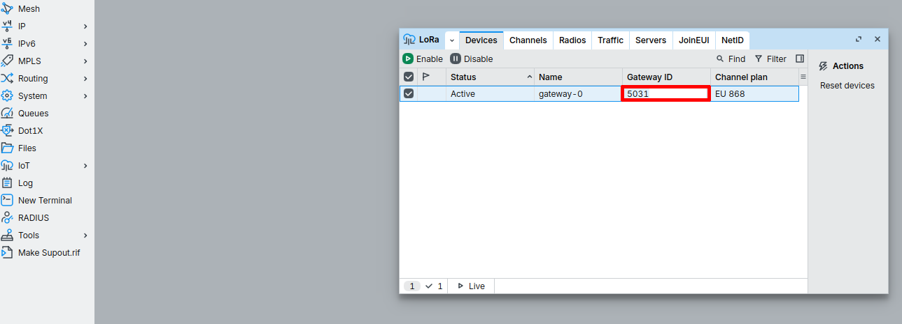
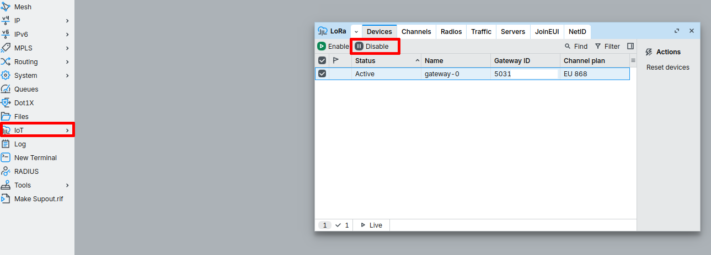
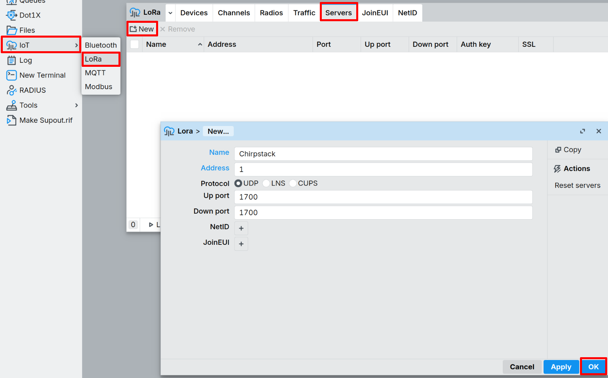
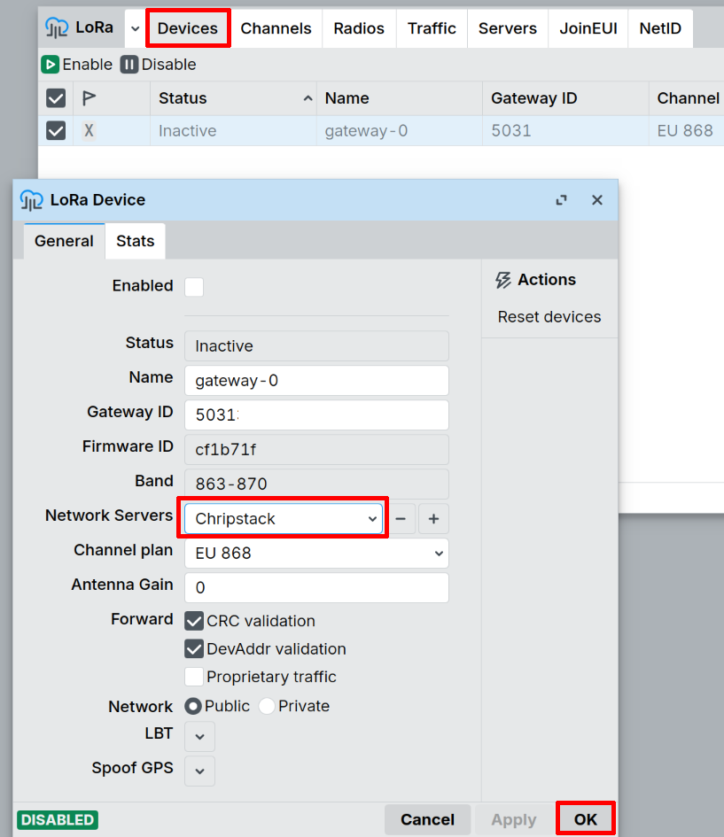
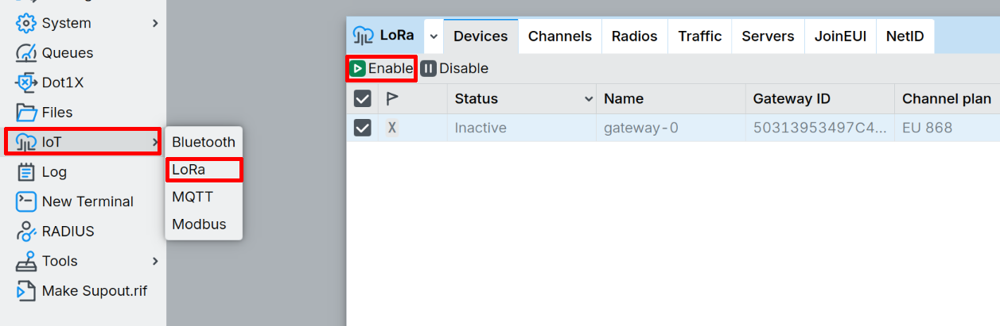
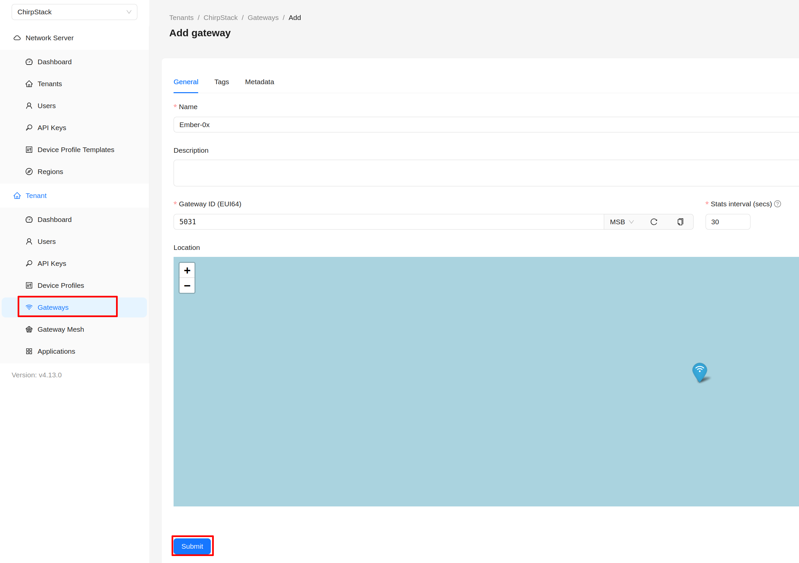

import Image from '@theme/IdealImage';

# ChirpStack v4

This guide shows how to connect the **HARDWARIO EMBER** LoRaWAN gateway (MikroTik RouterOS) to a **ChirpStack v4** network server.

## Useful docs
- ChirpStack v4 Installation → https://docs.hardwario.com/apps/chirpstack/chirpstack-installation
- EMBER → ChirpStack: https://docs.hardwario.com/ember/chirpstack/chirpstack-ember/
- EMBER hotspot configuration (RouterOS basics, LoRaWAN section): https://docs.hardwario.com/ember/hotspot-configuration/

:::info
Before configuring the HARDWARIO EMBER gateway, make sure **ChirpStack v4 is installed and running**.

Installation instructions are available here:  
https://docs.hardwario.com/apps/chirpstack/chirpstack-installation
:::

## Prerequisites
- Access to the EMBER management interface (**WebFig** or **WinBox**)
- Your ChirpStack gateway endpoint (hostname/IP + UDP ports) — typically the **Gateway Bridge** endpoint
- If you are not using the EMBER Cloud service, point the LoRaWAN server address to **your own** LoRaWAN server (no VPN tunnels needed).

---

## 1) Get the Gateway ID (EUI-64) from EMBER
On MikroTik RouterOS, the gateway EUI is shown as **Gateway ID**:

- **IoT → LoRa → Devices → Gateway ID**

---

## 2) Configure EMBER (MikroTik RouterOS) to connect to TTS
> RouterOS typically requires the LoRa card to be **Disabled** while you change LoRa settings.

1. In the left panel, open **IoT**→ **LoRa**. Click on line at the list and  aply disable. 

2. In the left panel, open **IoT**→ **LoRa**→ **Servers**. Select **New** and fill boxes:
- Name: **Chirpstack**
- Address: **ENTER_ADDRESS_OF_CHIRPSTACK_SERVER**
- Protocol: **UDP**
- Up/Down ports: **1700** (Or your custom port)

3. Go to **IoT → LoRa → Devices** and double-click on the device. In the Network Servers field, check that ChirpStack is selected. If not, click **+** and add it.

4. Enable your LoRa card. Go to **IoT → LoRa → Devices → Enable**

---

## 3) Register EMBER as a gateway in ChirpStack
1. In **ChirpStack v4**, open **Tenant → Gateways**.
2. Click **Add Gateway**.
3. Fill in:
   - Name: **Ember-0** (Or your preferred name)
   - Gateway ID: **GETEWAY_ID**
   - Stats Interval: **YOUR_PREFERENCE**
4. Click **Submit**.

---

## 4) Verify gateway traffic
- On EMBER: **WebFig → LoRa → Traffic** should show incoming messages when nearby end devices transmit.
- In ChirpStack: the gateway should show activity (e.g., status/“last seen” updates).

---

## Payload decoder links (for end devices)
EMBER (gateway) forwards packets only — payload decoding is configured **per end device/app** in ChirpStack.

Example decoder (CHESTER Clime):
- Codec folder: https://github.com/hardwario/chester-sdk/tree/main/applications/clime/codec
- ChirpStack JS decoder: https://github.com/hardwario/chester-sdk/blob/main/applications/clime/codec/cs-decoder.js
