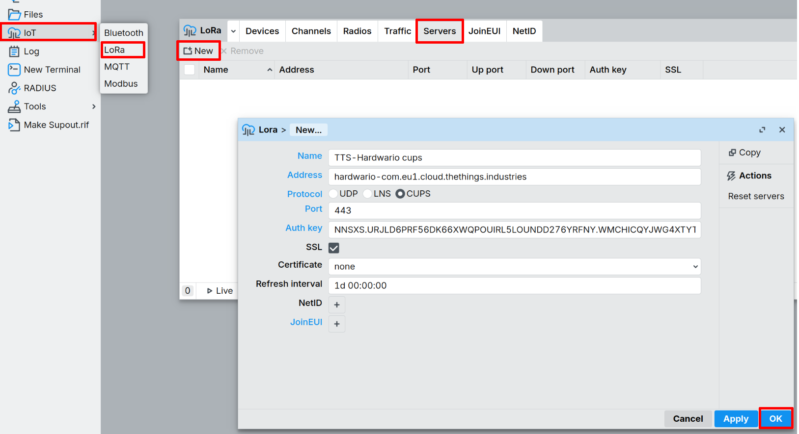
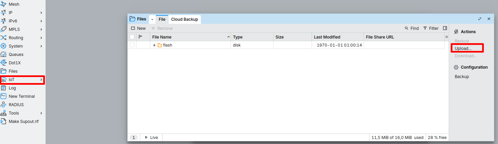
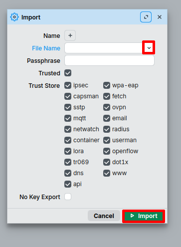
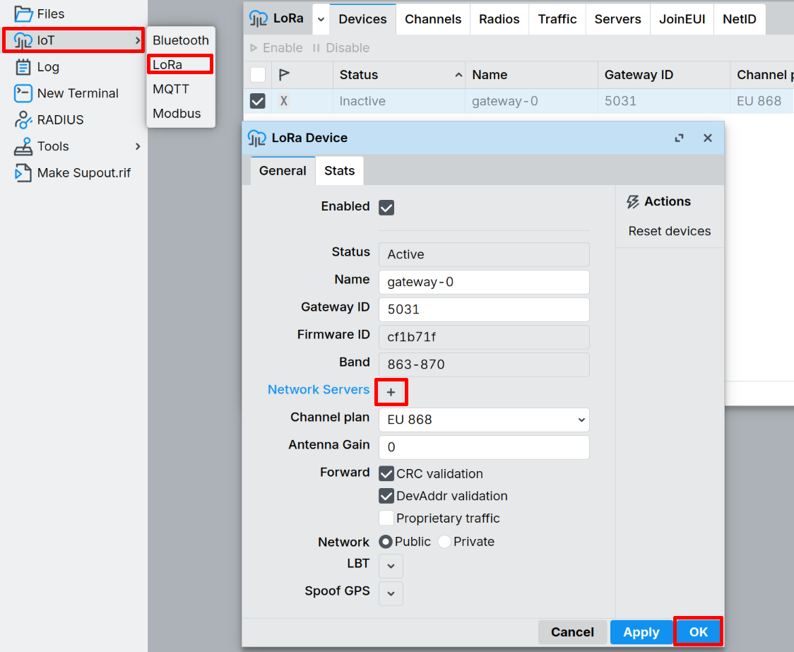

import Image from '@theme/IdealImage';

# The Things Stack

This guide shows how to connect the **HARDWARIO EMBER** LoRaWAN gateway (MikroTik RouterOS) to **The Things Stack (TTS)**.

## Useful docs
- TTS gateway registration: https://docs.hardwario.com/apps/the-things-stack/tts-configuration/tts-gateways/
- MikroTik RouterOS + TTS (UDP / LNS / CUPS): https://help.mikrotik.com/docs/spaces/ROS/pages/67633276/The%2BThings%2BStack
- EMBER hotspot configuration (RouterOS basics): https://docs.hardwario.com/ember/hotspot-configuration/

## Prerequisites
- Access to the EMBER management interface (**WinBox**)
- A TTS account with permissions to create gateways
- If you are not using the EMBER Cloud service, point the LoRaWAN server address to **your own** LoRaWAN server (no VPN tunnels needed).

---

## 1) Get the Gateway EUI (EUI-64)
On MikroTik RouterOS, the gateway EUI is shown as **Gateway ID**:

- **IoT → LoRa → Devices → Gateway ID**

---

## 2) Register the gateway in The Things Stack
1. In TTS Console, click **Register gateway**.
2. Enter the **Gateway EUI** (use RouterOS **Gateway ID**).
3. Fill the gateway details:
   - **Gateway ID** ( Your chosen identifier for the device → example: **test-geteway-001**)
   - **Gateway Name** (Your chosen name for the device → example **Test Geteways-001**)   
   - **Frequency plan** (choose the one matching your region/hardware; e.g., Europe 868.1 MHz)
4. Enable **Require authenticated connection**.
5. Enable both:
   - **Generate API key for CUPS**
   - **Generate API key for LNS**
6. Click **Register gateway** and **download both API keys** (CUPS + LNS).

---

## 3) Configure EMBER (MikroTik RouterOS) to connect to TTS
> RouterOS typically requires the LoRa card to be **Disabled** while you change LoRa settings.

In the left panel, open **IoT**→ **LoRa**. Click on line at the list and  aply disable. 

You’ll use the downloaded keys in RouterOS.

### CUPS (Configuration & Update Server)
- Protocol: **CUPS**
- Port: **443**
- Set the CUPS key (from the downloaded `cups.key` file)
- Enable **SSL/TLS**

In the left panel, open **IoT**→ **LoRa**→ **Servers**. Select **New** and fill boxes:
- Name: **TTS-Hardwario cups**
- Address: **hardwario-com.eu1.cloud.thethings.industries**
- Port: **443**
- Auth Key: (Value of file **"cups.key"**)

### Root certificates (required for SSL/TLS)

To establish a secure TLS connection to **The Things Stack (LNS / CUPS)**, import the official **The Things Stack Root CA certificates** into RouterOS and mark them as **trusted**.

- Download the certificates from:  
  https://www.thethingsindustries.com/docs/reference/root-certificates/
  
In the left panel, open **Files**→ **Upload** and choose file "ca.pem".

In the left panel, open **System**→ **Certificates**→ **Import**. Click on dropdown arrow, select file "ca.pem" and click at **Import**.

### Select Network server
You need to select a network server.

- In the left panel, open **IoT → LoRa** click on the device. A new window will show, click **+** to select TTS server, after that click **OK**.

---
## 4) Enable and verify
1. In RouterOS: **IoT → LoRa → Devices → Enable**
[Ember enable lrw card](images/ember-enable-lrw.png)
2. In TTS Console, open the gateway and confirm **Live data** updates.

---

## Payload decoder links (for end devices)
Decoders are configured per **end device/application** in TTS (Payload Formatter).

Example decoder (CHESTER Clime):
- Codec folder: https://github.com/hardwario/chester-sdk/tree/main/applications/clime/codec
- JS decoder reference: https://github.com/hardwario/chester-sdk/blob/main/applications/clime/codec/cs-decoder.js
