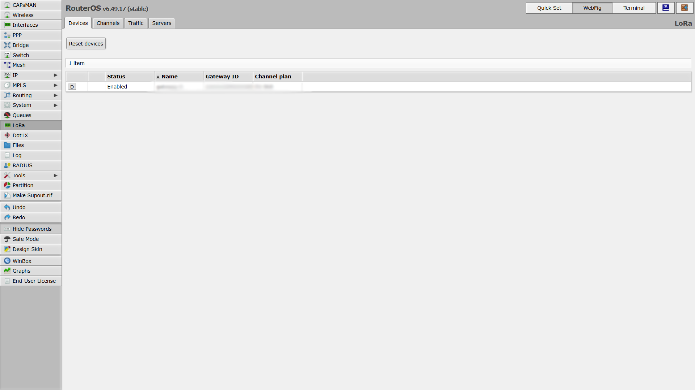
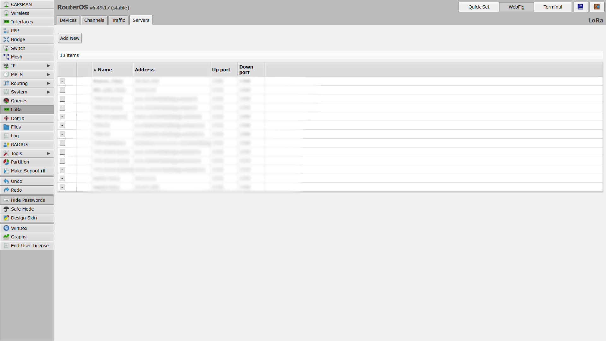
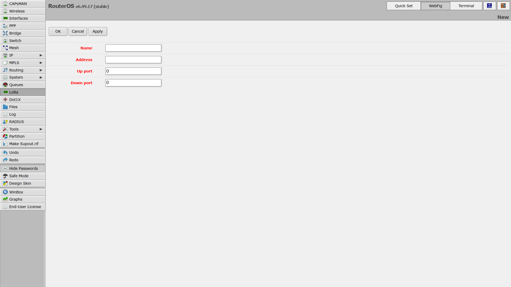
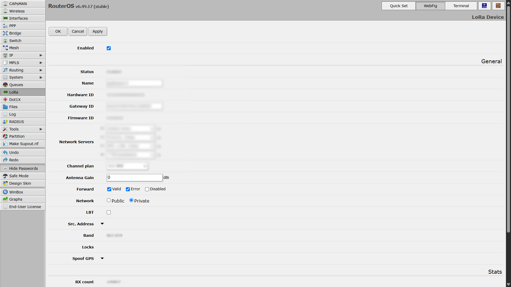
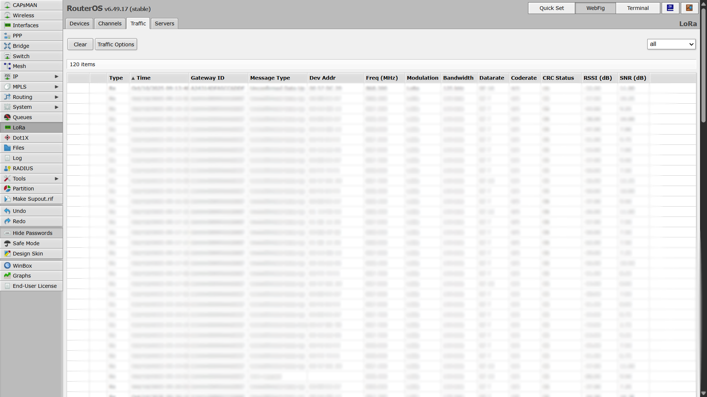

import Image from '@theme/IdealImage';

# MikroTik Gateway Configuration

This step-by-step guide explains how to configure the LoRa interface on a MikroTik gateway using the WebFig interface.

---

## Prerequisites
- Admin access (username & password)
- The gateway’s IP address (e.g., `http://192.168.1.1`)

---

## A) Prepare LoRa Device for Configuration

1. Open your browser and log in to the gateway via its **IP address**.
2. In the left menu, open **WebFig → LoRa**.

3. Go to the **Devices** tab.
4. Check that the **gateway status is set to Disabled** — all LoRa card settings must be made while the card is stopped.

---

## B) Define LoRa Server

1. Go to the **Servers** tab.
2. If there are **predefined servers** (from the manufacturer), you can **remove them**.

3. Click **Add New** to create your own server.
4. Enter the **server details**:
   - **Name**
   - **Address**
   - **Up/Down ports**
5. Click **Apply** to save the server configuration.

---

## C) Link LoRa Device to the New Server

1. Go back to the **Devices** tab.
2. Click on your LoRa card.

:::info
Here you can also find the **Gateway ID**
:::

1. Under the **Network** option, select **Public**.
2. Click the **plus (+)** button next to **Network Servers** and select the **newly created server**.

3. Once configured, **enable the LoRa card** by selecting it and clicking **Enabled**.

---

## D) Verify Operation and Traffic

1. While still in the **LoRa** section, open the **Traffic** tab.
2. Check for **incoming messages** — this confirms that the LoRa card is active and receiving data.
3. If no messages appear, try **restarting your end device**.  
   - For example, with a sensor (Sticker), simply **remove and reinsert the power supply or battery**.

---

✅ **Your MikroTik LoRa interface is now configured and active.**
