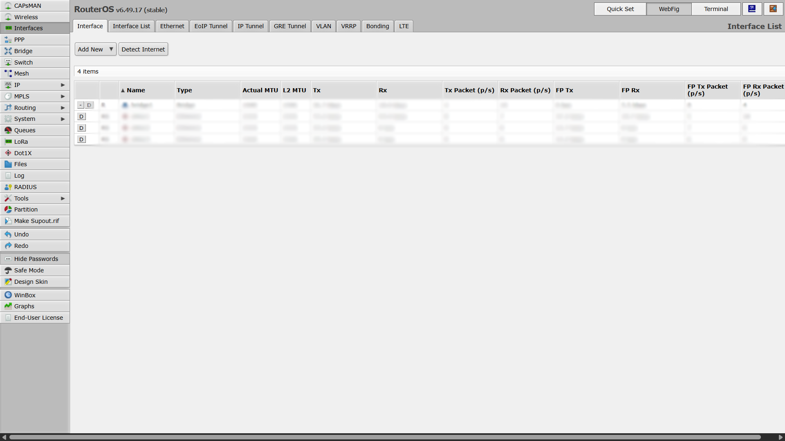
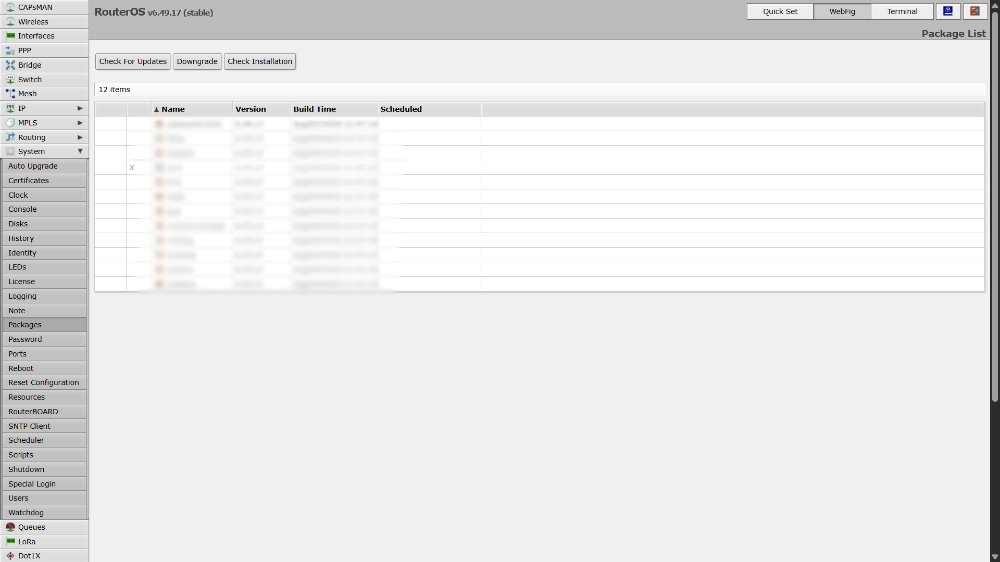
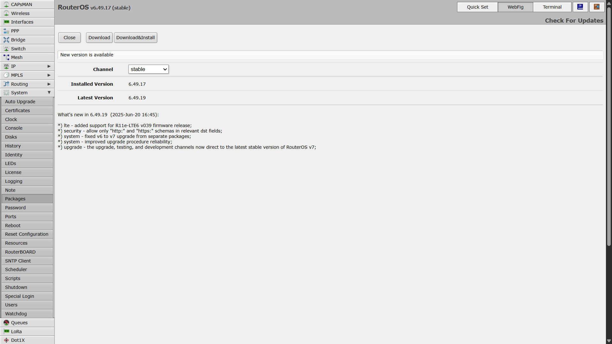
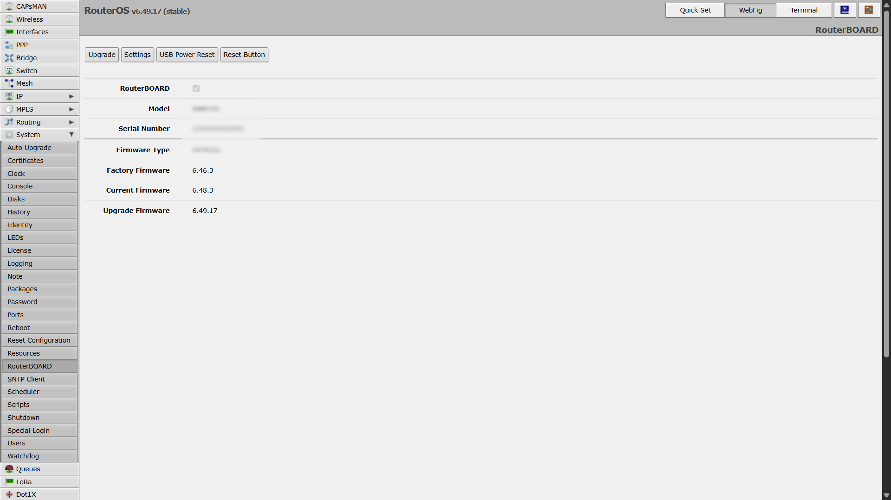

import Image from '@theme/IdealImage';

# MikroTik Gateway Update

This guide walks you through updating RouterOS packages and the RouterBOARD (firmware/“BIOS”) using the WebFig interface.

---

## Prerequisites
- Admin access (username & password)
- The gateway’s IP address (e.g., `http://192.168.1.1`)

---

## A) Update RouterOS Software

1. **Open your browser** and enter the gateway’s **IP address**.
2. **Log in** with your administrator credentials.

3. Go to **WebFig** → in the left menu open **System → Packages**.

4. Click **Check For Updates** (top-left).
5. When a new version is available, click **Download & Install**.

---

## B) Update RouterBOARD (Firmware/“BIOS”)

1. In the left menu, open **System → RouterBOARD**.
2. Check whether a **new firmware version** is available — you can compare **Current Firmware** with **Upgrade Firmware**.

3. If an upgrade is available, click **Upgrade**.

---

## C) Reboot to Apply Firmware

1. In the left menu, open **System → Reboot**.
2. Confirm the reboot to apply the RouterBOARD firmware upgrade.
3. Wait for the device to come back online, then log in again.

---

## D) Verify the Update

1. **System → Packages**:  
   - Click **Check For Updates** — it should now report **up to date** (both versions should match).
2. **System → RouterBOARD**:  
   - Confirm that **Current Firmware** now matches **Upgrade Firmware** — meaning the firmware is successfully updated.

---

✅ **The gateway is now fully updated and running the latest RouterOS and firmware versions.**
