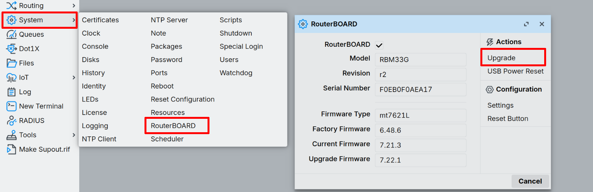
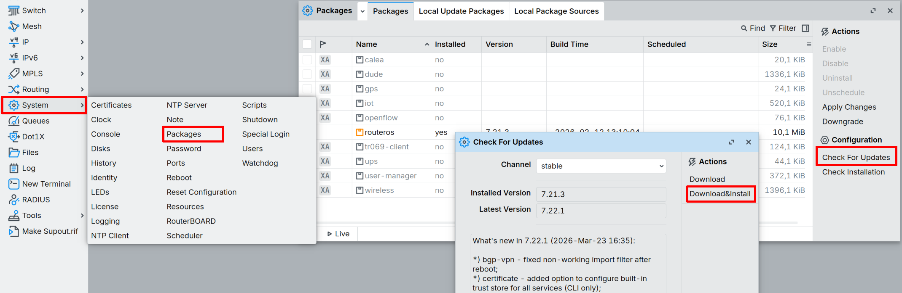
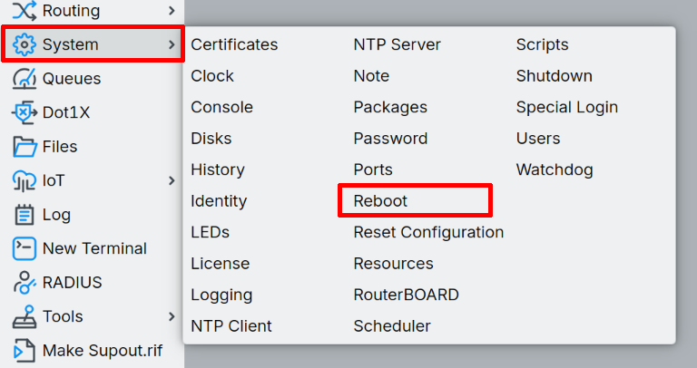

import Image from '@theme/IdealImage';

# MikroTik Gateway Update

This guide walks you through updating RouterOS packages and the RouterBOARD (firmware/“BIOS”) using the Winbox 4.

---

## Prerequisites
- Admin access (username & password)

---

## 1. Update RouterOS Software

In the left panel **System → Packages → Check for Updates**. A new window will open, check if the versions match. If not, click **Download&Install** and wait a few minutes.

---

## 2. Update RouterBOARD (Firmware/“BIOS”)

1. In the left menu, open **System → RouterBOARD**.
2. Compare **Current Firmware** with **Upgrade Firmware**.
3. If an upgrade is available, click **Upgrade**.

---

## 3. Reboot to Apply Firmware

1. In the left menu, open **System → Reboot**.
2. Confirm the reboot to apply the RouterBOARD firmware upgrade.

3. Wait for the device to come back online, then log in again.

---

## 4. Verify the Update

1. **System → Packages**:  
   - Click **Check For Updates** — it should now report **up to date** (both versions should match).
2. **System → RouterBOARD**:  
   - Confirm that **Current Firmware** now matches **Upgrade Firmware** — meaning the firmware is successfully updated.

