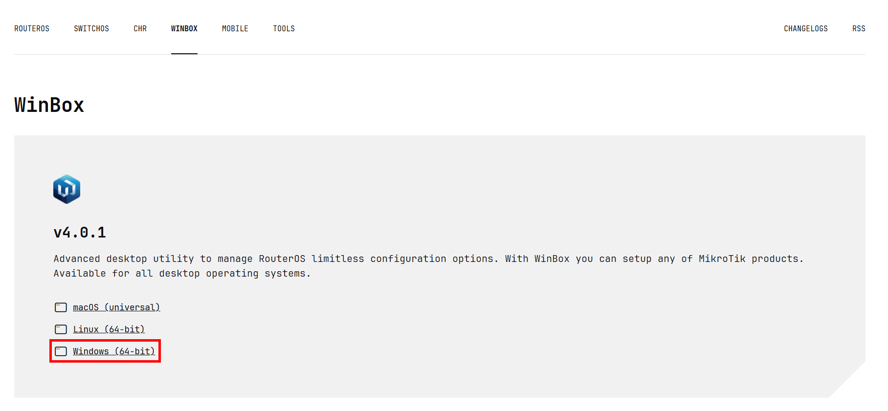
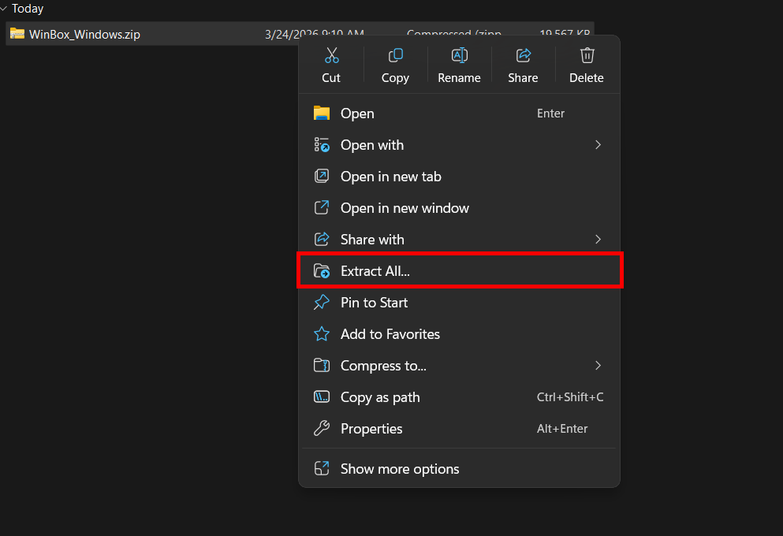
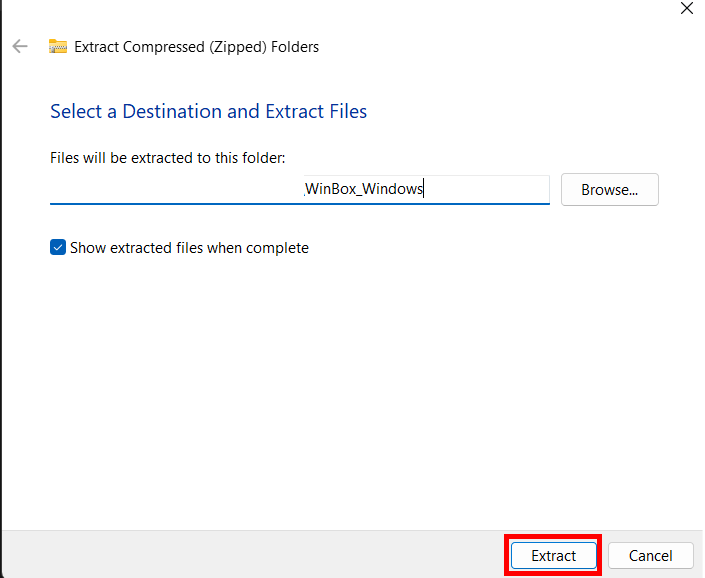
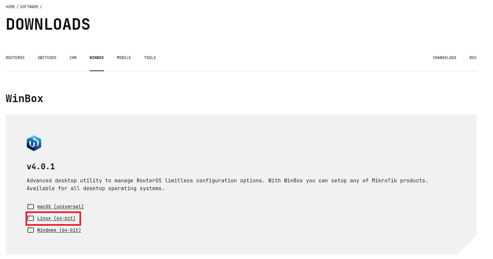

# Winbox 4 Installation

This step-by-step guide explains how to install Winbox 4 on Windows and Linux.

---

## Windows

### 1. Download Winbox 4

Click the link below and go to the MikroTik download page:

https://mikrotik.com/download/winbox

On the page, click **Windows (64-bit)** — this will download a `.zip` file.

    

---

### 2. Extract the Archive

Open the folder where the file was downloaded. Right-click on the file and click **Extract All**.

Click the **Extract** button to extract the file.

---

### 3. Run Winbox 4

Open the **WinBox.exe** application in the extracted folder. After opening the application, a system window will appear — confirm it by clicking **Allow**.

**Winbox 4 is now ready to use.**

---

## Linux

### 1. Download Winbox 4

Click the link below and go to the MikroTik download page:

[https://mikrotik.com/download/winbox](https://mikrotik.com/download/winbox)

On the page, click **Linux (64-bit)** — this will download a `.zip` file. Make sure to place it somewhere easy to access, like the **Downloads** folder.

---

### 2. Extract the Archive

Right-click on the downloaded **WinBox_Linux.zip** file and select **Extract Here** — or **Extract to…** if you want to place it in a specific folder.

Once the extraction is complete, you will see a folder containing the **WinBox** file and an **assets** folder.

---

### 3. Run Winbox 4

1. Open the folder you just extracted.
2. Find the file named **WinBox**.
3. Right-click on the file.
4. Select **Run** or **Run as Program**.
5. Wait a few seconds until Winbox opens and is ready to use.

**Winbox 4 is now ready to use.**
