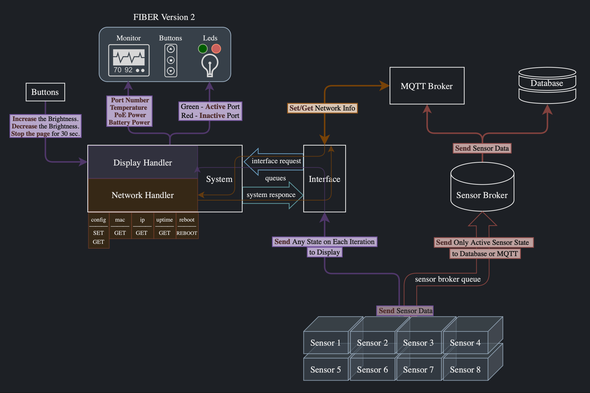

import Image from '@theme/IdealImage';

# Project Structure Overview

## 1. Root Directory of the Project (app/)

The root directory of the project contains files and folders related to core aspects of the project, such as the license, README file, installation scripts, and tests.

## 2. Configuration (data/)

This directory holds project configuration files, such as **config.yaml**, as well as files defining network settings.

> For more information, see chapter [**Configuration File**](./configuration)

## 3. Source Code (fiber/)

This is the main directory of the project, containing the source code of the FIBER application. It is divided into submodules:

**broker/: Module responsible for working with the sensor data broker**

> This module includes classes and functions to receive data from sensors and send them to the mqtt broker or to the local storage of temperature measurement data. Its behavior is determined by configuration variables, where **enabled** for activating or deactivating sensor functionality, **report_interval_seconds** specifies the interval for sending data to the broker, and **sampling_interval_seconds** sets the interval for reading sensor data. This module optimizes sensor data transmission and storage, enhancing overall system performance and reliability.

**buttons/: Module for handling physical buttons on the FIBER device.**

> This module contains functionality for **interacting with physical buttons** connected to the FIBER device. It includes a threaded approach for managing button inputs, configuring GPIO lines, and detecting button presses based on rising edge events. Specific actions are triggered upon each button press, such as adjusting the **display brightness more/less and stopping the page for 30 seconds**.

**interface/: Module implementing the interface-side of the application and works directly with the system**

> This module simplifies the exchange of data and commands between _Interface_ and _System_. It provides functions to retrieve essential information such as **MAC address**, **IP address**, **FIBER ID**, and **system uptime** from the _System_. Moreover, it enables monitoring, while also **setting the status and color of the indicators** based on predefined conditions. This module plays a crucial role in maintaining communication integrity and ensuring seamless interaction between the interface and system components of the application.

**common/: Common modules and utilities used across various parts of the project.**

> This module provides essential functionalities shared among different parts of the project. It includes the ability to take **common constants** for the entire project and the **management of configurations, queues and LED states**. Seamlessly integrating with project settings, making it easy to load and save configurations from/to files. Additionally, it defines constants for basic file paths for devices like FIBER and 1-Wire, as well as LED indices for identification and control purposes. Moreover, module implements thread-safe communication using queues, which improves the efficiency of message passing between different components. It also facilitates LED control and status retrieval, contributing to system monitoring and control. Overall, this module serves as a foundational layer for maintaining consistency and facilitating interoperability within the project architecture.

**display/: Module for working with the display and data visualization.**

> This module handles the interaction with display hardware and provides functionalities for data visualization. It encompasses functions for controlling the display, managing sensor data presentation, and monitoring system metrics. Additionally, it orchestrates communication with the display hardware, enabling the rendering of graphical elements and text. Display module **manages brightness control and buzzer activation**, contributing to user interaction and feedback. It coordinates the overall display functionality, including thread management and widget configuration. The module seamlessly integrates with sensor widgets **to display temperature data, time, date, sensors, POE and battery voltages**. Furthermore, it facilitates the presentation of sensor information on the display, allowing for real-time monitoring of temperature readings and power levels.

**models/: Data models defining the structure of information in the project.**

> This module serves as a central repository for data models utilized across various sections of the project. It encapsulates structured data representations for **FIBER and system configuration, sensor data, indicators, request/response structure**. These models facilitate seamless data exchange and validation between different components of the application. By standardizing data formats, the module enhances code clarity, promotes maintainability, and ensures consistency in data handling throughout the project.

**mqtt/: Module for interacting with the MQTT protocol.**

> This module facilitates communication with the MQTT broker, enabling data exchange between the FIBER application and external MQTT-enabled devices or services. It includes classes and functions responsible for **establishing MQTT connections, subscribing to topics, and publishing messages**. The **enabled** variable activates or deactivates MQTT functionality. The **host** specifies the hostname or IP address of the MQTT broker to connect to, while the **port** determines the port number for the connection. Key functionalities include handling connections, sending and receiving messages, and managing system configurations. It plays a vital role in enabling real-time communication and data synchronization within the FIBER ecosystem.

**sensor/: Module for working with sensors and collecting data from them.**

> This module manages sensor interactions and data collection based on configuration variables. The **enabled** variable activates or deactivates sensor functionality. It orchestrates the **scanning of thermometers** on specified channels, **retrieving temperature data from each thermometer**, and processing it for further use. The module utilizes a queue manager for efficient data transmission, sending sensor output to other components of the application. By doing so, it starts **working with indicators and sending data to the broker and display**. This module plays an important role in monitoring environmental conditions and collecting real-time sensor readings in the FIBER ecosystem.

**system/: System-side of the application, handling requests from interface.**

> This module manages communication between the interface and system components, executing various operations based on incoming requests. Its functionality is driven by configuration variables, where **network interface** specifies the network interface used for communication. The system listens for interface requests via a queue manager, processing requests such as **setting indicator states and colors, retrieving MAC and IP addresses, system uptime, and rebooting the system**. It utilizes handlers to execute specific operations corresponding to each request type. Additionally, the module handles network interface initialization, ensuring availability for communication. This system-side module plays a pivotal role in facilitating seamless interaction between interface and system components within the FIBER application.

## 4. Installation and Configuration Scripts (install/ and scripts/)

These directories contain scripts for installing and configuring the project.

## 5. Dependency and Configuration Files (pyproject.toml and poetry.lock)

These files are used for managing project dependencies with Poetry.

## 6. Tests (tests/)

This directory contains tests for verifying the functionality of various project components.

# FIBER Architecture Diagram
This diagram shows the operation of the software part of FIBER.

- Sensors (**Sensor 1-8**) collect temperature data and send it at each iteration.
- If a sensor is active, its data is forwarded to the broker (**Sensor Broker**) via the queue (**sensor broker queue**).
- The data is filtered, and then the sensor broker sends it either to the MQTT broker (**MQTT Broker**) or directly to the database (**Database**).
- Additionally, regardless of whether the sensor is active or not, data is sent to the system (**System**) for real-time display and visualization of the sensor's status (**Display Handler**).
- The display handler updates the monitor (**Monitor**) with information such as port numbers, temperature, PoE power, and battery power. It also manages the indicators (**LEDs**) for each sensor: green indicates an active sensor, and red indicates an inactive sensor.
- Users can interact with the monitor (**Monitor**) using buttons (**Buttons**) to adjust the brightness or to pause the display updates for 30 seconds.
- Through MQTT, various information can also be requested and retrieved from the system network handler (**Network Handler**).
- The network handler manages network settings and status, providing information such as MAC address, IP address, and uptime to the system. It also allows for the retrieval and modification of configuration files and the rebooting of FIBER.
- The interface (**Interface**) handles external communications by managing requests from MQTT and sensors, and it forwards them to the system (**System**) for processing and response generation as necessary.
- The interface (**Interface**) and the system (**System**) communicate and coordinate data and command flows via queues (**interface request, system response**). These queues ensure the necessary requests and responses are sent and received between different components of the program.