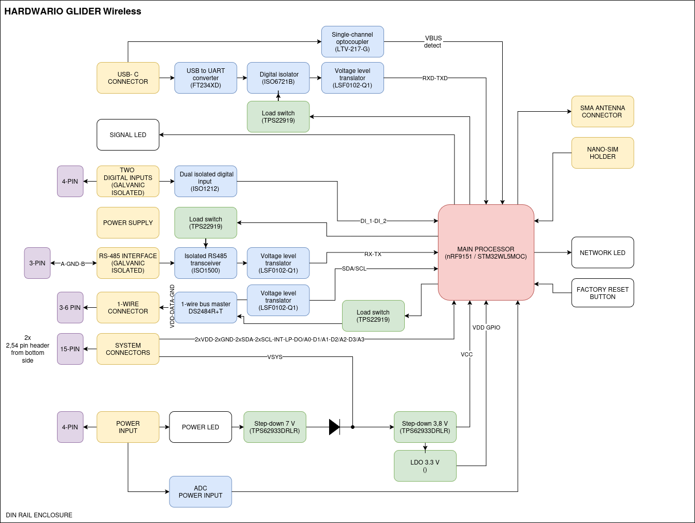

import Image from '@theme/IdealImage';

# Hardware Description

GLIDER is built around the **Nordic nRF9151** system-in-package, a Cortex-M33 microcontroller with an integrated LTE-M / NB-IoT cellular modem. This page summarises the technical details that matter when integrating, wiring or extending the device.

## Block diagram 



## Microcontroller

| | |
| :--- | :--- |
| SoC | **Nordic nRF9151** |
| Core | ARM Cortex-M33 with TrustZone-M |
| Security extensions | TF-M (Trusted Firmware-M) IPC backend, non-secure execution domain (`*_ns` target) |
| Modem | Integrated LTE-M / NB-IoT |
| Bootloader | MCUboot with dual-image swap (DFU via `AT$FW`) |
| Watchdog | 120 s hardware watchdog |

The firmware target string used by `west build` is:

```text
gauger_lte/nrf9151/ns
```

## Pinout

The table below lists every GPIO used by GLIDER, taken from `gauger_lte_nrf9151_common.dtsi`.

| Pin | Net | Function | Notes |
| :--- | :--- | :--- | :--- |
| P0.00 | `USB_EN` | USB bridge power enable | Active high; default off. |
| P0.01 | `INT` | (Reserved interrupt input) | - |
| P0.02 / P0.03 | `I2C3 SDA/SCL` | DS2484 1-Wire master | 100 kHz I²C. |
| P0.04 / P0.05 / P0.06 | `RS_DE / RS_RE / RS_ON` | RS-485 driver enable, receive enable, isolator power | `RS_ON` active high; default off. |
| P0.07 | `SLPZ` | DS2484 sleep / wake | Active low. |
| P0.08 / P0.09 / P0.10 | `LED_Y / LED_R / LED_G` | Yellow / red / green status LEDs | Active high. |
| P0.13 - P0.20 | `GP0` - `GP7` | General-purpose analog headers | Routable to `AIN7` - `AIN0`. |
| P0.21 | `DI_EN` | Digital input power enable | Active high; default off. |
| P0.22 / P0.23 | `DI_CH0 / DI_CH1` | Isolated digital inputs (CH1 / CH2) | Active high. |
| P0.24 / P0.25 | `UART0 RX / TX` | USB-C console (via FT234XD) | 1 000 000 baud. |
| P0.26 | `USB_DETECT` | USB-C cable detection | Active low. |
| P0.27 / P0.28 | `UART1 RX / TX` | JP5 header debug port | 115 200 baud. |
| P0.29 / P0.30 | `UART2 RX / TX` | RS-485 (Modbus RTU) via ISO1212DBQ | 19 200 baud, 8E1. |
| P0.31 | `BUTTON` | User pushbutton | Internal pull-up; active low. |

## Connectivity

#### Cellular

- **LTE-M** and **NB-IoT** via the on-board nRF9151 modem.
- **nano-SIM** slot accessible from the outside.
- LTE bands enabled by default: **band 8** and **band 20** (Europe). Bands can be reconfigured at build time.

#### USB-C (AT console)

- USB-C connector → **FT234XD** USB-UART bridge → `UART0` of the nRF9151.
- 1 000 000 baud, 8N1.
- The firmware turns the bridge on automatically when it sees `USB_DETECT` go low (50 ms debounce).
- See [**AT Console (USB-C)**](console/usb-at.md).

#### J-Link (RTT)

- Standard SWD header (`SWDIO`, `SWCLK`, `GND`, `VTref`).
- RTT (Real-Time Transfer) provides the Zephyr shell and live log stream.
- See [**RTT Console (J-Link)**](console/rtt-jlink.md).

#### 1-Wire (W1, W2)

Two electrically equivalent ports on the screw terminal, both driven by the same **Maxim DS2484** 1-Wire master on the internal I²C3 bus.

- Up to **8 DS18B20** thermometers can be bound to slots simultaneously.
- Up to **12 devices** can be enumerated by `therm scan` in a single sweep.
- See [**External Temperature Sensors**](external-sensors/temperature.md).

#### Digital inputs (CH1, CH2)

- **2 galvanically isolated** channels routed to `P0.22` and `P0.23`.
- Each channel supports `disabled`, `counter` and `event` modes.
- Configurable debounce (active / inactive durations) and cooldown between events.
- See [**Configuration → Digital Inputs**](configuration.md#digital-inputs).

#### RS-485 (Modbus RTU)

- Isolated RS-485 transceiver (**ISO1212DBQ**) on `UART2`.
- 19 200 baud, 8E1, RTU framing, 500 ms response timeout.
- Powered only when explicitly enabled (`modbus enable`) - saves current when idle.
- See [**Shell Commands → `modbus`**](commands/shell-commands.md).

## Power and timing

| | |
| :--- | :--- |
| Supply rail | Single 3.3 V (typical for nRF9151) |
| Watchdog timeout | 120 s |
| Default sample period | 60 s (`app config interval-sample`) |
| Default uplink period | 300 s (`app config interval-send`) |
| Default downlink watchdog | 36 h (`app config downlink-wdg-interval`; `0` disables) |
| Peripheral power gating | USB bridge, digital inputs and RS-485 isolator default off - only powered when needed |

## Indicators and controls

- **LEDs (3):** red, green, yellow. Driven by GPIO; controllable via the `led` shell command.
- **Button (1):** drives `app sample` / `app send` actions depending on click pattern:
 - 1 click - force `send`
 - 2 clicks - force `sample`
 - 3 clicks - `sample` then `send`
 - 4 clicks - reboot the device

## Firmware

GLIDER firmware is built on **Zephyr / nRF Connect SDK** with HARDWARIO's **HIO SDK** on top, which provides the cloud client, configuration framework, button handling, edge detection and the ATCI interpreter.

Build command:

```bash
west build -b gauger_lte/nrf9151/ns application
```

The internal board name is `gauger_lte` - GLIDER is the commercial product name; both refer to the same hardware.
