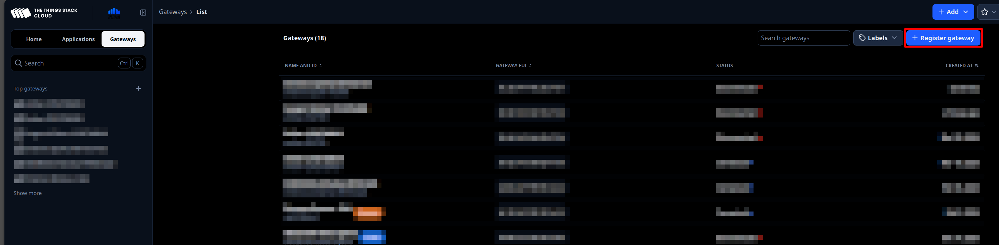
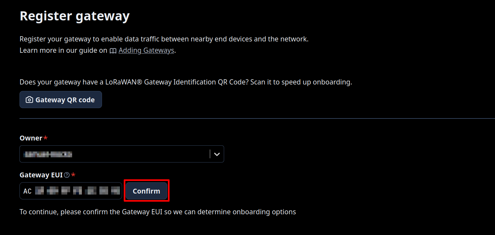
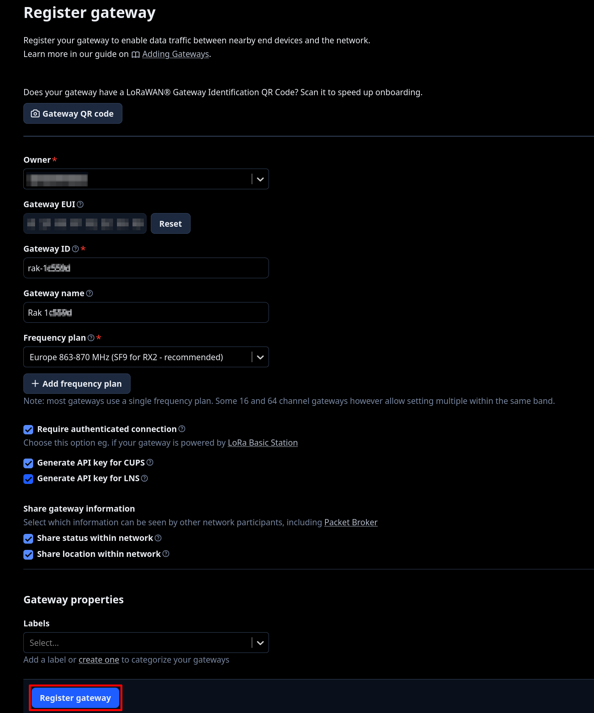
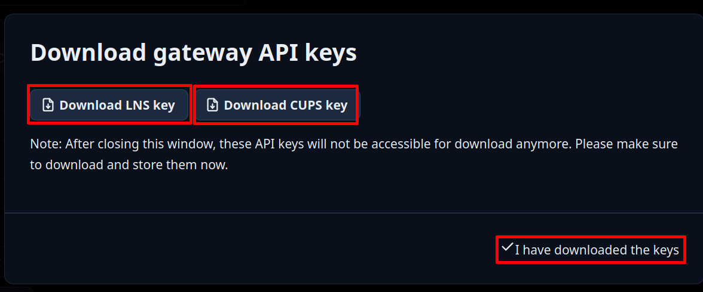
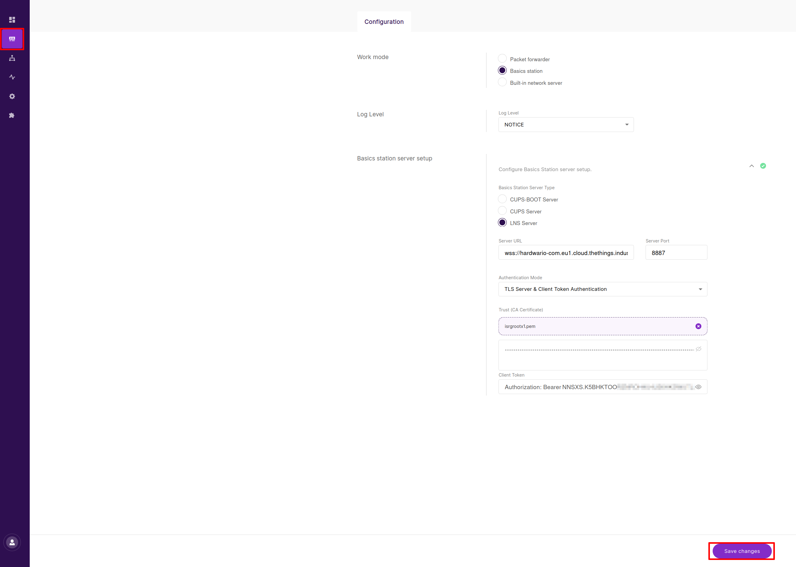
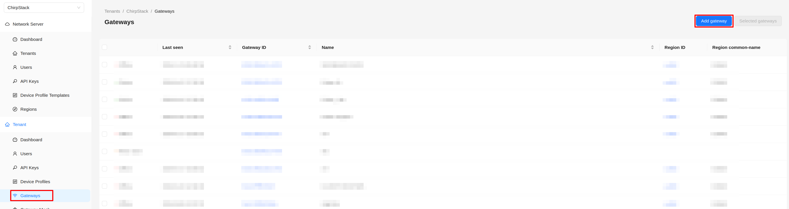
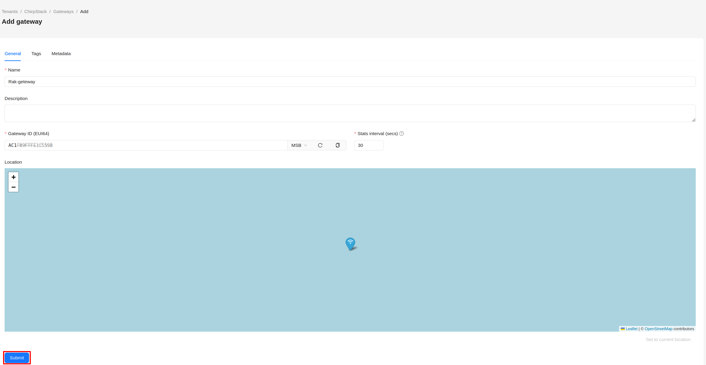
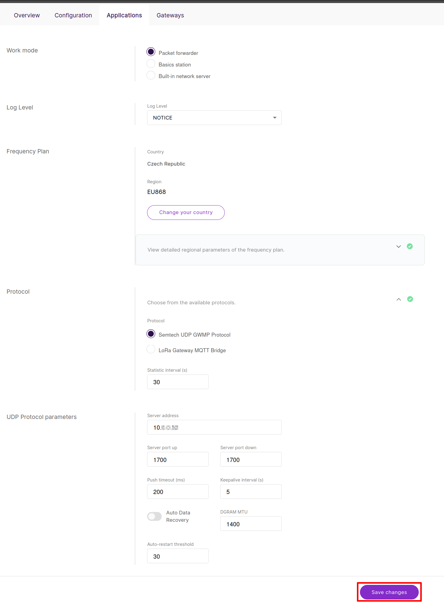

import Image from '@theme/IdealImage';

Here is a list of tested **RAKwireless gateways** by HARDWARIO with reference resources:

| Name | Type | Overview | Product page | Purchase link |
| :--- | :--- | :--- | :--- | :--- |
| [**RAK7268V2**](/rakwireless/gateways/rak-RAK7268V2.md) | Indoor LoRaWAN® Gateway  (WisGate Edge Lite 2) | [Details](/rakwireless/gateways/rak-RAK7268V2.md) | [Official site](https://docs.rakwireless.com/product-categories/wisgate/rak7268v2/overview) | [Buy here](https://www.hardwario.store/p/rak-7268v2) |
| [**RAK7289V2**](/rakwireless/gateways/rak-RAK7289V2.md) | Outdoor Industrial LoRaWAN® Gateway  (WisGate Edge Pro) | [Details](/rakwireless/gateways/rak-RAK7289V2.md) | [Official site](https://docs.rakwireless.com/product-categories/wisgate/rak7289v2/overview/) | [Buy here](https://www.hardwario.store/p/rak-7289v2) |

---

## LoRaWAN Network Options

To operate your LoRaWAN device, you can choose between two supported network server platforms. Both solutions allow you to manage gateways, register end devices, configure profiles, and process payload data.

### Option 1: The Things Stack (TTS)

A cloud-based LoRaWAN Network Server suitable for both small and large deployments.

#### Gateway Registration on TTS

1. Log in to your TTS Console (e.g., `hardwario-com.eu1.cloud.thethings.industries`).
2. Go to **Gateways → Register gateway**.

3. Paste your **Gateway EUI** (16 characters, found in the gateway Dashboard) and click **Confirm**.

4. After entering the Gateway EUI, fill in the following fields:
- Gateway ID: ( Your chosen identifier for the device → example: **rak-0x**)
- Gateway Name: (Your chosen name for the device → example **Rak 0x**)
- Frequency Plan: **Europe 863-870 MHz (SF9 for RX2 - recommended)**
- **(Optional)** Label

Check the box **Require authenticated connection**.

Enable the following:
- **Generate API key for CUPS**
- **Generate API key for LNS**

Click **Register gateway** and **download both API keys** (CUPS + LNS).

5. A new window will appear. Click **Download LNS key**, then **Download CUPS key** to save both API keys to your device. Once both files are downloaded, click **I have downloaded the keys**.

#### Gateway Configuration

On your RAK gateway, navigate to **LoRa → Configuration** and select **Basics Station** as **Work mode**.
- Make sure the **Frequency Plan** and **Country** matches your regional settings.
Click on **Configure Basics Station server setup** and fill the following field:
- Basics Station Server Type: **LNS Server**
- Server URL: **wss://hardwario-com.eu1.cloud.thethings.industries**
- Server Port: **8887**
- Authentication Mode: **TLS Server & Client Token Authentication**
- Trust (CA Certificat): **isrgrootx1.pem** (Download from https://letsencrypt.org/certs/isrgrootx1.pem and select)
- Client Token: **NNSXS.K5BHKTOO...** (From file **tc.key**)
- Confirm by clicking **Save changes**.

---

### Option 2: ChirpStack v4

An open-source LoRaWAN Network Server ideal for on-premise or private network installations.

#### Gateway Registration on ChirpStack
1. In **ChirpStack v4**, open **Tenant → Gateways**.
2. Click **Add Gateway**.

3. Fill in:
   - Name: **Rak-gate** (Or your preferred name)
   - Gateway ID: **GATEWAY_ID**
   - Stats Interval: **YOUR_PREFERENCE**
4. Click **Submit**.

#### Gateway Configuration
On your RAK gateway, navigate to **LoRa → Configuration** and select **Packet forwarder** as **Work mode**.
- Make sure the **Frequency Plan** and **Country** matches your regional settings.
Select **Samtech UDP GWMP Protocol** as Protocol.
In **UDP Protocol parameters** category fill the following field:
- Server address: **ADDRESS_OF_YOUR_CHIRPSTACK_SERVER**
- Server Port up: **1700**
- Server port down: **1700**
- Confirm by clicking **Save changes**.

