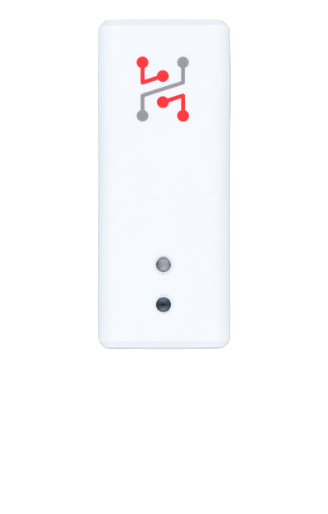

import Image from '@theme/IdealImage';

# Sticker Clime

**STICKER Clime** is a compact, wireless LoRaWAN sensor designed for accurate temperature and humidity monitoring. Powered by two AA batteries, it delivers long-term operation and is ideal for applications such as climate control in buildings, storage monitoring, or environmental analysis in industrial and agricultural settings.



## Quick Links

* [**Getting Started Guide**](https://docs.hardwario.com/sticker/getting-started) – Step-by-step setup guide.
* [**Buy STICKER Clime**](https://www.hardwario.store/p/sticker-clime) – Purchase on our store.
* [**Ordering Codes**](https://docs.hardwario.com/sticker/ordering-codes) - List of components and part numbers.
* [**Hardware Description**](https://docs.hardwario.com/sticker/hardware-description) - Technical details and hardware overview.
* [**Official Product Page**](https://www.hardwario.com/sticker) – Features and overview.

## Typical use cases

#### Smart monitoring for material quality

- Monitoring temperature and humidity during material storage and usage is crucial in processes like plastic injection molding. Moisture from temperature differences can cause granulate condensation, leading to final product porosity. Long-term monitoring helps uncover these hidden issues.

#### Reliable monitoring for medicine storage

- Storing medicine requires precise environmental control. Any significant change in temperature or humidity must be reported immediately. Large storage areas often demand multiple sensors to ensure complete and reliable coverage.

#### Protecting patients with smart sensing

- With rising global temperatures and more climate extremes, maintaining stable conditions in hospital rooms is critical. A failing air conditioner - or even an open window - can put patients at risk. Temperature and humidity sensors in each room enable early warnings and better care.

## Example JSON Message

```json
{
  "event": "interval",
  "voltage": 3.01,
  "battery": 98,
  "temperature": 24.5,
  "humidity": 48.5,
  "illuminance": 120,
  "pressure": 101300
}
```

