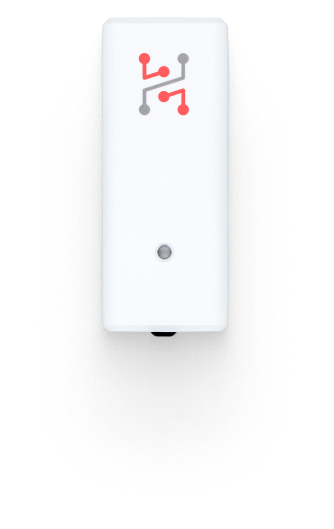

import Image from '@theme/IdealImage';

# Sticker Input

**STICKER Input** is a compact, wireless LoRaWAN module for connecting external sensors and reading digital or analog signals. Powered by two AA batteries, it supports 1-Wire temperature probes, voltage and current measurement, and monitoring of digital inputs up to 30 V, making it a versatile tool for industrial and monitoring applications.

[Web-site](https://www.hardwario.com/sticker/input)

## Typical use cases

#### Smart temperature monitoring
- Some manufacturing processes require temperature monitoring across extreme ranges that conventional electronics can’t handle. External sensors - like 1-Wire temperature probes - are essential in such cases. A single data line can connect up to 10 sensors, enabling detailed and scalable monitoring.

#### Digitizing legacy machines
- Digitizing older machines can be tricky, even if they still run reliably. Many offer a 24 V digital output, or you can add an inductive sensor near the output mechanism to detect each produced item. This enables simple piece counting via digital signals.

#### Smart open/close detection
- Door and window detection isn’t just for security - it’s also key for smart heating and cooling. Traditional systems can be costly due to strict certification standards. STICKER Input offers a simple and affordable alternative with a built-in magnetic field sensor or digital inputs for standard switches.

## Configuration and Wiring of External Inputs

Documentation → [**STICKER Input Configuration**](/sticker/sticker-input-configuration/sticker-input-configuration)

Here you can find information about STICKER input configuration, including DIP switch settings, wiring options, and supported modes such as 1-Wire sensors, dry contact inputs, and 0–24 V analog inputs.
