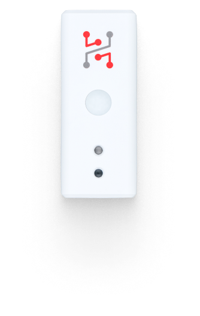

import Image from '@theme/IdealImage';

# Sticker Motion

**STICKER Motion** is a compact, wireless LoRaWAN motion detector built for ultra-low-power operation. Powered by two AA batteries, it uses a precise PIR sensor to detect movement and transmit events, making it suitable for security, facility monitoring, retail analytics, and logistics tracking.



## Quick Links

* [**Getting Started Guide**](https://docs.hardwario.com/sticker/getting-started) – Step-by-step setup guide.
* [**Buy STICKER Motion**](https://www.hardwario.store/p/sticker-motion) – Purchase on our store.
* [**Ordering Codes**](https://docs.hardwario.com/sticker/ordering-codes) - List of components and part numbers.
* [**Hardware Description**](https://docs.hardwario.com/sticker/hardware-description) - Technical details and hardware overview.
* [**Official Product Page**](https://www.hardwario.com/sticker) – Features and overview.

## Typical use cases

#### Optimizing movement in industrial spaces
- Monitoring aisles in industrial spaces helps optimize logistics routes for material flow and finished products. It reduces downtime and minimizes safety risks caused by overcrowded paths and unpredictable movement.

#### Smarter store layouts with motion data
- In retail, knowing where customers move -and how often - transforms store layout planning and boosts sales. With STICKER Motion, you can track aisle traffic and identify high-traffic areas to optimize product placement and enhance the shopping experience.

#### Smarter comfort in busy spaces
- The average person emits about 100 W of heat per hour. In places with high foot traffic, like waiting rooms, monitoring motion, temperature, and humidity helps maintain comfort and efficiency. STICKER Motion captures all three for smarter climate control.

## Example JSON Message

```json
{
  "motion_count": 12,
  "acceleration_x": 0.05,
  "acceleration_y": -0.02,
  "acceleration_z": 0.98,
  "orientation": 1,
  "voltage": 2.98,
  "battery": 95,
  "event": "motion"
}
```