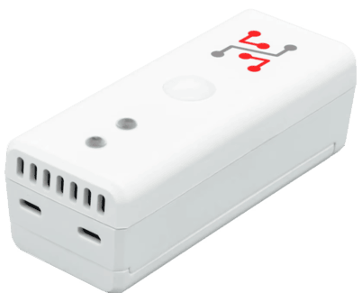

import Image from '@theme/IdealImage';

# Hardware Description

STICKER is a compact IoT device built on the **STM32WL System-on-Chip** with an integrated **LoRa radio** and ARM Cortex-M4F core.  
It is powered by two AA batteries, with battery voltage monitoring and efficient power management (boost converter and LDO).

The device includes **NFC memory and antenna** for simple configuration, even without power (energy harvesting).

It features a rich set of **built-in sensors**:
- Temperature and humidity (SHT43)  
- Light intensity (OPT3001)  
- Atmospheric pressure (MPL3115A2)  
- PIR motion (PYD1698)  
- 3-axis accelerometer (LIS2DH12)  
- Dual Hall-effect door opening detector (A1266)  

For flexibility, there is also:
- **1-Wire bus master** for external sensors  
- **Terminal block for external inputs**  

Device status is indicated by a **multi-color LED (R/G/Y)** and communication is handled via an **internal 868/915 MHz antenna**.

---

## Block Diagram

  

    

      

        <Image img={require('./block-diagram-sticker.png')} />
      

    

    

    

  

 

---

## Overview

#### Sticker Clime - Enclosure, Mainboard, and Battery Holder

#### Sticker Input - Enclosure, Mainboard, and Battery Holder

#### Sticker Motion - Enclosure, Mainboard, and Battery Holder

---

## Schematics

### MCU

### Antenna

### Sensors

### NFC

### NFC Configuration Architecture

### Power

---

## Enclosures

| **Parameter**        | **Value**             |
|-----------------------|-----------------------|
| **Enclosure material**| ABS                   |
| **Dimension**         | 91 × 36.5 × 33.3 mm   |

