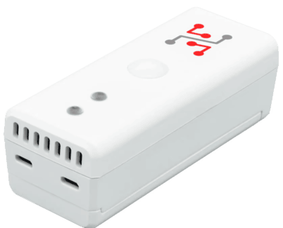

import Image from '@theme/IdealImage';

# STICKER

**STICKER** is an open IoT platform based on STM32WL with integrated LoRaWAN connectivity. It is a compact, battery-powered device with long lifetime and ready-to-use applications such as STICKER Clime, Input, and Motion, making it ideal for flexible sensor deployments.

[Web-site](https://www.hardwario.com/sticker)

## STICKER – Typical Use Cases

- Track and maintain optimal temperature conditions in various rooms for comfort and energy efficiency  
- Ensure precise temperature control and monitoring during critical manufacturing operations  
- Maintain appropriate storage conditions by monitoring temperature in warehouses to protect stored goods  
- Monitor and regulate temperature to create ideal growing conditions for plants in greenhouses  
- Integrate with PLCs or standalone sensors to gather essential data for manufacturing and industrial processes  

## Key Features

| Feature                   | Description                                                                 |
|----------------------------|-----------------------------------------------------------------------------|
| **Wireless Connectivity**  | Supports LoRaWAN for efficient wireless data transmission.                  |
| **Long Battery Life**      | Designed for low energy consumption, ensuring at least one year of operation on standard AA batteries. |
| **Compact Size**           | Miniature dimensions for easy installation and use.                         |
| **Integrated PIR Motion Sensor** | Detects motion with an integrated PIR sensor up to 4 meters.               |
| **NFC Ready**              | Connect to the device using an NFC-enabled smartphone.                      |
| **Industrial Logic Inputs**| Supports up to 2 digital inputs for 24V industrial logic.                   |
| **Voltage Measurement**    | Measure up to 2 channels of voltage up to 30V.                              |
| **Open-source SDK**        | Built on the Zephyr OS SDK, can be easily customized.                       |

## Technical Specification

| **Category**      | **Parameter**             | **Value**                          |
|-------------------|---------------------------|------------------------------------|
| **Structure**     | Enclosure material        | ABS                                |
|                   | Dimension                 | 91 × 36.5 × 33.3 mm                |
| **Power**         | Nominal cell voltage      | 1.5 V                              |
|                   | Nominal battery capacity  | 3000 mAh                           |
|                   | Operating voltage range   | 1.8 V to 3.6 V                     |
|                   | Idle power consumption    | < 80 µA                            |
|                   | Peak power consumption    | < 100 mA                           |
| **Environment**   | Operating temperature     | -30 °C to +70 °C                   |
|                   | Storage temperature       | -40 °C to +85 °C                   |
|                   | Enclosure protection      | IP40                               |
| **Sensors**       | Integrated thermometer – Measurement range   | -40 °C to +105 °C     |
|                   | Integrated thermometer – Measurement accuracy| ±0.2 % (0 °C to 65 °C) |
|                   | Integrated hygrometer – Measurement range    | 0 % to 100 %           |
|                   | Integrated hygrometer – Measurement accuracy | ±2 % (from 10 % to 90 %) |
|                   | PIR – Detection range     | 4 m                                |
|                   | PIR – Viewing angle       | ≥ 50°                              |
