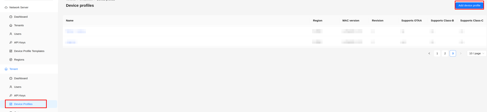
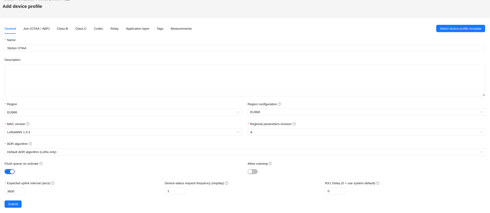
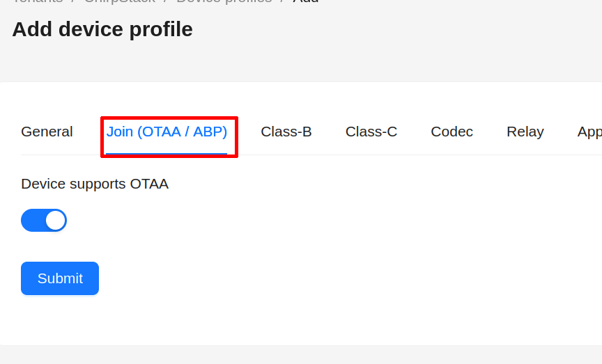
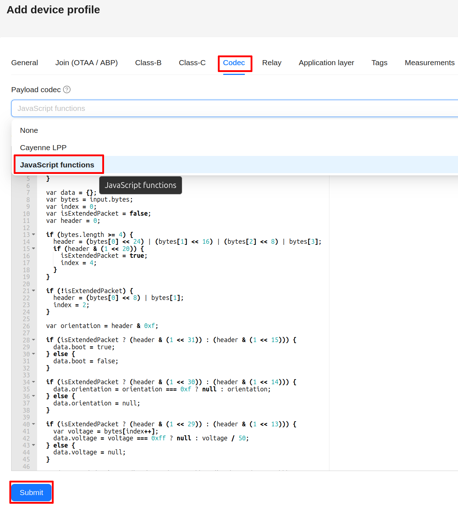
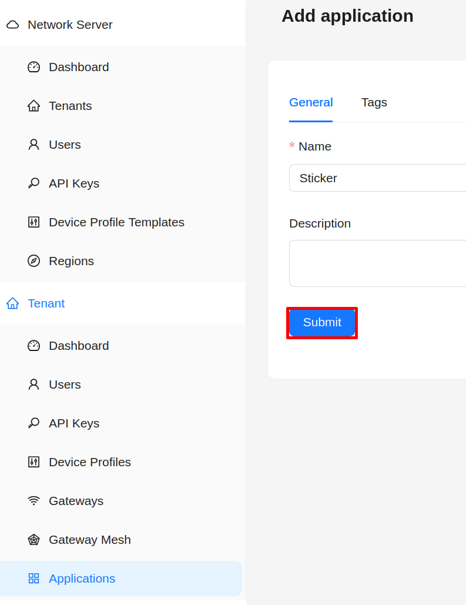
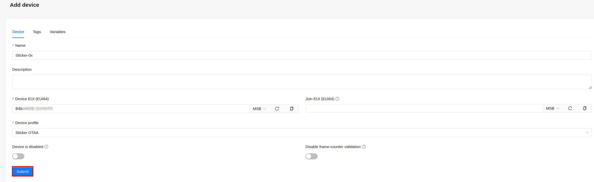
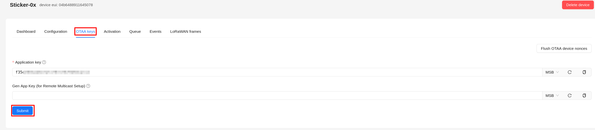

import Image from '@theme/IdealImage';

# ChirpStack v4 – OTAA

This page explains how to register **HARDWARIO STICKER** as a LoRaWAN end device in **ChirpStack v4** using **OTAA (Over-The-Air Activation)**, including the recommended device-profile settings and how to add a payload decoder.

Useful HARDWARIO docs:
- ChirpStack v4 Installation  
  https://docs.hardwario.com/apps/chirpstack/chirpstack-installation
- ChirpStack v4 – End Devices  
  https://docs.hardwario.com/apps/chirpstack/chirpstack-configuration/chirpstack-end-devices
- ChirpStack v4 – Data Decoding (STICKER codec example)  
  https://docs.hardwario.com/apps/chirpstack/chirpstack-configuration/chirpstack-decoding
- STICKER Decoder - https://github.com/hardwario/sticker-firmware/blob/main/app/decoder/ttn.js

:::info
Before registering your STICKER, make sure **ChirpStack v4 is installed and running**.

Installation instructions:  
https://docs.hardwario.com/apps/chirpstack/chirpstack-installation
:::

---

## Prerequisites

- A working LoRaWAN gateway connected to ChirpStack v4 and configured for your region / frequency plan.
- A ChirpStack v4 tenant with the gateway visible and online.
- Your STICKER powered and within gateway coverage.

---

## 1) Collect the required LoRaWAN identifiers & keys

The required LoRaWAN identifiers and keys are **provided together with the STICKER** (device provisioning).

You will need:

- **DevEUI**
- **AppEUI / JoinEUI**
- **AppKey**

:::info
STICKER supports configuration via **NFC**.  
A HARDWARIO provisioning and configuration application using NFC is currently under development.
:::

---

## 2) Create a Device Profile for STICKER (recommended)

In ChirpStack v4:  
**Tenant → Device Profiles → Add Device Profile**

Next, configure the following parameters:
- Name: **Sticker - OTAA** (or your chosen identifier for the device)
- MAC Version: **LoRaWAN 1.0.4**
- Region: **EU866** (or US915 if you are outside the EU)
- Expected uplink interval: **X** (according to your STICKER firmware configuration)

Go to the **Join (OTAA / ABP)** tab and verify that **Device supports OTAA** is toggled on.

As the final step, add a codec to the device profile. Switch to the Codec tab, select JavaScript functions in the Payload codec dropdown, and paste the codec linked below into the input field:
- https://github.com/hardwario/sticker-firmware/blob/main/app/decoder/ttn.js

Save the device profile by clicking **Submit**.

---

## 3) Create an Application in ChirpStack

In ChirpStack, go to **Applications → Add Application** and fill in the fields:
- Name: **Sticker** (or any name of your choice)

Save by clicking **Submit**.

---

## 4) Register the STICKER end device

In your application:  
**Application → End Devices → Add End Device**

Fill:
- **Name** (human-readable)
- **Device EUI (DevEUI)**
- **Device Profile** → select the STICKER profile you created

Save by clicking **Submit**.

New window will pop up. In **Application key** fill the App Key of your device.

---

## 5) Verify uplinks

- Go to **Applications → (your application) → Events**
- Check **Up** events
- You should see:
  - raw payload bytes
  - decoded JSON fields (if the codec is correct)

