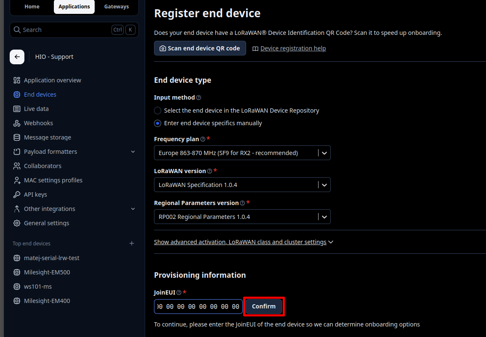
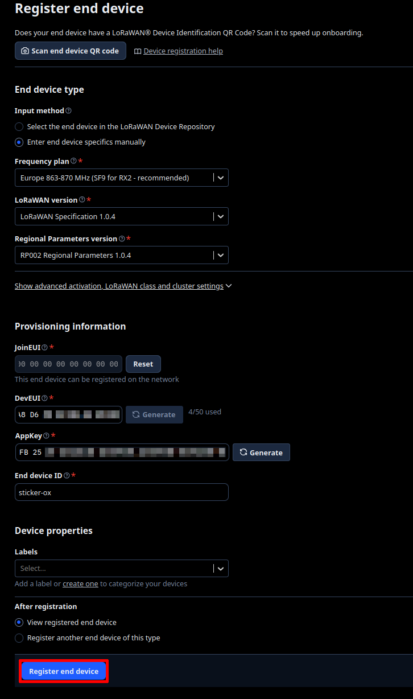

import Image from '@theme/IdealImage';

# The Things Stack – OTAA

This page explains how to register **HARDWARIO STICKER** as a LoRaWAN end device in **The Things Stack (TTS)** using **OTAA (Over-The-Air Activation)**, and how to add a payload formatter (decoder).

Useful HARDWARIO docs:
- TTS – End Devices  
  https://docs.hardwario.com/apps/the-things-stack/tts-configuration/tts-end-devices
- STICKER Decoder – https://github.com/hardwario/sticker-firmware/blob/main/app/decoder/ttn.js

:::info
Before registering your STICKER, make sure you have access to a **The Things Stack** deployment (Cloud, Community, or Enterprise) and that a LoRaWAN gateway is connected and online.
:::

---

## Prerequisites

- A working LoRaWAN gateway connected to The Things Stack and configured for your region / frequency plan.
- A TTS account with permission to create applications and register devices.
- Your STICKER powered and within gateway coverage.

---

## 1) Collect the required LoRaWAN identifiers & keys

The required LoRaWAN identifiers and keys are **provided together with the STICKER** (device provisioning).

You will need:

- **DevEUI**
- **AppEUI / JoinEUI**
- **AppKey**

:::info
STICKER supports configuration via **NFC**.  
A HARDWARIO provisioning and configuration application using NFC is currently under development.
:::

---

## 2) Register the STICKER end device

Inside your application:  
**Application → + Register end device**

Select **Enter end device specifics manually**.

Under **End Device Type**, configure:
- Frequency plan – select your region (e.g. **Europe 863–870 MHz**)
- LoRaWAN version – **LoRaWAN Specification 1.0.4**
- Regional Parameters version – **RP002 Regional Parameters 1.0.4**

Under **Provisioning Information**, enter the **JoinEUI (AppEUI)** and click **Confirm**.

Under **Device Identifiers**, fill in:
- DevEUI – **DEVICE_EUI** (unique identifier printed on the device)
- AppKey – **APPLICATION_KEY** (application key provided with your STICKER)
- Device ID – your chosen name for this device (e.g. **sticker-ox**)

Click **Register end device**.

---

## 3) Add a payload formatter (decoder)

To decode raw uplink bytes into readable JSON fields, navigate to:  
**Application → (YOUR_DEVICE) → Payload formatters → Uplink**

Set the formatter type to **Custom Javascript formatter** and paste the STICKER decoder from the link below:
- https://github.com/hardwario/sticker-firmware/blob/main/app/decoder/ttn.js

Click **Save changes**.

---

## 4) Verify uplinks

- Open the device's **Live data** view in the TTS Console
- You should see:
  - Incoming uplink frames
  - Decoded JSON fields (if the payload formatter is correctly set up)
