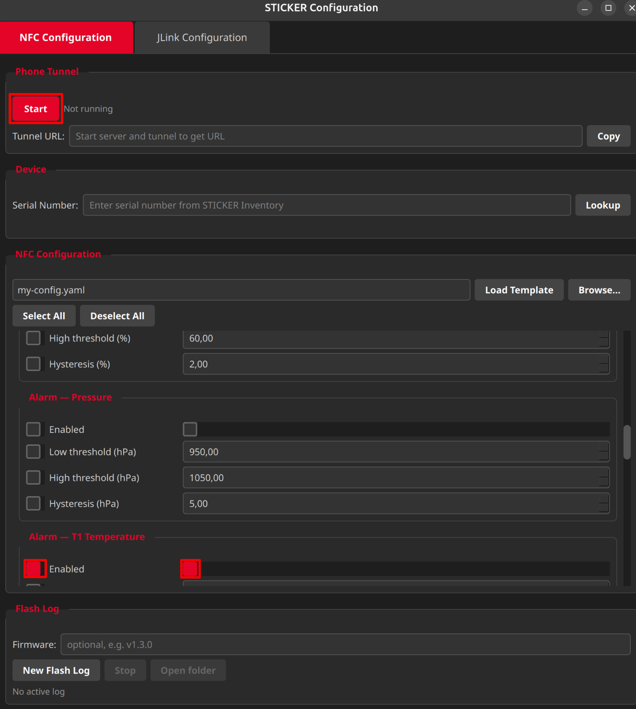
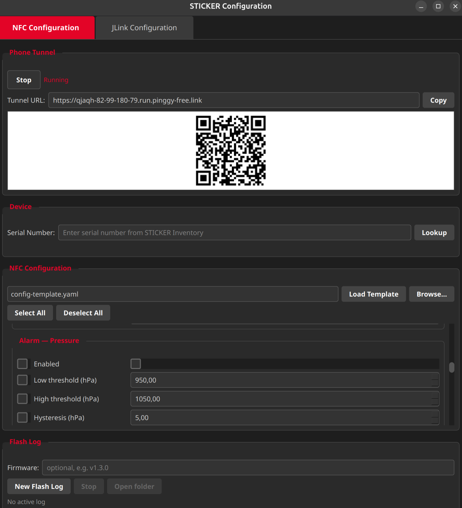
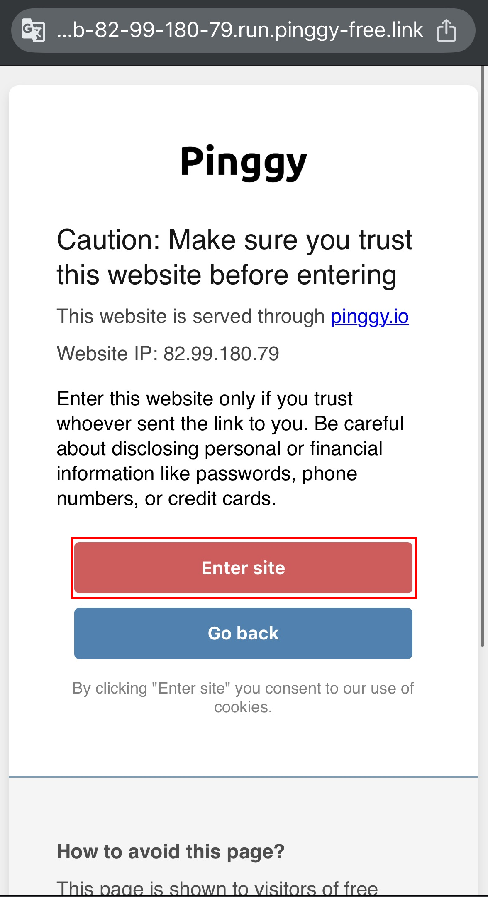
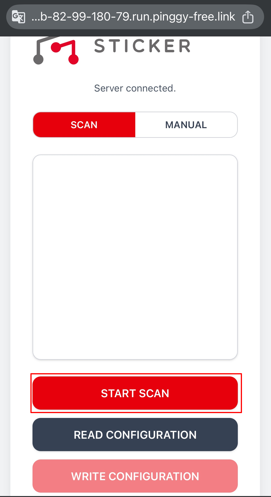
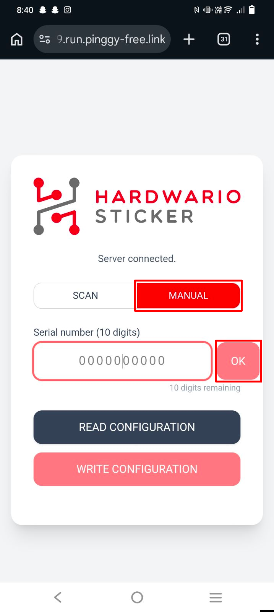

import Image from '@theme/IdealImage';

# NFC Configurator – Configuration

This page describes how to use the **HARDWARIO STICKER NFC Configurator** to write and read configuration over NFC, and lists all parameters that can be set on the device.

If you have not yet installed the application, start with the [**Setup →**](./setup.md) guide.

---

## How it works

The desktop application runs a small local web server and opens a secure HTTPS tunnel to the internet. Your phone connects to that tunnel by scanning a QR code.

When you enter a STICKER serial number on the phone, the desktop looks up the device's encryption key, encrypts the configuration, and sends the encrypted payload to the phone, which writes it to the STICKER over NFC.

:::info
STICKER includes an NFC interface that allows configuration even when batteries are not inserted, thanks to **NFC energy harvesting** the NFC field from the smartphone provides enough power to write settings into the device's internal EEPROM. When the device wakes up on battery power, it reads the NFC tag, applies the stored configuration and clears the temporary storage.
:::

---

## Writing configuration to a device

1. **Start the application.**
   - Windows: `python main.py`
   - Linux: `source .venv/bin/activate && python3 main.py`

2. **Select the parameters** you want to write, tick the checkboxes next to the items in the editor. Unchecked parameters are **not** sent to the device. The image below shows an example of turning on the alarm for sensor T1.

3. **Click Start.** The local server and HTTPS tunnel start automatically. A QR code appears in the desktop window after a few seconds.

4. **Connect your phone.** On your Android phone scan the QR code and open the page in **Google Chrome**. Click on **Enter site**.

5. **Enter the serial number.** The phone interface has two tabs:
   - **SCAN**: tap **START SCAN** and point the camera at the 10-digit barcode on the STICKER.
   
   
   - **MANUAL**: type the 10-digit serial number and press Enter (or tap **OK**). Use this when the barcode is damaged or unreadable.
   

6. **Write over NFC.** When **WRITE CONFIGURATION** becomes active, tap it and hold the back of your phone flat against the STICKER. Keep the phone still until the write is confirmed.
7. When you are finished, click **Stop** to close the tunnel.

:::caution
The **Nonce counter** in the CSV is updated automatically on every successful write. A failed attempt does **not** increment the counter.
:::

---

## Reading configuration from a device

You can read the current configuration from a STICKER to verify it.

1. Start the application and connect your phone.
2. On the phone, tap **READ CONFIGURATION** and hold the phone against the STICKER.
3. The encrypted data is sent back to the desktop, decrypted and shown on both the phone and the desktop.

---

## Device lookup

You can preview a device before configuring it. On the **NFC** tab, type a 10-digit serial number into the **Serial Number** field and click **Lookup**. The application shows the product type, **DevEUI** and current **nonce counter**. This is a handy way to confirm the CSV is loaded correctly.

---

## Configuration parameters

The application lets you tick which parameters to write. Anything left unticked is **not** sent to the device, so a single configuration can be reused across many devices.

:::danger
You can also request a **factory reset**, which restores all settings to their default values before the new configuration is applied.

Use this option **with caution**, it wipes all current settings on the device, including LoRaWAN keys and alarm thresholds. There is no undo. Only enable factory reset when you are sure you want to start from a clean state.
:::

---

### LoRaWAN

| Parameter | Format | Default | Description |
|---|---|---|---|
| Region | eu868 / us915 / au915 | eu868 | LoRaWAN frequency region |
| Network | public / private | public | LoRaWAN network type |
| ADR | true / false | false | Adaptive Data Rate |
| Activation | abp / otaa | abp | Activation method |
| DevEUI | 16 hex digits, lowercase | *empty* | Device EUI |
| JoinEUI | 16 hex digits, lowercase | *empty* | Join EUI / AppEUI |
| Network Key | 32 hex digits, lowercase | *empty* | Network Key (OTAA) |
| Application Key | 32 hex digits, lowercase | *empty* | Application Key (OTAA) |
| Device Address | 8 hex digits, lowercase | *empty* | Device Address (ABP) |
| Network Session Key | 32 hex digits, lowercase | *empty* | Network Session Key (ABP) |
| Application Session Key | 32 hex digits, lowercase | *empty* | Application Session Key (ABP) |

---

### Sampling and reporting

| Parameter | Range | Default | Description |
|---|---|---|---|
| Calibration mode | true / false | false | Factory use only |
| Sample interval | 0 or 5 to 3600 s | 30 | Sensor sampling interval. 0 means sample immediately before each report |
| Aggregation interval | 0 to 86400 s | 0 | Aggregation interval. 0 means disabled |
| Report interval | 60 to 86400 s | 900 | Uplink report interval (default 15 minutes) |

---

### Internal thermometer alarm

| Parameter | Range | Default | Description |
|---|---|---|---|
| Enabled | true / false | false | Enable temperature alarm |
| Low threshold | −30 to 70 °C | 15.0 | Alarm triggers when temperature drops below this value |
| High threshold | −30 to 70 °C | 25.0 | Alarm triggers when temperature rises above this value |
| Hysteresis | 0 to 5 °C | 0.5 | Dead band around the threshold |

---

### Hygrometer alarm

| Parameter | Range | Default | Description |
|---|---|---|---|
| Enabled | true / false | false | Enable humidity alarm |
| Low threshold | 0 to 100 % | 40.0 | Low threshold |
| High threshold | 0 to 100 % | 60.0 | High threshold |
| Hysteresis | 0 to 20 % | 2.0 | Hysteresis |

---

### Barometer alarm

| Parameter | Range | Default | Description |
|---|---|---|---|
| Enabled | true / false | false | Enable pressure alarm |
| Low threshold | 500 to 1200 hPa | 950.0 | Low threshold |
| High threshold | 500 to 1200 hPa | 1050.0 | High threshold |
| Hysteresis | 0 to 50 hPa | 5.0 | Hysteresis |

---

### External thermometer alarms (1-Wire T1 / T2)

These alarms work with the first and second external 1-Wire temperature sensors. Each has its own enabled flag, low/high threshold and hysteresis.

| Parameter | Range | Default | Description |
|---|---|---|---|
| T1 enabled | true / false | false | Enable T1 alarm |
| T1 low threshold | −30 to 70 °C | 15.0 | T1 low threshold |
| T1 high threshold | −30 to 70 °C | 25.0 | T1 high threshold |
| T1 hysteresis | 0 to 5 °C | 0.5 | T1 hysteresis |
| T2 enabled | true / false | false | Enable T2 alarm |
| T2 low threshold | −30 to 70 °C | 15.0 | T2 low threshold |
| T2 high threshold | −30 to 70 °C | 25.0 | T2 high threshold |
| T2 hysteresis | 0 to 5 °C | 0.5 | T2 hysteresis |

---

### Hall sensor inputs

The hall effect sensor detects magnetic fields (e.g. magnets on rotating machinery or open/close detection).

| Parameter | Format | Default | Description |
|---|---|---|---|
| Hall left counter | true / false | false | Enable pulse counting on the left hall sensor |
| Hall left notify on activation | true / false | false | Send uplink on activation (magnet detected) |
| Hall left notify on deactivation | true / false | false | Send uplink on deactivation (magnet removed) |
| Hall right counter | true / false | false | Enable pulse counting on the right hall sensor |
| Hall right notify on activation | true / false | false | Send uplink on right activation |
| Hall right notify on deactivation | true / false | false | Send uplink on right deactivation |

---

### External inputs (STICKER Input)

These settings apply to the **STICKER Input** variant with external digital/analog inputs.

| Parameter | Format | Default | Description |
|---|---|---|---|
| Input A counter | true / false | false | Enable pulse counting on input A |
| Input A notify on activation | true / false | false | Send uplink on input A activation |
| Input A notify on deactivation | true / false | false | Send uplink on input A deactivation |
| Input B counter | true / false | false | Enable pulse counting on input B |
| Input B notify on activation | true / false | false | Send uplink on input B activation |
| Input B notify on deactivation | true / false | false | Send uplink on input B deactivation |

For wiring details (DIP switches, 1-Wire, dry contact, analog), see [**STICKER Input Wiring**](https://docs.hardwario.com/sticker/sticker-input-wiring/sticker-input-wiring/).

---

### Temperature corrections

Apply a fixed offset to compensate for sensor placement or self-heating effects.

| Parameter | Range | Default | Description |
|---|---|---|---|
| Internal correction | −5.0 to +5.0 °C | 0.0 | Offset applied to the built-in thermometer |
| T1 correction | −5.0 to +5.0 °C | 0.0 | Offset applied to external 1-Wire sensor T1 |
| T2 correction | −5.0 to +5.0 °C | 0.0 | Offset applied to external 1-Wire sensor T2 |

---

### Capability flags

Capability flags tell the firmware which hardware features are present on a given device variant. They are typically set during factory provisioning and should **not** need to be changed in the field.

| Parameter | Format | Description |
|---|---|---|
| Hall left | true / false | Hall left sensor present |
| Hall right | true / false | Hall right sensor present |
| Input A | true / false | External input A present |
| Input B | true / false | External input B present |
| Light sensor | true / false | Ambient light sensor present |
| Barometer | true / false | Barometric pressure sensor present |
| PIR detector | true / false | PIR motion detector present |
| 1-Wire thermometer | true / false | 1-Wire thermometer (DS18B20) support |
| 1-Wire machine probe | true / false | 1-Wire machine probe support |

---

## Troubleshooting

| Problem | Solution |
|---|---|
| Web NFC does not work on phone | You must use **Chrome on Android**. iOS, Safari, Firefox and other browsers are not supported. Make sure NFC is enabled in phone settings. |
| NFC write fails or times out | Hold the phone flat against the STICKER and keep it still for 2–3 seconds. Try a different position on the back of the phone, the NFC antenna is usually near the top or center. |
| `serial number not found` | The scanned device is not in the CSV. Make sure the file is named exactly `STICKER Inventory.csv` and contains a row for this device. |
| `No secret key for device` | The `Secret key` column is empty for this device in the CSV. Add the 32-character hex key. |
| `Payload too large` | Your configuration is bigger than 448 bytes. Uncheck parameters you do not need, only checked parameters count toward the limit. |
| `Rx 2 timeout` after LoRaWAN join | LoRaWAN server does not respond. Verify the LoRaWAN keys and the device profile in your network server. |
| Humidity alarm triggers immediately | Current humidity is outside the configured range (40 to 60 %). Adjust the humidity low and high thresholds. |
