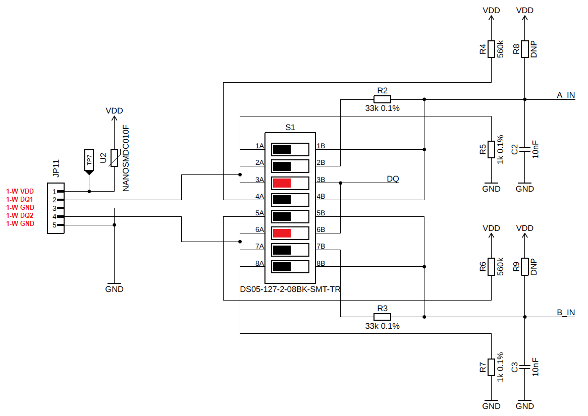
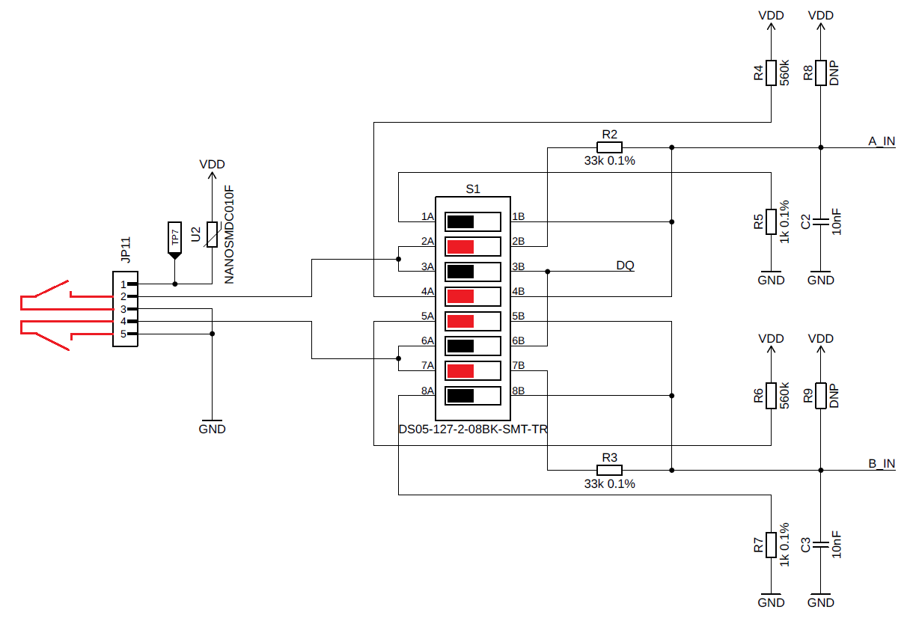
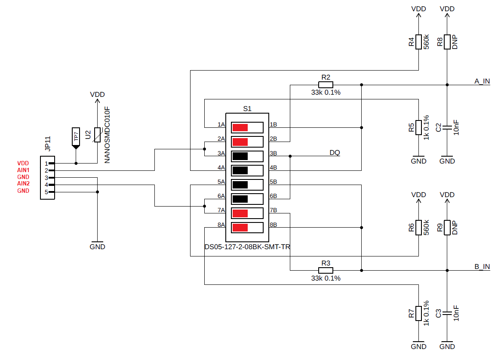

import Image from '@theme/IdealImage';

# STICKER Input Configuration

## DIP Switch Legend

- 🔴 = DIP switch ON [RED]
- ⚫ = DIP switch OFF [BLACK]

## 1-Wire Input
Wiring for 1-WIRE (Dallas, ...):
- DIP switches enable the data lines (DQ1/DQ2).

---

## Dry Contact Input
Wiring for DRY CONTACT:  
- 560 kΩ pull-up and grounded through 33 kΩ.  

---

## Analog Input (0–24 V)
Analog input 0–24 V:  
- Divider 1 kΩ / 33 kΩ.

