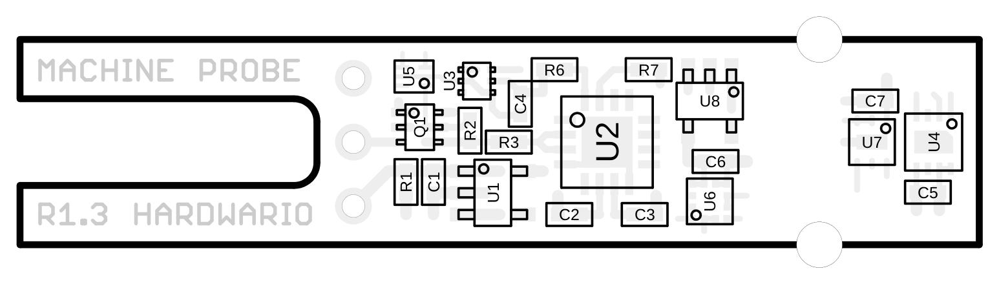
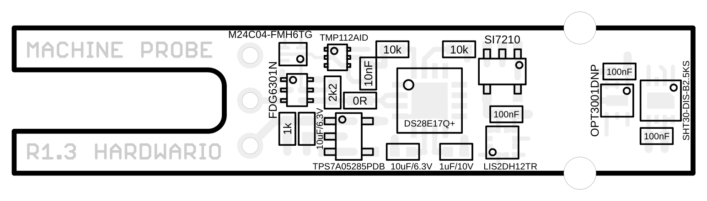
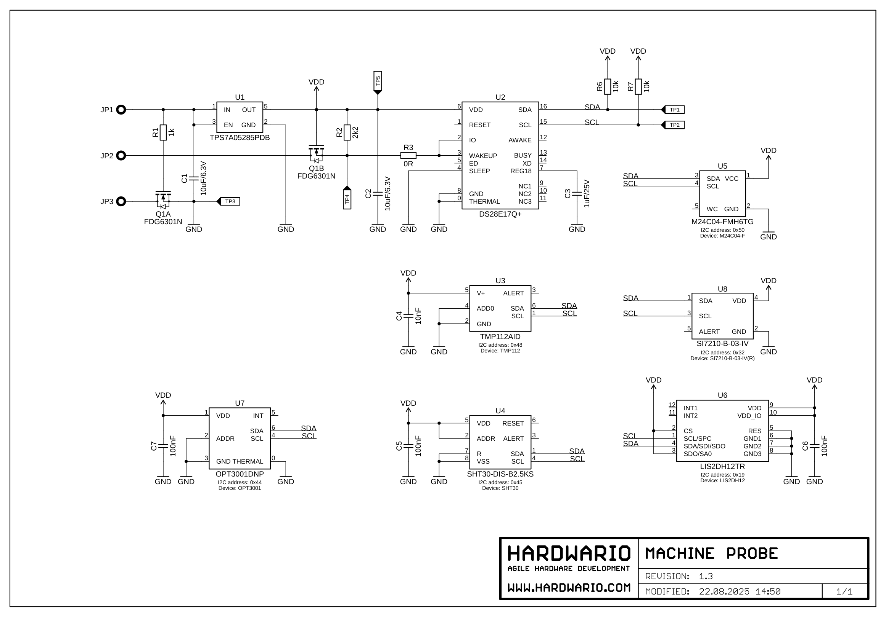

# External Sensor Support

**STICKER Input** can be extended with external sensors and probes connected through its input interface. This allows the module to handle demanding measurement tasks where a quantity needs to be sensed away from the unit itself — for example temperature and humidity directly on a machine, vibration and motion, or pulse counting from industrial meters.

This chapter describes the currently supported external interfaces:

- **MACHINE PROBE** – a compact multi-function probe with digital sensors on a 1-Wire bus.
- **1-Wire temperature probes (Dallas)** – standalone temperature sensors connected over a single data wire.
- **S0 interface** – a pulse input for reading energy and flow meters.

---

## MACHINE PROBE (v1.3)

**MACHINE PROBE** is an external measurement probe designed to be mounted directly on the monitored equipment. A single enclosure integrates a set of digital sensors (temperature, humidity, accelerometer, ambient light, Hall sensor) that communicate over an internal **I²C** bus. A 1-Wire-to-I²C bridge exposes the whole probe over a single **1-Wire** data line, so from the perspective of STICKER Input the probe behaves as one device connected with a three-wire cable.

:::tip

The MACHINE PROBE is not limited to STICKER Input — it is also fully compatible with **HARDWARIO CHESTER**, which exposes the same 1-Wire interface. The same probe can therefore be reused across both platforms without any hardware modification.

:::

### Description and real-world use

The probe has already proven itself in the field — for example monitoring **shakers** at OK SERVIS, where it reliably:

- measures the **temperature** of the monitored equipment,
- measures the **relative humidity** of the surroundings,
- detects **motion, shock and vibration** using its accelerometer.

By combining these quantities you can monitor not only the operating conditions but also the actual operation of the machine — for instance recognizing whether the equipment is genuinely running, has stopped, or is vibrating abnormally.

#### Example: monitoring motor vibration

A typical use case is **vibration monitoring of electric motors, pumps and fans**. The MACHINE PROBE is mounted directly on the motor housing, and its built-in accelerometer continuously senses mechanical vibration. From the measured data you can:

- confirm whether the motor is **running or stopped** (presence and level of vibration),
- detect a **gradual increase in vibration** that often precedes a mechanical fault — worn bearings, shaft misalignment or an unbalanced load,
- combine the vibration reading with the probe's **temperature** measurement to catch overheating that develops alongside excessive vibration.

This makes the probe a simple building block for **predictive maintenance**: instead of waiting for a motor to fail, the trend in vibration and temperature is sent over LoRaWAN and an alert can be raised before a breakdown occurs.

### Electrical specifications

| Parameter | Value |
| --- | --- |
| Supply voltage range | **3.0 – 5.5 V** |
| Reverse-polarity protection | **Yes** (integrated) |
| Sensor bus | I²C (internal), exposed via 1-Wire bridge |
| Connection | Three-wire interconnecting cable |

:::info

The integrated reverse-polarity protection guards the probe electronics against incorrect wiring of the supply leads. Even so, we recommend following the correct wire order from the table below during installation.

:::

### Wiring

The probe connects with a **three-wire cable** using the following pinout:

| Wire | Signal | Description |
| --- | --- | --- |
| Minus | **GND** | Ground / common |
| Data | **DATA** | 1-Wire data bus |
| Plus | **VDD** | Supply 3.0 – 5.5 V |

### Onboard sensors and chips

The following table summarizes the active components fitted on the **MACHINE PROBE R1.3** board, including their function and I²C address.

| Reference | Chip | Function | I²C address |
| --- | --- | --- | --- |
| U2 | DS28E17Q+ | 1-Wire → I²C bridge (handles all probe communication) | — |
| U4 | SHT30-DIS-B2.5KS | Temperature and humidity sensor | 0x45 |
| U6 | LIS2DH12TR | Accelerometer / motion sensor | 0x19 |
| U3 | TMP112AID | Digital temperature sensor | 0x48 |
| U7 | OPT3001DNP | Digital ambient light sensor | 0x44 |
| U8 | SI7210-B-03-IV | Hall sensor / magnetometer | 0x32 |
| U5 | M24C04-FMH6TG | EEPROM memory | 0x50 |
| U1 | TPS7A05285PDB | Linear regulator (LDO) | — |

:::note

The **DS28E17Q+ (U2)** acts as a bridge between the 1-Wire bus (toward STICKER Input) and the internal I²C bus that connects all of the probe's sensors. The I²C addresses therefore apply within the probe's internal bus, not directly on the STICKER Input interface.

:::

### Board assembly

Component reference designators (top side):

Component values (top side):

<b>Show schematic (MACHINE PROBE R1.3)</b>

---

## Other supported interfaces

In addition to the MACHINE PROBE, STICKER Input supports other types of external sensors. The sections below serve as an introductory overview; detailed documentation will be added.

### 1-Wire temperature probes (Dallas)

STICKER Input supports standard **1-Wire (Dallas) temperature probes** (e.g. the DS18B20 family). The sensors connect to a single data wire, and thanks to the addressability of the 1-Wire bus, multiple probes can be wired to one data line at the same time. This interface is well suited to distributed temperature measurement over longer distances and in harsh conditions.

:::info

A detailed description of the wiring, DIP switch settings and the maximum number of sensors will be added in a dedicated section.

:::

### S0 interface (pulse output)

The **S0 interface** is a standardized pulse output used by many **energy and utility meters** — electricity meters, gas meters, water meters and heat meters. Each pulse corresponds to a defined amount of consumed energy or medium, and STICKER Input counts these pulses, enabling remote consumption readout over the LoRaWAN network.

:::info

A detailed description of the S0 wiring and pulse measurement configuration will be added in a dedicated section.

:::
