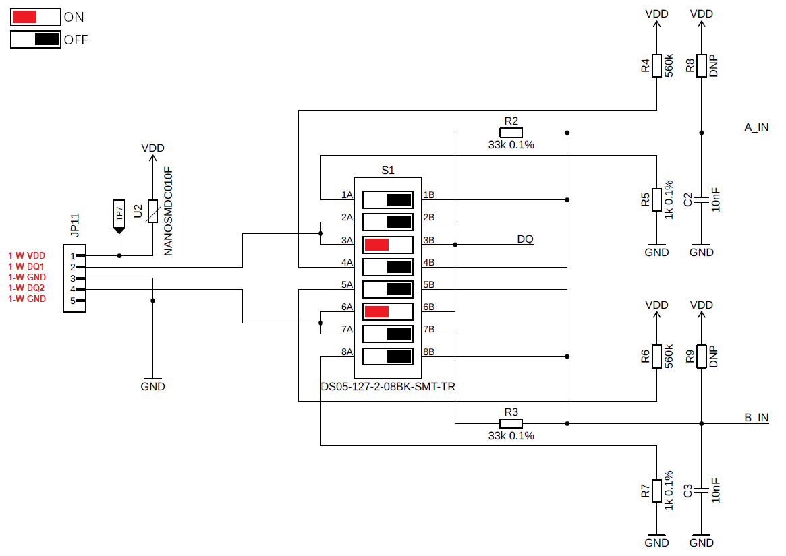
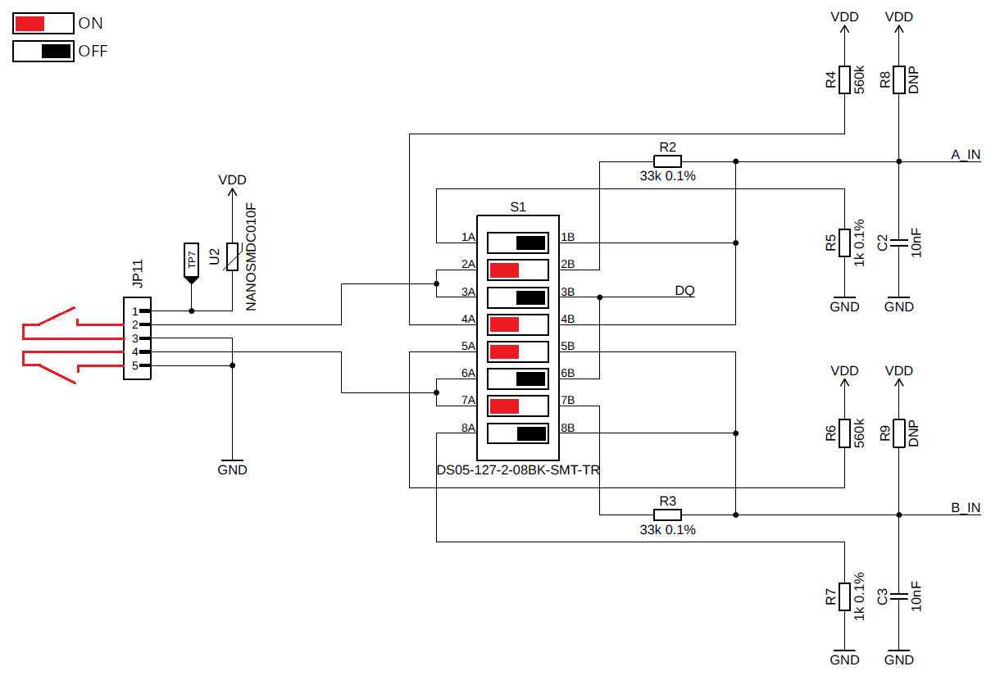
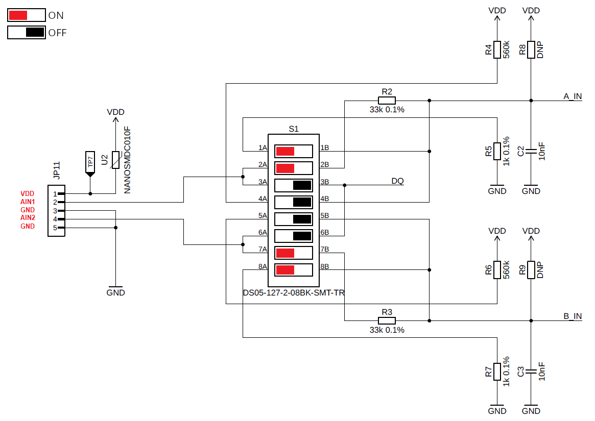
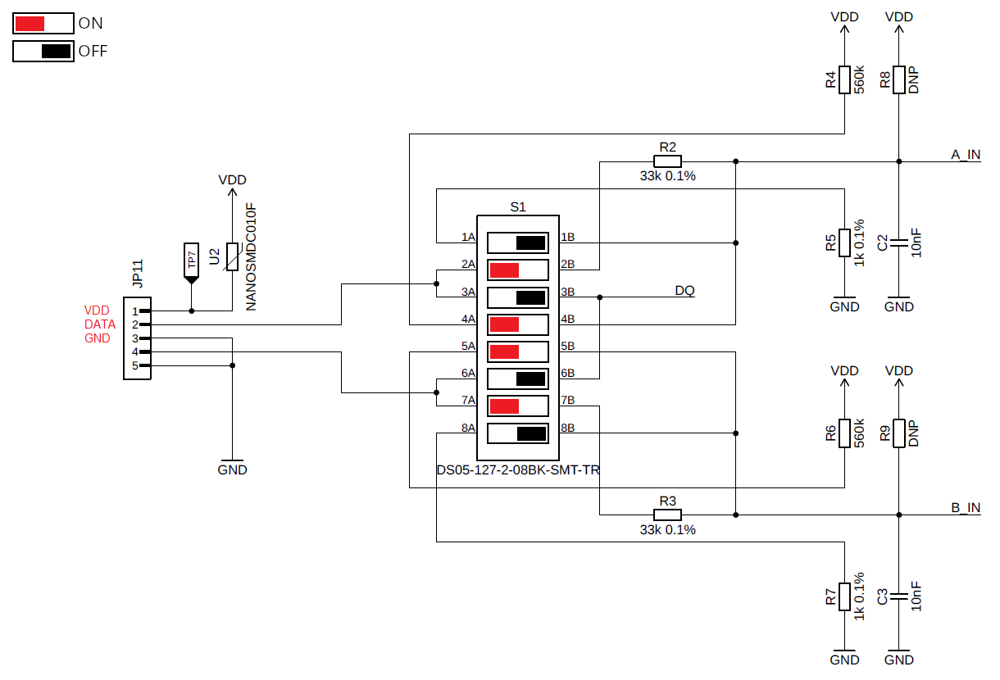

import Image from '@theme/IdealImage';

# STICKER Input Wiring

## DIP Switch Legend

- |🟥←| **ON** — DIP switch in the ON position (red)
- |→⬛| **OFF** — DIP switch in the OFF position (black)

## 1-Wire Input
Wiring for 1-WIRE (Dallas, ...):
- DIP switches enable the data lines (DQ1/DQ2).

---

## Dry Contact Input
Wiring for DRY CONTACT:  
- 560 kΩ pull-up and grounded through 33 kΩ.  

---

## Analog Input (0–24 V)
Analog input 0–24 V:  
- Divider 1 kΩ / 33 kΩ.

## SO Sensor

