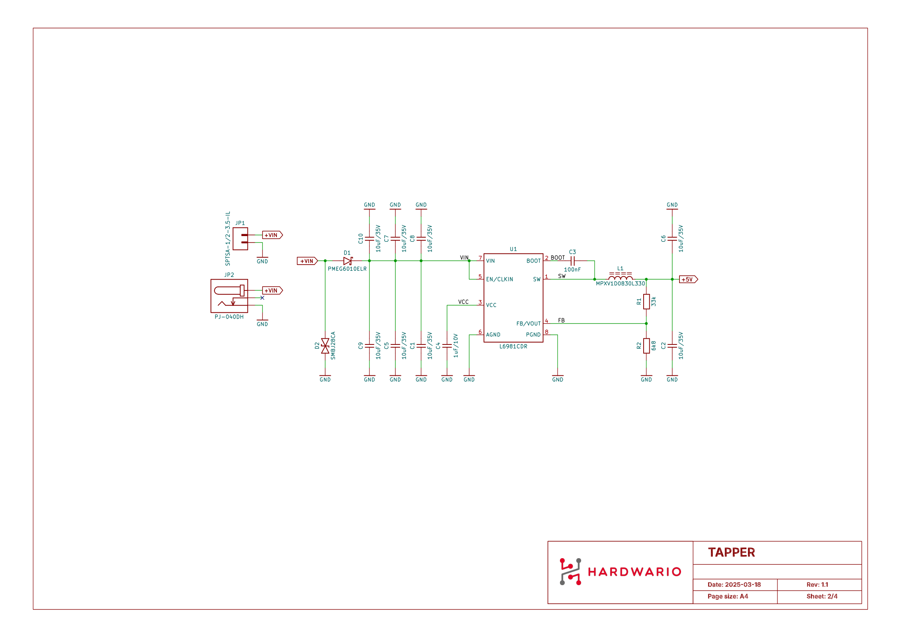
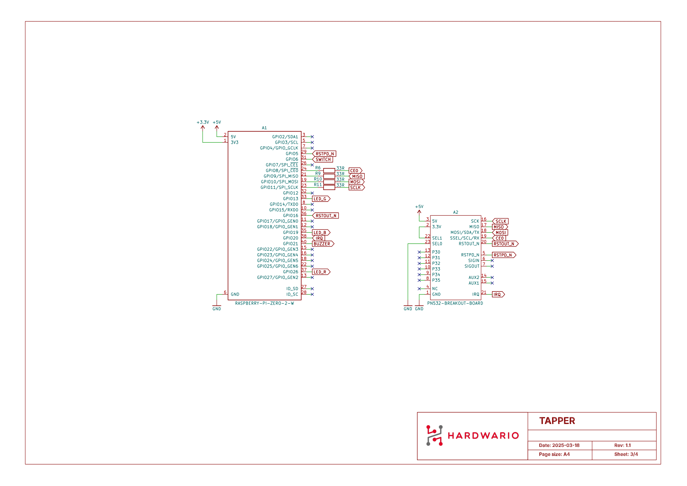
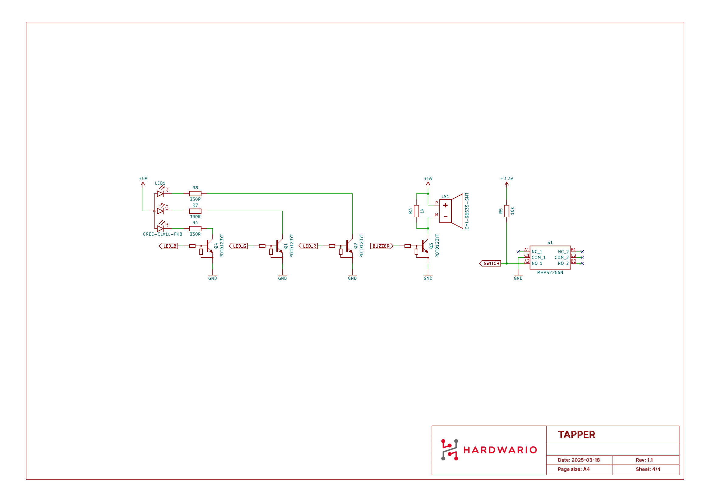

import Image from '@theme/IdealImage';

# TAPPER Hardware Description

In this article, you will find the details about the TAPPER hardware configuration.

## Basic Parameters

|       **Electrical**       |                           |
| :------------------------: | :-----------------------: |
|   Minimal supply voltage   |            10V            |
|   Maximum supply voltage   |            30V            |
| Typical power consumption  |            TBA            | [//]: # TODO |
| Maximum power consumption  |            TBA            | [//]: # TODO |
|         **Inputs**         |                           |
|       Terminal block       |          10-30V           |
|       DC power Jack        |         1.3x3.8mm         |
|        **Outputs**         |                           |
|          RGB LED           | 355 mcd, 710 mcd, 140 mcd |
|           Buzzer           |      80 dBA / 2.7kHz      |
|        **Physical**        |                           |
|    Enclosure dimensions    |       155x84x21.3mm       |
|     Enclosure material     |    ASA+PC (UL 94 V-0)     |
| Enclosure protection class |           IP40            |
|      Enclosure colour      |  traffic white RAL 9016   |
|   Operation temperature    |     -20 °C to +60 °C      |

## Schematic Diagram

- [Schematic R1.1 (PDF)](media/hio-tapper-r1.1-schematic.pdf)

### Power

### Raspberry Pi + PN532 Breakout Board

### Peripherals

